# UML Basics: Class Diagrams

**What you will learn**

- What UML is and which of its diagrams matter for low-level design.
- How to read and draw every part of a **class diagram**: the class box, visibility, and all six relationships (association, aggregation, composition, dependency, inheritance, realization).
- How each notation maps to real **Python** code, so you can go from diagram to code and back.
- How to choose the right arrow, how much detail to draw, and the mistakes that cost marks in interviews.
- The **Mermaid** syntax for each notation, so your diagrams live in Markdown and render on GitHub and on this site.

The Python snippets on this page were run on Python 3.12, and every diagram was checked with the Mermaid parser.

---

## 1. What UML is, and why it exists

Code is precise but slow to read. A picture of "which classes exist and how they are connected" can be understood in seconds, and it lets a team discuss a design before writing it.

The **Unified Modeling Language (UML)** is a standard visual vocabulary for this. It was unified in the 1990s from earlier notations by Grady Booch, Ivar Jacobson and James Rumbaugh, and is now maintained by the Object Management Group (OMG). The point of a *standard* is that a rectangle, a diamond or a dashed arrow means the same thing to everyone, so you can hand a diagram to a stranger and they read it the same way you drew it.

UML 2.x defines 14 diagram types, split into **structure** diagrams (what the parts are) and **behaviour** diagrams (what happens over time). In low-level design you will mostly use these:

| Diagram | Answers the question | Covered here |
|---------|----------------------|--------------|
| **Class diagram** | What classes exist, what do they hold and do, and how are they related? | **Yes, in depth** |
| **Sequence diagram** | In what order do objects call each other for one scenario? | Briefly, see [section 9](#9-other-uml-diagrams-you-will-meet) |
| **State diagram** | What states can an object be in, and what moves it between them? | Briefly |
| **Activity diagram** | What are the steps and decisions in a process? | Briefly |

The class diagram is the most important one. It is the one you draw first in a low-level design interview.

## 2. Anatomy of a class

A class is drawn as a rectangle with up to **three compartments**:

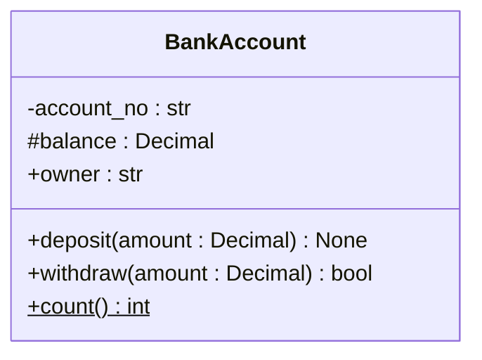

| Compartment | Contains | In the diagram above |
|-------------|----------|----------------------|
| **Top: name** | The class name | `BankAccount` |
| **Middle: attributes** | The data the class holds (fields) | `account_no`, `balance`, `owner` |
| **Bottom: operations** | What the class can do (methods) | `deposit`, `withdraw`, `count` |

### Attribute and operation syntax

UML writes them like this:

```text
attribute:   visibility name : type [multiplicity] = default value
operation:   visibility name(parameter : type, ...) : return type
```

Examples: `- balance : Decimal = 0`, `+ deposit(amount : Decimal) : None`. Mermaid accepts this form. It also accepts a C-style `type name` order (`+Decimal balance`), which you will see in many online diagrams. Pick one style and use it consistently. This site uses the UML form `name : type`.

### Visibility

The symbol in front of a member says who may use it:

| Symbol | Name | Meaning | Python equivalent |
|--------|------|---------|-------------------|
| `+` | Public | Any code may use it | `name` |
| `-` | Private | Only the class itself | `__name` (name-mangled) or, more commonly, `_name` |
| `#` | Protected | The class and its subclasses | `_name` by convention |
| `~` | Package | Code in the same package | No direct equivalent. A module-level name is the closest |

!!! note "Python has conventions, not enforcement"
    Python does not stop anyone from reading `_balance`. So in a diagram, `-` and `#` express **design intent**: "outside code should not touch this". That is still valuable, because it tells the reader what the public surface of a class is.

### Static and abstract members

| Marker | Meaning | Drawn as | Python equivalent |
|--------|---------|----------|-------------------|
| Static | Belongs to the class, not to an instance | Underlined (`$` after the member in Mermaid) | Class attribute, `@classmethod`, `@staticmethod` |
| Abstract | Declared but not implemented, subclasses must provide it | *Italic* (`*` after the member in Mermaid) | `@abstractmethod` |

A class with at least one abstract member is an **abstract class**: it cannot be instantiated. Mark it with the `<<abstract>>` annotation or an italic name.

### Annotations (stereotypes)

Text in double angle brackets above the class name says what *kind* of thing it is:

| Annotation | Meaning | Typical Python |
|------------|---------|----------------|
| `<<interface>>` | A pure contract: operations with no implementation | `typing.Protocol`, or an `ABC` with only abstract methods |
| `<<abstract>>` | A class that cannot be instantiated on its own | `ABC` with `@abstractmethod` |
| `<<enumeration>>` | A fixed set of named values | `enum.Enum` |
| `<<dataclass>>`, `<<service>>`, ... | Your own labels for extra meaning | `@dataclass`, a plain class |

### The same class in Python

Every part of the box maps to code:

```python
from abc import ABC, abstractmethod
from decimal import Decimal


class Account(ABC):  # <<abstract>>
    _count: int = 0  # static attribute

    def __init__(self, owner: str) -> None:
        self.owner = owner  # + owner : str
        self._balance = Decimal(0)  # # balance : Decimal
        self.__pin = "0000"  # - pin : str (name-mangled)
        Account._count += 1

    def deposit(self, amount: Decimal) -> None:  # + deposit(amount : Decimal) : None
        self._balance += amount

    @staticmethod
    def count() -> int:  # + count() : int   (static)
        return Account._count

    @abstractmethod
    def monthly_fee(self) -> Decimal:  # + monthly_fee() : Decimal   (abstract)
        ...


class Savings(Account):
    def monthly_fee(self) -> Decimal:
        return Decimal(0)


account = Savings("Asha")
account.deposit(Decimal(100))
print(Account.count(), account.monthly_fee())
```

Output:

```text
1 0
```

## 3. Relationships: the heart of a class diagram

Boxes tell you what exists. **Lines tell you the design.** There are six kinds of relationship, and choosing the right one is the skill.

| Relationship | Line and arrowhead | Read it as | Typical code shape |
|--------------|--------------------|------------|--------------------|
| **Association** | Solid line, optional open arrowhead | "A knows about B" | A field that holds a B |
| **Aggregation** | Solid line, **hollow diamond** at the whole | "A has B, but B can live without A" | A field holding B objects that were created elsewhere |
| **Composition** | Solid line, **filled diamond** at the whole | "A owns B. B dies with A" | A creates B itself and nobody else holds it |
| **Dependency** | **Dashed** line, open arrowhead | "A uses B briefly" | B is a parameter, a return value, or a local variable |
| **Generalization** (inheritance) | Solid line, **hollow triangle** at the parent | "A is a kind of B" | `class A(B)` |
| **Realization** (implements) | **Dashed** line, **hollow triangle** at the interface | "A promises to provide what interface B declares" | `class A(B)` where `B` is an interface or `Protocol` |

Two habits make the arrows easy to remember:

- **The arrowhead or diamond sits at the "more general" or "owning" end.** Triangles point at the parent, diamonds sit on the whole, and plain arrowheads point at the thing being used.
- **Dashed means weak or temporary.** Dependency is dashed because it is a passing use, and realization is dashed because an interface is a promise, not a shared implementation.

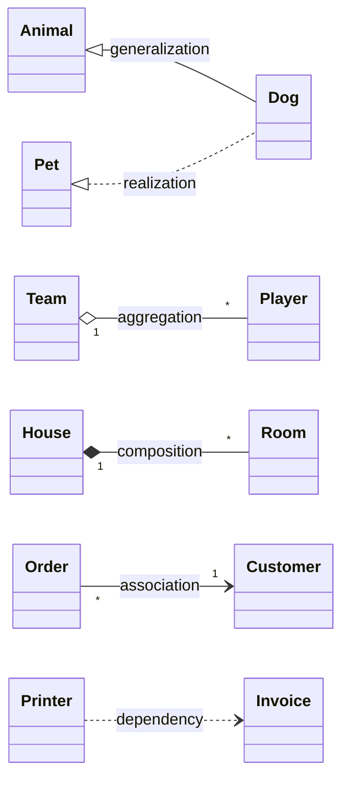

*All six relationships in one picture, each labelled with its name. The next sections take them one at a time.*

### 3.1 Association: "knows about"

The most general relationship: one class holds a reference to another **over time** (not just during one call).

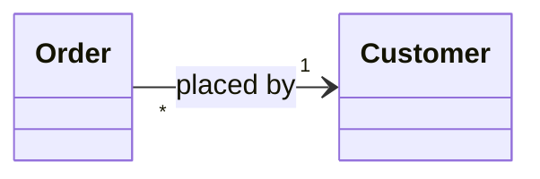

*Read: many orders are placed by one customer. The arrowhead shows that an `Order` can navigate to its `Customer`.*

- The **label** (`placed by`) names the relationship. Write it as a phrase that reads correctly in the arrow's direction.
- The **arrowhead** shows **navigability**: which side can reach the other. `Order --> Customer` means an order holds its customer, but a customer does not necessarily hold its orders. A plain line (`--`) means "related, direction not decided yet".
- The numbers are **multiplicities**, explained in [3.2](#32-multiplicity-how-many).

```python
class Customer:
    def __init__(self, name: str) -> None:
        self.name = name


class Order:
    def __init__(self, customer: Customer) -> None:
        self.customer = customer  # a long-lived reference: Order --> Customer


asha = Customer("Asha")
order = Order(asha)
print(order.customer.name)
```

Output:

```text
Asha
```

**When to use:** whenever two classes collaborate for longer than one method call and neither "owns" the other. If you are unsure which of the more specific relationships applies, association is the safe default.

### 3.2 Multiplicity: how many?

Numbers at the ends of a line say how many objects take part:

| Notation | Meaning | Python type |
|----------|---------|-------------|
| `1` | Exactly one | `Customer` |
| `0..1` | Zero or one (optional) | `Passport` or `None` |
| `*` or `0..*` | Zero or more | `list[Order]` |
| `1..*` | One or more | `list[Line]` with at least one item |
| `n` (e.g. `3`) | Exactly n | A fixed-size sequence |
| `m..n` (e.g. `2..5`) | Between m and n | A bounded list |

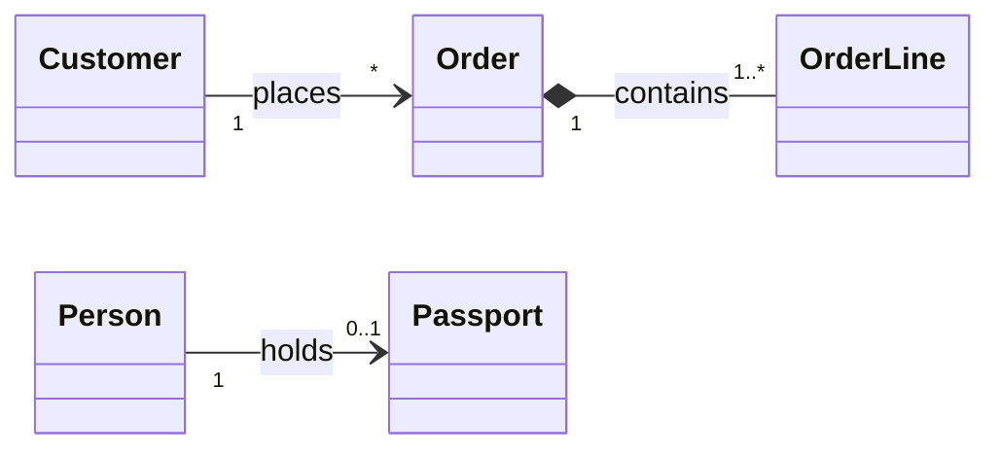

*Read each end aloud: "one customer places zero or more orders", "one order contains one or more lines", "a person holds zero or one passport". Reading the multiplicity out loud is the best way to catch a wrong one.*

```python
from dataclasses import dataclass, field


@dataclass
class Passport:
    number: str


@dataclass
class Order:
    id: int


@dataclass
class Customer:
    name: str
    orders: list[Order] = field(default_factory=list)  # 0..*


@dataclass
class Person:
    name: str
    passport: Passport | None = None  # 0..1


person = Person("Asha")
print(person.passport)
person.passport = Passport("K1234567")
print(person.passport.number)
```

Output:

```text
None
K1234567
```

!!! tip "Interview tip"
    Always put multiplicities on associations. "One-to-many" versus "many-to-many" changes the code (a single field versus a collection, or a link class in the middle), and interviewers check that you noticed.

### 3.3 Aggregation: "has a, but can live on its own"

A **whole made of parts, where the parts have their own life**. Remove the whole and the parts still exist.

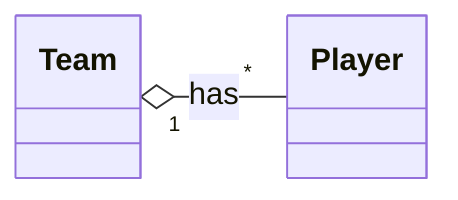

*Read: a team has many players. The hollow diamond is on the whole, `Team`. Players exist independently of any particular team.*

```python
class Player:
    def __init__(self, name: str) -> None:
        self.name = name


class Team:
    def __init__(self, name: str) -> None:
        self.name = name
        self.players: list[Player] = []

    def sign(self, player: Player) -> None:
        self.players.append(player)  # the player comes from outside


asha = Player("Asha")
team = Team("Red")
team.sign(asha)
del team  # the team is gone...
print(asha.name)  # ...but the player lives on
```

Output:

```text
Asha
```

**When to use:** collections of independent things: a team and its players, a playlist and its songs, a department and its employees.

!!! warning "The fuzzy one"
    The UML specification gives aggregation very little precise meaning beyond "whole and part", and many authors recommend drawing plain association instead. Interviewers, however, often still ask you to distinguish aggregation from composition, so learn the difference in the next section.

### 3.4 Composition: "owns, and the part dies with it"

A **stronger** whole-part relationship. The whole creates and owns its parts, a part belongs to **one** whole at a time, and when the whole is destroyed, so are its parts.

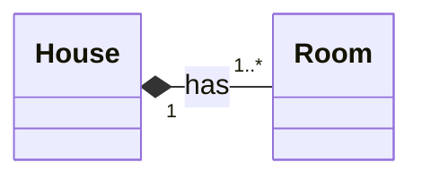

*Read: a house is made of one or more rooms. The filled diamond is on the whole, `House`. A room has no meaning outside its house.*

```python
class Engine:
    def __init__(self) -> None:
        self.running = False

    def start(self) -> None:
        self.running = True


class Car:
    def __init__(self) -> None:
        self._engine = Engine()  # created here, owned here, never handed out

    def start(self) -> None:
        self._engine.start()

    @property
    def running(self) -> bool:
        return self._engine.running


car = Car()
car.start()
print(car.running)
```

Output:

```text
True
```

!!! note "Python cannot enforce lifetimes"
    Nothing stops another object from keeping a reference to `car._engine` after the car is gone, because `_engine` is only private by convention. Composition in a diagram states the **design intent**: this object is created by the whole, belongs to it alone, and is not shared. The clue in the code is that the whole *creates* the part and does not accept it from outside.

**The lifetime test.** Ask: "If I delete the whole, should the part still make sense?" A `Room` without a `House`? No, so composition. A `Player` without a `Team`? Yes, so aggregation or association.

| | Aggregation | Composition |
|---|-------------|-------------|
| Diamond | Hollow | Filled |
| Who creates the part? | Someone else, then it is added | The whole itself |
| Part can be shared? | Yes | No, one owner |
| Part outlives the whole? | Yes | No |
| Example | Team and Player | House and Room |

### 3.5 Dependency: "uses briefly"

The weakest relationship: one class **uses** another only inside a method. It does not keep a reference.

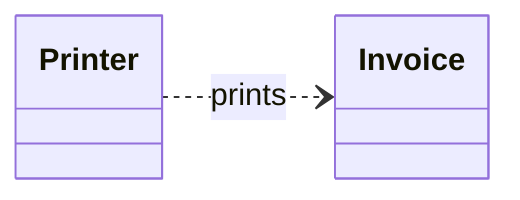

*Read: a printer depends on an invoice. If `Invoice` changes, `Printer` may break, but `Printer` does not remember any invoice.*

```python
class Invoice:
    def __init__(self, total: float) -> None:
        self.total = total


class Printer:
    def print(self, invoice: Invoice) -> str:  # Invoice appears only as a parameter
        return f"Invoice total: {invoice.total:.2f}"


print(Printer().print(Invoice(250)))
```

Output:

```text
Invoice total: 250.00
```

Signs of a dependency in code: the other class shows up as a **parameter type, a return type, a local variable**, or is only called statically. It is **not** stored in a field, otherwise it is an association.

**When to use:** to show that a change in B can ripple into A. Draw dependencies **sparingly**: most classes depend on many others, and showing all of them turns the diagram into noise. Show the ones that matter to the design.

### 3.6 Generalization: "is a kind of" (inheritance)

A child class **is a** specialised version of a parent and inherits its attributes and operations.

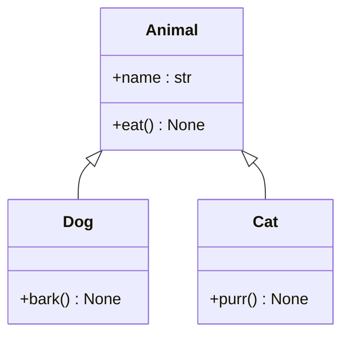

*Read: a dog is an animal, and a cat is an animal. The hollow triangle points at the **parent**. `Dog` shows only what it adds (`bark`), because `name` and `eat` are inherited.*

```python
class Animal:
    def __init__(self, name: str) -> None:
        self.name = name

    def eat(self) -> str:
        return f"{self.name} is eating"


class Dog(Animal):
    def bark(self) -> str:
        return f"{self.name} says woof"


dog = Dog("Rex")
print(dog.eat())
print(dog.bark())
print(isinstance(dog, Animal))
```

Output:

```text
Rex is eating
Rex says woof
True
```

**The is-a test.** Say the sentence: "A Dog **is an** Animal." If it sounds wrong ("A Car is an Engine"), it is not inheritance. That case is composition: a car **has an** engine.

!!! warning "Common mistake: inheritance for code reuse"
    Do not inherit just to reuse code. If the "is a" sentence is false or only true by accident, use **composition** (hold the other object in a field). Deep inheritance trees are hard to change, and this is why design pattern advice says "prefer composition over inheritance".

### 3.7 Realization: "implements this interface"

A class **promises to provide** what an interface declares. The interface has no implementation, only the contract.

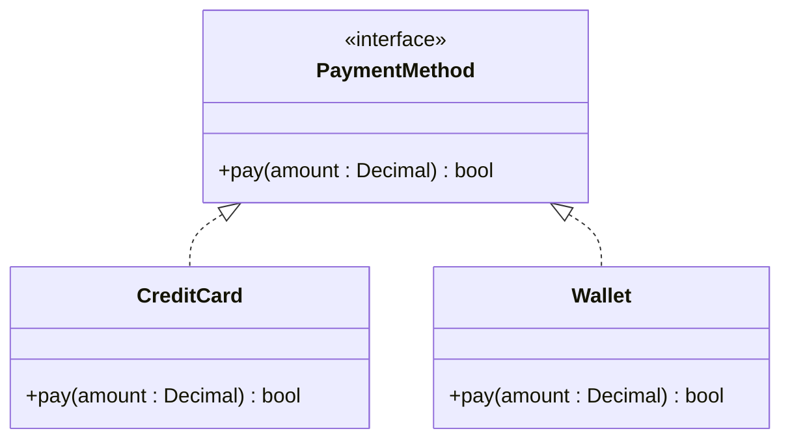

*Read: `CreditCard` and `Wallet` both realize `PaymentMethod`. The line is dashed (a promise), and the triangle still points at what is being implemented. Callers hold a `PaymentMethod` and do not care which one.*

```python
from abc import ABC, abstractmethod
from decimal import Decimal


class PaymentMethod(ABC):  # <<interface>>
    @abstractmethod
    def pay(self, amount: Decimal) -> bool: ...


class CreditCard(PaymentMethod):
    def pay(self, amount: Decimal) -> bool:
        return amount <= Decimal(5000)  # pretend the card has a limit


class Wallet(PaymentMethod):
    def pay(self, amount: Decimal) -> bool:
        return amount <= Decimal(100)


methods: list[PaymentMethod] = [CreditCard(), Wallet()]
print([method.pay(Decimal(250)) for method in methods])
```

Output:

```text
[True, False]
```

In Python you can also write the interface as a `typing.Protocol`. Then a class realizes it **implicitly**, just by having the right methods, without naming it in `class X(...)`. Draw it the same way: the diagram shows the *design*, and the language decides how strictly it is enforced.

Some diagrams draw an interface as a **lollipop**: a small circle on a line. It says "this class provides this interface" without drawing the interface box. Use it when the interface has no interesting detail.

**When to use realization:** whenever callers should depend on a *capability* and not a concrete class. It is the notation behind most design patterns (Strategy, Factory, Observer, and others).

### 3.8 Which arrow do I draw?

Work through these questions in order:

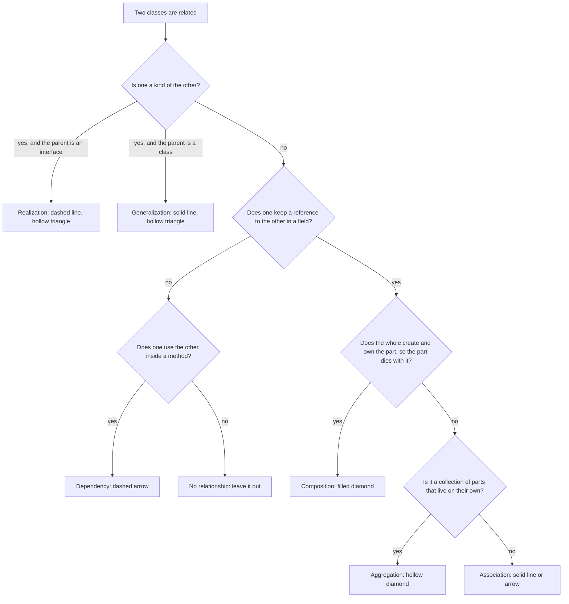

*When in doubt between two, pick the weaker one (dependency over association, association over aggregation). A wrong strong relationship misleads more than a missing one.*

## 4. More notation you will meet

### Enumerations

A fixed set of named values. Draw a class with the `<<enumeration>>` annotation and list the values.

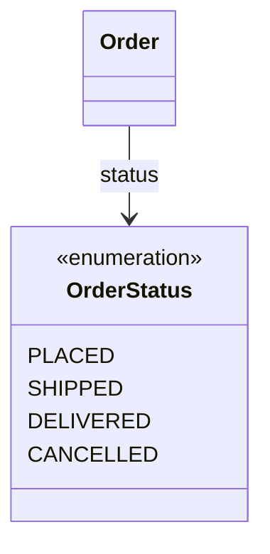

```python
from enum import Enum


class OrderStatus(Enum):
    PLACED = "placed"
    SHIPPED = "shipped"
    DELIVERED = "delivered"
    CANCELLED = "cancelled"


print(OrderStatus.SHIPPED.value)
```

Output:

```text
shipped
```

### Generic (template) classes

A class parameterised by a type. UML puts the type parameter in angle brackets, and Mermaid writes it between tildes (`~T~`).

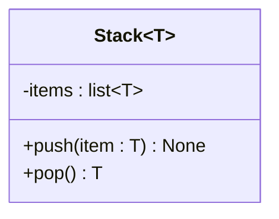

```python
class Stack[T]:  # PEP 695 syntax, Python 3.12
    def __init__(self) -> None:
        self._items: list[T] = []

    def push(self, item: T) -> None:
        self._items.append(item)

    def pop(self) -> T:
        return self._items.pop()


numbers = Stack[int]()
numbers.push(7)
print(numbers.pop())
```

Output:

```text
7
```

### Association class

Sometimes the relationship itself has data: a student enrols in a course, and the enrolment has a grade. UML draws a class attached by a dashed line to the association. Mermaid has no association-class notation, so the standard workaround is to draw the relationship as a **class in the middle**, which is also how you would write the code:

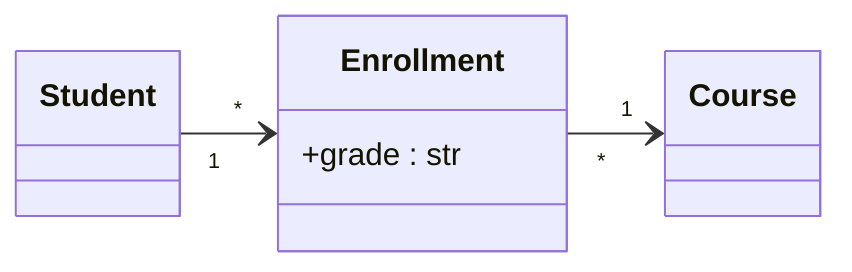

```python
from dataclasses import dataclass


@dataclass
class Student:
    name: str


@dataclass
class Course:
    title: str


@dataclass
class Enrollment:  # the relationship, promoted to a class
    student: Student
    course: Course
    grade: str


enrollment = Enrollment(Student("Asha"), Course("Algorithms"), grade="A")
print(enrollment.student.name, enrollment.course.title, enrollment.grade)
```

Output:

```text
Asha Algorithms A
```

### Self-association

A class related to itself, for example a manager who is also an employee:

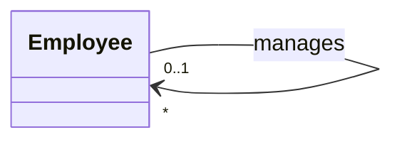

*Read: an employee is managed by zero or one manager, and a manager manages zero or more employees.*

### Notes, constraints and packages

- A **note** is free text attached to a class. Use it for a rule the notation cannot express, such as "balance can never be negative".
- A **constraint** is a rule in braces, such as `{ordered}` on a relationship, meaning the items keep an order.
- A **package** (a namespace) groups related classes. It corresponds to a Python module or package.

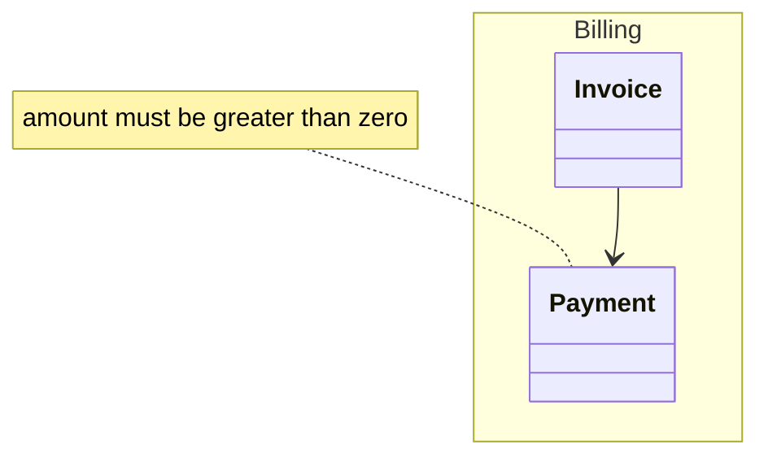

## 5. Putting it together: a library system

A single diagram that uses most of the notation. Read it before looking at the explanation below it.

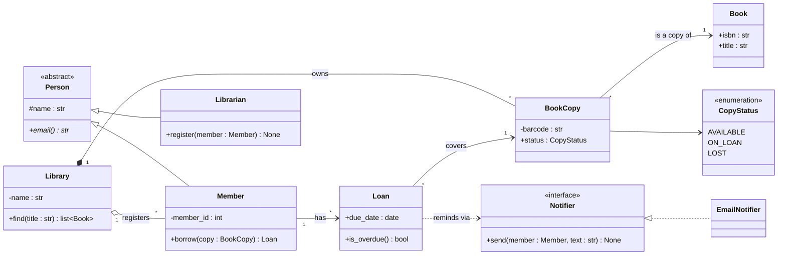

Read it line by line:

| Line | In words | Why this notation |
|------|----------|-------------------|
| `Member` and `Librarian` each to `Person` (hollow triangle) | A member is a person, and so is a librarian | Generalization: shared `name` and `email()` live in the abstract parent |
| `Library "1" *-- "*" BookCopy` | A library owns many physical copies, and a copy belongs to exactly one library | Composition: a copy is created by the library and is meaningless without it |
| `Library "1" o-- "*" Member` | A library has registered members | Aggregation: a person continues to exist if they leave the library |
| `BookCopy "*" --> "1" Book` | Many copies are copies of one book title | Association with multiplicity: each copy knows its title |
| `BookCopy --> CopyStatus` | A copy has a status | Association to an enumeration |
| `Member "1" --> "*" Loan` and `Loan "*" --> "1" BookCopy` | A member has loans, and each loan covers one copy | The `Loan` is an association class: the borrowing itself holds data (`due_date`) |
| `EmailNotifier` to `Notifier` (dashed, hollow triangle) | An email notifier implements the notifier contract | Realization: callers depend on the interface |
| `Loan ..> Notifier` | A loan uses a notifier to send reminders | Dependency: used inside a method, not stored |

**Design decisions visible in the picture:** `Book` (the title) and `BookCopy` (the physical item) are separate classes because "the library has 3 copies of one book" is a fact the model must express. `Loan` is its own class because it carries data and has behaviour (`is_overdue`). `Notifier` is an interface so the library does not care how reminders are sent.

### Exercise: read the diagrams you have already met

Two earlier pages contain class diagrams. Try naming each relationship before checking the answer.

- [Singleton: Logger class diagram](../design-principles/singleton-design-pattern/README.md#63-class-diagram)
- [Factory: Notification Service class diagram](../design-principles/factory-design-pattern/README.md#63-class-diagram)

| Look for | Relationship | Why |
|---------------------|--------------|-----|
| `Logger` and `LogHandler`: open diamond on `Logger` | Aggregation | The logger has handlers that are created elsewhere and added to it |
| `Logger` and `LogRecord`: dashed arrow | Dependency | The logger creates a record inside `log()` and does not store it |
| `ConsoleHandler` and `LogHandler`: hollow triangle at `LogHandler` | Generalization | A console handler is a handler |
| `LogHandler` and `Formatter`: solid arrow | Association | The handler keeps a formatter in a field |
| `SimpleFormatter` and `Formatter`: dashed line, hollow triangle | Realization | `Formatter` is a `Protocol`, and `SimpleFormatter` implements it |
| `NotifierFactory` and `Notifier`: dashed arrow | Dependency | The factory builds a notifier and hands it over |
| `Notifier` and `Channel`: dashed arrow | Dependency | `create_channel()` returns a channel that `notify()` uses locally |
| `Channel` and `Gateway`: solid arrow | Association | The channel holds its gateway in a field |

## 6. How much detail to draw

A class diagram is a **communication tool**, not a full specification. Choose the level to match the audience:

| Level | Shows | Use it when |
|-------|-------|-------------|
| **Conceptual** | Class names and relationships only | Early discussion, or explaining the domain to non-programmers |
| **Design** | Key attributes and the important operations, visibility, multiplicities | Interviews and design reviews. This is the default |
| **Implementation** | Every attribute, signature and type | Documenting an existing codebase, usually generated by a tool |

For low-level design interviews, aim for the **design** level:

- **Include:** classes with a clear responsibility, the important operations, multiplicities, and every relationship that shapes the design.
- **Leave out:** getters and setters, trivial helpers, `__init__` boilerplate, and dependencies that do not matter to the story you are telling.

### A drawing routine that works

1. **List the nouns** in the requirements. These are candidate classes.
2. **Give each class one responsibility.** Split or merge until each has a single clear job.
3. **List the verbs.** These become operations, on the class that has the data.
4. **Draw the relationships** using the flowchart in 3.8, then add multiplicities.
5. **Look for variation.** Where behaviour differs (payment types, notification channels), introduce an interface and realizations.
6. **Name the patterns** you used, and add a note for any rule the notation cannot show.

## 7. Mermaid cheat sheet

Everything above, in the syntax this repository uses:

```text
Class box            class Name { +field : type   -private   #protected   ~package }
Method               +method(arg : type) return_type
Static / abstract    +method()$ type       +method()* type
Annotation           <<interface>>  <<abstract>>  <<enumeration>>  (first line inside the box)
Generic              class Stack~T~        list~T~
Lollipop interface   Pet ()-- Dog

Generalization       Parent <|-- Child
Realization          Interface <|.. Implementation
Composition          Whole *-- Part
Aggregation          Whole o-- Part
Association          A --> B         (plain link: A -- B)
Dependency           A ..> B

Multiplicity         Customer "1" --> "0..*" Order : places
Label                A --> B : label text
Note                 note for Name "text"
Package              namespace Billing { class Invoice }
Layout direction     direction LR      (LR, RL, TB, BT)
```

Mermaid draws diagrams from text, so they can live in the same Markdown file as the explanation, show up cleanly in code review diffs, and never go out of date as image files do. One limitation to remember: it has no association-class or qualified-association notation, and no use-case diagram type.

## 8. When to use class diagrams

**Use them:**

- In **low-level design interviews**, right after clarifying requirements.
- In **design reviews and pull requests**, to show how a change reshapes the classes.
- To **onboard** someone to a codebase, or to document a module's structure.
- To **compare alternatives**: draw both designs and see which is simpler.
- To **spot problems early**: a class with 12 arrows into it is a warning sign, and so is a diagram you cannot draw on one screen.

**Do not use them:**

- To describe **behaviour over time**. A class diagram is static. Use a sequence or state diagram for "what happens when".
- For every class in a large system. Draw the part relevant to the question.
- As a substitute for talking. A diagram nobody explains is only half a design.

| Benefit | Cost |
|---------|------|
| A whole design becomes visible in seconds | Static only: it shows structure, not the order of calls |
| Forces you to decide relationships and multiplicities | Drawings go stale when the code changes, unless they are generated or kept in the repo |
| A shared vocabulary within a team | Too much detail makes them unreadable, and too little makes them useless |
| Cheap to change before any code exists | The notation has subtle rules (aggregation vs composition) that people get wrong |

!!! note "Real world"
    Some tools go the other direction, and generate class diagrams from code. For Python, `pylint` ships `pyreverse`, which reads a package and draws its classes and relationships. That is handy for documenting an existing codebase, though hand-drawn diagrams at the design level are usually clearer than generated implementation-level ones.

## 9. Other UML diagrams you will meet

Class diagrams show structure. When the question is about *behaviour*, switch diagram. All of these render in Mermaid except the use-case diagram.

| Diagram | Shows | Use it when | Mermaid type |
|---------|-------|-------------|--------------|
| **Sequence** | Messages between objects in time order for one scenario | Explaining a flow such as "what happens on `log.info()`" | `sequenceDiagram` |
| **State** | The states of one object and the events that move it between them | An object with a lifecycle: an order (placed, shipped, delivered), a connection | `stateDiagram-v2` |
| **Activity** | Steps, decisions and parallel branches of a process | A workflow or an algorithm | `flowchart` |
| **Use case** | Who uses the system and for what goals | Gathering requirements with stakeholders | Not supported. Use a table of actors and goals |
| **Entity-relationship** | Tables and their relationships (not UML, but often drawn beside it) | Data modelling for a database | `erDiagram` |

The Logger and Notification Service pages use a class diagram for structure and a sequence diagram for the main flow, which is the usual pair for a low-level design answer.

## 10. Common mistakes

| Mistake | What is wrong | Fix |
|---------|---------------|-----|
| Arrow on the wrong end of inheritance | The triangle must point at the **parent** | Remember "child points to parent", and in Mermaid write the parent on the left of the arrow |
| Diamond on the part, not the whole | The diamond sits on the **whole** | `Whole *-- Part` |
| Everything is an association | The diagram loses the ownership and lifetime story | Use the flowchart in 3.8 |
| Composition when the part is shared | A composed part has exactly one owner | Use aggregation or association |
| Inheritance to reuse code | "Is a" is false, so the design is fragile | Hold the object in a field (composition) |
| No multiplicities | Readers cannot tell one-to-one from one-to-many | Put a number on every association end |
| Showing every getter, setter and dependency | The important structure is buried | Design-level detail only |
| One giant diagram | Nobody can read it | Split by feature or package, and keep each under about a dozen classes |
| Attributes that are really relationships | `Order` lists `customer : Customer` as an attribute *and* draws an arrow to `Customer` | Show it once, as the relationship. Keep plain attributes for simple values |
| Class names that are verbs or vague (`Manager`, `Processor`, `Data`) | Unclear responsibility | Name classes after domain nouns |

## 11. Interview tips

!!! tip "Interview tip: what a good class diagram in an interview looks like"
    1. Start from the requirements, and name classes with clear single responsibilities.
    2. Draw **interfaces and abstract classes** where behaviour varies, and say which pattern that is.
    3. Put **multiplicities** on associations and get the arrow directions right.
    4. Keep it to about 6 to 10 classes, with the key operations only.
    5. Talk while you draw, and state assumptions ("I assume a copy belongs to exactly one library").

Common questions and short model answers:

| Question | Short answer |
|----------|--------------|
| Aggregation vs composition? | Both are "has-a". In composition the whole **creates and owns** the part, the part has one owner and dies with the whole (house and rooms). In aggregation the parts have their own lifetime and can be shared or moved (team and players) |
| Association vs dependency? | Association is a **long-lived** reference held in a field. Dependency is a **short-lived** use inside a method: a parameter, a return value or a local variable |
| Inheritance vs composition? | Inheritance is "is a" and fixes the relationship at design time. Composition is "has a" and lets you swap parts at run time. Prefer composition unless the "is a" sentence is truly correct |
| How do you show an interface? | A box with `<<interface>>` and realization arrows (dashed line, hollow triangle) from the implementing classes. In Python that is a `Protocol` or an `ABC` |
| What does the arrowhead on an association mean? | Navigability: the class at the tail can reach the class at the head. No arrowhead means it is undecided or bidirectional |
| How do you show a many-to-many relationship? | Two `*` multiplicities. If the relationship carries data, promote it to its own class (an association class) with a one-to-many on each side |
| How detailed should the diagram be? | Design level: important attributes and operations, no getters or setters, all the relationships that shape the design |
| Which other diagrams do you draw? | A sequence diagram for the main flow, and a state diagram if an object has a meaningful lifecycle |
| How do UML notations map to Python? | Generalization is `class B(A)`. Realization is an `ABC` or `Protocol`. Composition is a part created inside `__init__`. Aggregation and association are injected fields. Dependency is a parameter or local. Enumeration is `Enum`. Generics are `Stack[T]` |

## 12. Key takeaways

- A class box has **three compartments**: name, attributes, operations. Members carry **visibility** (`+ - # ~`), and static or abstract markers.
- There are **six relationships**: association, aggregation, composition, dependency, generalization and realization. Choose by asking "is a?", "keeps a reference?", "owns and controls the lifetime?".
- **Solid means strong, dashed means weak or a promise.** Triangles point at the parent or interface, and diamonds sit on the whole.
- **Composition** = owns and dies with it. **Aggregation** = has, but the part can live on. **Dependency** = uses briefly.
- Always add **multiplicities**, and read them aloud to check them.
- Draw at the **design** level: the structure that matters, not every getter.
- A class diagram shows structure only. Pair it with a **sequence** or **state** diagram for behaviour.
- In Python, the notation states **intent** that the language does not enforce. That is exactly why it is worth drawing.

## References

- Object Management Group. *Unified Modeling Language (UML) Specification*, version 2.5.1. The authoritative definition of the notation.
- Martin Fowler. *UML Distilled: A Brief Guide to the Standard Object Modeling Language*, 3rd edition. Addison-Wesley, 2003. A short, practical guide to the parts of UML worth using.
- Mermaid documentation: [Class diagrams](https://mermaid.js.org/syntax/classDiagram.html).
- Python documentation: [`abc`](https://docs.python.org/3/library/abc.html), [`typing.Protocol`](https://docs.python.org/3/library/typing.html#typing.Protocol), [`enum`](https://docs.python.org/3/library/enum.html), [`dataclasses`](https://docs.python.org/3/library/dataclasses.html), [generic classes (PEP 695)](https://docs.python.org/3/reference/compound_stmts.html#generic-classes).
