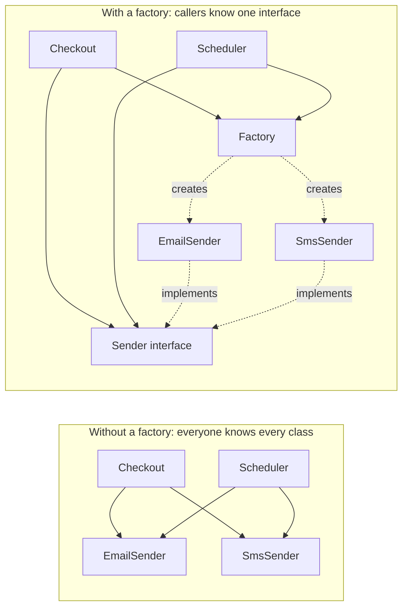
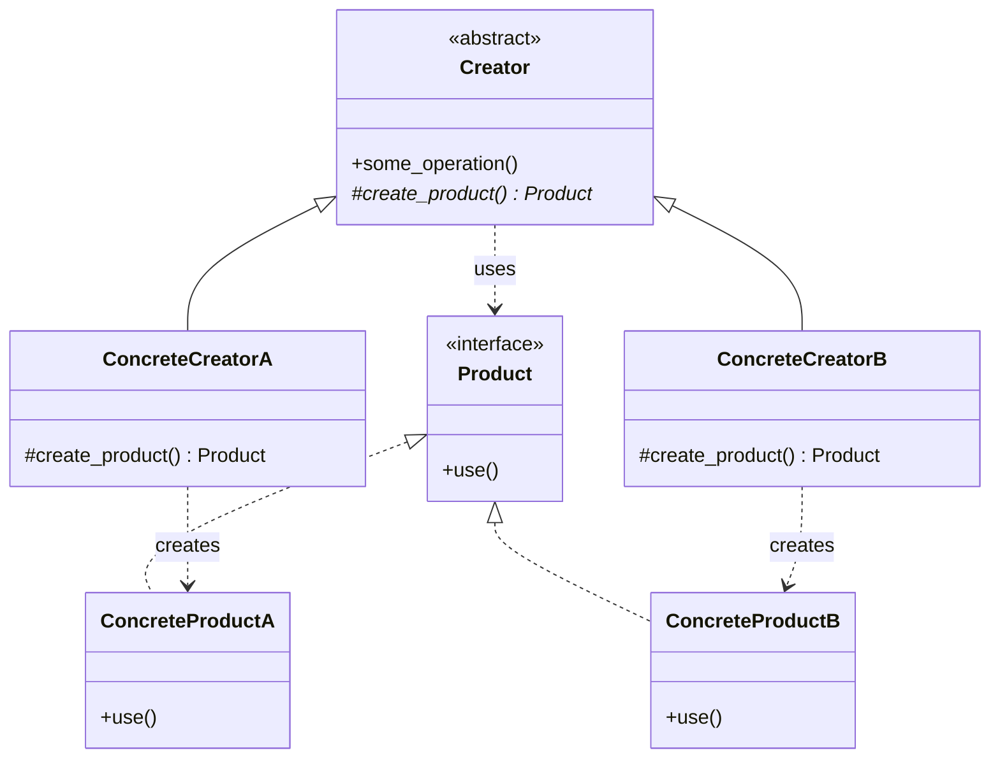
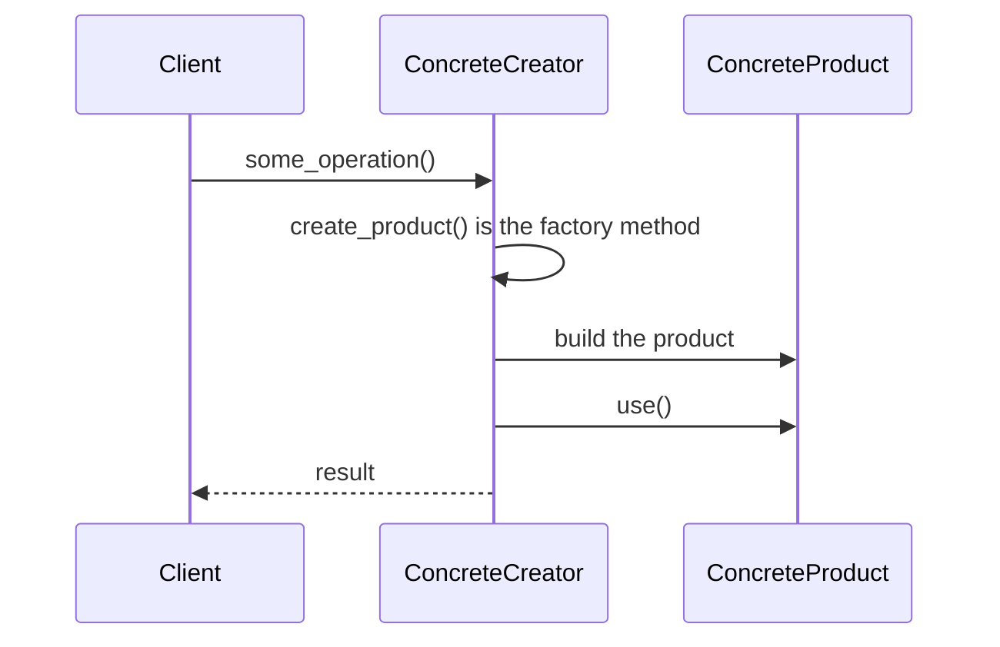
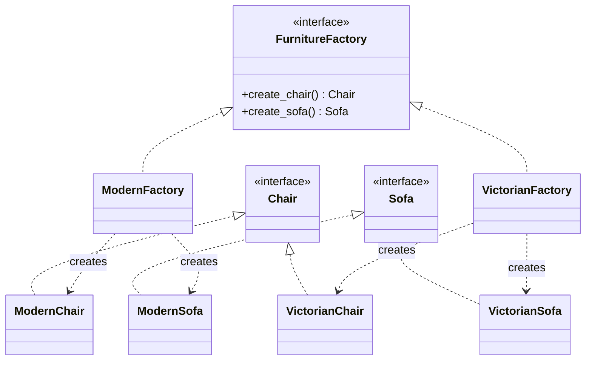
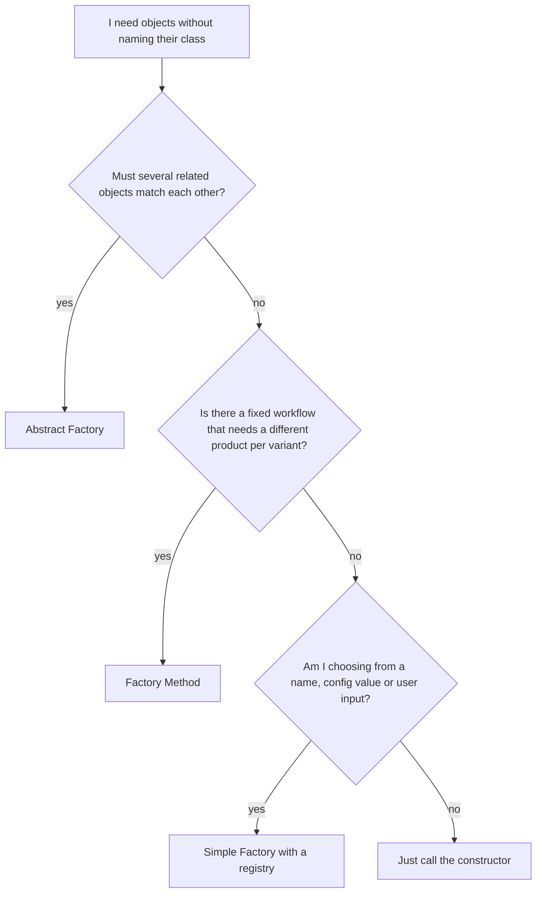
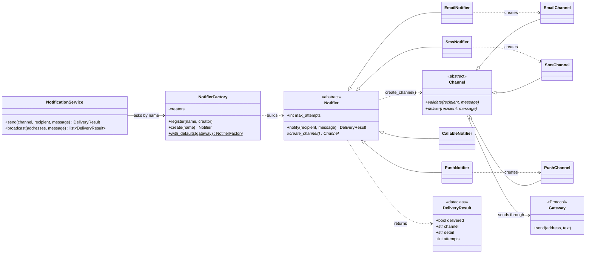
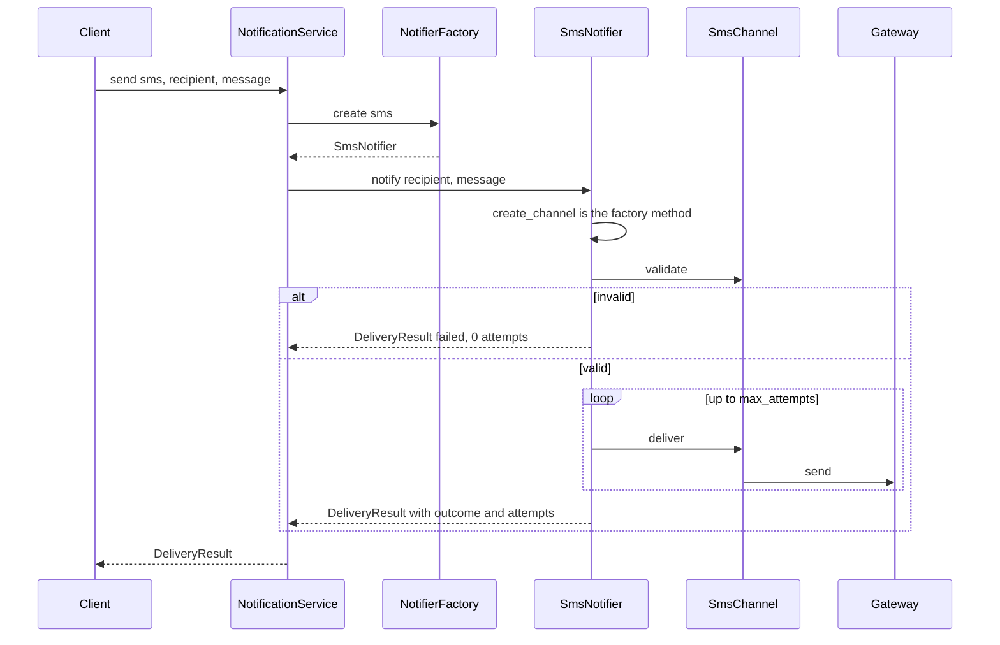

# Factory Design Pattern

**What you will learn**

- The problem factories solve, in plain language.
- The three "factory" ideas people mix up: **Simple Factory**, **Factory Method** and **Abstract Factory**, and how to tell them apart.
- The official (Gang of Four) definitions, explained phrase by phrase.
- How to apply them in a real design: a **Notification Service** with class diagrams, decisions and tradeoffs, and runnable, tested Python 3.12 code.
- Where the pattern is used, where it is overkill, and how to talk about it in an interview.

The Notification Service source lives next to this page as real `.py` files with tests. Everything was run on Python 3.12 and the output shown is real. Code blocks with a file title are the real files, and a test checks that they match. Blocks without a title are illustrations.

---

## 1. The problem

Your app sends notifications by email, SMS and push. The quickest way to write it is a chain of `if` statements that builds the right sender:

```python
def send_notification(channel: str, recipient: str, message: str) -> None:
    if channel == "email":
        client = SmtpClient(host="smtp.example.com", user=..., password=...)
        client.send_mail(recipient, subject="Notification", body=message)
    elif channel == "sms":
        client = SmsProviderClient(api_key=...)
        client.send_text(recipient, message[:160])
    elif channel == "push":
        client = PushServiceClient(project_id=...)
        client.send_push(recipient, message)
    else:
        raise ValueError(f"unknown channel {channel}")
```

It works, but the same chain soon gets copied into the retry job, the scheduler and the admin tool. Then:

1. **Every new channel edits every chain.** Adding WhatsApp means finding and changing all the copies, and missing one is a bug.
2. **Callers depend on concrete classes.** `SmtpClient` and friends are imported everywhere, so you cannot test the callers without a real (or mocked) SMTP server.
3. **Creation details leak into business logic.** Hosts, keys and settings are mixed into code whose real job is "tell the user their order shipped".



*Left: every caller is tied to every concrete class. Right: callers talk to an interface and ask a factory for the object, so only the factory knows the concrete classes.*

What we want is a **single place that decides which class to create**, handing back something callers can use without knowing what it really is. That is the idea behind the Factory family of patterns.

## 2. An everyday analogy

Think of a **ride-hailing app**. You tap "Ride". The app runs the same process every time: estimate the fare, match a driver, track the trip, take payment. But *what kind of vehicle shows up* depends on the city: an auto-rickshaw in Mumbai, a yellow cab in New York, a tuk-tuk in Bangkok.

- The **process is fixed** and lives in the app. It never says "auto-rickshaw".
- The **vehicle is decided by a local operator** who overrides one step: "create the vehicle".

That is **Factory Method**: a fixed workflow that hands one decision, "which object do I create?", to a subclass.

Now picture a **furniture showroom** with themed collections. If you choose the "Modern" collection you get a modern chair, a modern sofa and a modern table, and they match. You would not want a Victorian chair next to a modern sofa. That is **Abstract Factory**: one factory that produces a whole *family* of matching objects.

And the person at the reception desk who hears "I'd like a taxi" and calls the right company? That is a **Simple Factory**: a helper that maps a request to the right thing.

## 3. What a factory is, in plain words

> A factory is code whose only job is to **decide which concrete class to create**, and to hand the object back as something with a **known interface**. Callers say *what they need*, not *which class to build*.

There are three flavours, and interviewers care that you can separate them:

| Flavour | One-line idea | In the GoF book? | Typical shape |
|---------|---------------|------------------|---------------|
| **Simple Factory** | One function or class that maps a name or condition to an object | No, it is a common programming idiom | `create("email")` returns an email notifier |
| **Factory Method** | A base class has a fixed workflow and an abstract "create" step; **subclasses decide** what to create | Yes | `Notifier.create_channel()` overridden by `EmailNotifier` |
| **Abstract Factory** | An interface for creating **families of related objects** that must go together | Yes | `ModernFactory` creates a modern chair *and* a modern sofa |

## 4. The official definitions

Both patterns come from *Design Patterns: Elements of Reusable Object-Oriented Software* (Gamma, Helm, Johnson and Vlissides, 1994, the "Gang of Four" or GoF book). Simple Factory is not one of its 23 patterns.

### Factory Method

> **"Define an interface for creating an object, but let subclasses decide which class to instantiate. Factory Method lets a class defer instantiation to subclasses."**

| Phrase | What it means in practice | Why it is there |
|--------|---------------------------|-----------------|
| **"Define an interface for creating an object"** | A method, such as `create_channel()`, that returns a `Channel` (the abstract type) | The base class can ask for "a channel" without naming one |
| **"but let subclasses decide which class to instantiate"** | `EmailNotifier` overrides the method to return an `EmailChannel`, `SmsNotifier` returns an `SmsChannel` | The decision moves to where the knowledge is |
| **"lets a class defer instantiation to subclasses"** | The base class does all the shared work (validate, retry, report), and only the "which object?" step is postponed | You reuse one workflow for many products |

!!! note "A variation you will meet"
    The GoF book also describes a **parameterized factory method**: a factory method that takes an identifier ("email", "sms") and decides what to return. That is very close to what people call a Simple Factory, and it is what the `NotifierFactory` below does.

### Abstract Factory

> **"Provide an interface for creating families of related or dependent objects without specifying their concrete classes."**

| Phrase | What it means in practice | Why it is there |
|--------|---------------------------|-----------------|
| **"an interface for creating"** | A factory with one creation method per kind of object, e.g. `create_chair()` and `create_sofa()` | Callers depend on this interface only |
| **"families of related or dependent objects"** | A set of objects that must match each other (same theme, same platform, same vendor) | Prevents mixing a Victorian chair with a modern sofa |
| **"without specifying their concrete classes"** | Callers never write `ModernChair(...)` | Swapping the whole family is a one-line change |

## 5. Structure

**Factory Method.** The creator holds the workflow and calls the abstract factory method. Each concrete creator overrides it:



| Role | Meaning | In the Notification Service |
|------|---------|-----------------------------|
| **Product** | The interface of the thing being created | `Channel` |
| **Concrete product** | One implementation | `EmailChannel`, `SmsChannel`, `PushChannel` |
| **Creator** | Owns the workflow and declares the factory method | `Notifier` |
| **Concrete creator** | Overrides the factory method | `EmailNotifier`, `SmsNotifier`, `PushNotifier` |



*The client only talks to the creator. The creator's own code calls `create_product()`, and the subclass decides what comes back.*

**Abstract Factory.** One factory interface, several creation methods, one concrete factory per family:



*The client holds a `FurnitureFactory` and never learns which family it got. Everything it creates matches.*

**Which one do I need?**



*The last branch matters: if nothing varies, a factory is needless indirection.*

!!! note "Python is not built like the books' languages"
    In Python, classes are objects and can be passed around and called like functions. So `EmailChannel` itself is already a "factory function" for email channels, and a plain `dict` of name to class often replaces a whole class hierarchy. Section 6 keeps the textbook Factory Method *and* ships the Pythonic alternative side by side so you can compare them.

## 6. Worked example: Design a Notification Service

Time to use the ideas on a real low-level design problem. Most products send notifications through several channels, and "design a notification system" is a common interview question.

The full source is in this folder as real Python files with tests. Everything below explains *why* it looks the way it does.

| File | Purpose |
|------|---------|
| `notifications/channel.py` | The products: `Channel` and its three implementations |
| `notifications/notifier.py` | The creators: `Notifier` with the factory method, plus its subclasses |
| `notifications/factory.py` | The simple factory with a registry: name in, notifier out |
| `notifications/service.py` | The client that application code calls |
| `notifications/gateway.py`, `errors.py`, `result.py` | The outside world, the error types and the result |
| `demo.py` | A runnable demo |
| `tests/` | `pytest` tests |

### 6.1 Requirements

**Functional**

- Send a message to a recipient on a chosen channel: **email**, **SMS** or **push**.
- Each channel has its own rules. An email needs an address, an SMS needs an E.164 phone number and at most 160 characters, and a push needs a device token.
- Retry when the provider has a temporary failure, and give up after a limit.
- Send one message on **every channel a user has an address for**, using their saved preferences.
- Report the outcome of every send.

**Non-functional**

- **Extensible**: adding a channel (Slack, WhatsApp) must not require editing existing classes (Open/Closed Principle).
- **Testable**: application code must be testable without real email or SMS servers.
- **Robust**: a bad address or a stale channel name on one channel must not stop the other channels.

**Out of scope** (good follow-ups, see [6.9](#69-extending-it-and-interview-follow-ups)): real provider integrations, backoff between retries, asynchronous sending, templates, delivery receipts, persistence.

### 6.2 Finding the classes

Underline the nouns, then give each class one job:

| Class | Its one job | What it does *not* know |
|-------|-------------|-------------------------|
| `NotificationService` | The entry point for application code: sends on one channel, or on all of a user's channels | Any concrete class |
| `NotifierFactory` | Turns a channel **name** into a ready `Notifier` | How sending works |
| `Notifier` (creator) | The delivery workflow: build the channel, validate, send with retries, report | Which concrete channel it is dealing with |
| `EmailNotifier`, `SmsNotifier`, `PushNotifier` | Decide which channel to build and carry that channel's retry budget | The workflow's details |
| `Channel` (product) | One way of reaching a person: its validation rules and its message format | Retries, or how it was chosen |
| `Gateway` | The outside world (SMTP server, SMS provider) | Anything about notifications |
| `DeliveryResult` | The outcome of one send | Everything else |

### 6.3 Class diagram



*Reading the diagram: the service asks the factory for a `Notifier` by name. `Notifier` is the Factory Method **creator**: its workflow calls `create_channel()`, and each subclass overrides that to build its own `Channel`. `NotifierFactory` is the simple factory that maps names to notifiers. `CallableNotifier` is the Pythonic alternative to writing one subclass per channel.*

### 6.4 What happens on `service.send("sms", ...)`



*The loop stops at the first success. A `TransientChannelError` from the gateway triggers another attempt; when the budget runs out, the result says so.*

### 6.5 Design decisions and tradeoffs

This is the part interviewers care about most. Each row is a real choice with a real cost:

| # | Decision | Chosen | Alternative | What it costs us |
|---|----------|--------|-------------|------------------|
| 1 | Where the delivery workflow lives | In `Notifier.notify()`: validate, retry, report | In the service, or copied into each channel | The workflow needs a base class, and that base class must not know concrete channels |
| 2 | How the workflow gets its channel | **Factory Method**: `create_channel()` overridden per subclass | `if channel == "email"` inside the workflow | One small subclass per channel (three lines each) |
| 3 | How a name becomes a notifier | A **simple factory with a registry**: `dict[str, creator]` | An `if/elif` chain in the factory | Names are strings, so a typo is caught at run time. The error message lists the valid names to soften that |
| 4 | Where the registry lives | An **instance** built at start-up and passed in | A global registry filled by decorators | A little wiring code. In return there is no hidden global state, and each test gets its own factory (see the [Singleton tradeoffs](../singleton-design-pattern/README.md#8-tradeoffs-and-criticism)) |
| 5 | Registry thread-safety | Register at start-up, then only read | A lock around every access | You must not register while serving traffic |
| 6 | What `create_channel()` returns each call | A **fresh channel** every time | Cache one channel per notifier | Cheap here. If building a channel opened a connection, you would cache it |
| 7 | Reporting failures | Return a `DeliveryResult`, never raise for bad input or exhausted retries | Raise exceptions | Callers must look at the result. In return, one failed channel cannot abort the others |
| 8 | Unknown channel name | `send()` **raises** `UnknownChannelError`, but `broadcast()` turns it into a failed result | Always raise, or always swallow | Two behaviours to learn. It fits the two uses: a direct call with a bad name is a bug, while stored preferences can be stale |
| 9 | Retry policy | A `max_attempts` class attribute, overridable per notifier | One global setting | It lets each channel carry its own budget, at the price of more places to look |
| 10 | Shipping a Pythonic variant | `CallableNotifier(make_channel)` next to the subclasses | Subclasses only | Two ways to do the same thing. Worth it because the comparison is the lesson (see 6.6) |

Smaller choices:

- `DeliveryResult` is a **frozen dataclass**: a result cannot change after it is created.
- `Gateway` is a **`Protocol`**, so any object with a `send(address, text)` method qualifies. Tests use `RecordingGateway`, and production would supply an SMTP or SMS gateway.
- `Channel.validate()` **raises** `InvalidNotification`, and `Notifier.notify()` turns that into a result. Validation stays simple inside the channel, and the reporting policy stays in one place.

### 6.6 Choosing the factory flavour

Which of the three flavours does this design need? Compare the realistic options:

| Option | Adding a "Slack" channel means | Verdict for this design |
|--------|--------------------------------|-------------------------|
| `if/elif` on the channel name | Editing every chain, in every file that has one | The problem from section 1. Avoid |
| Simple factory as an `if/elif` inside one function | Editing that one function | Fine for a small, stable set. Breaks Open/Closed |
| **Simple factory with a registry** | Registering one more entry at start-up | **Chosen** for selecting by name |
| **Factory Method** (`Notifier` subclasses) | One `Channel` class + one `Notifier` subclass + one register line | **Chosen** for the workflow: it shares the retry logic and lets each notifier carry its own policy |
| Callable instead of a subclass (`CallableNotifier`) | One `Channel` class + one register line | Less code. Loses the "a subclass can override more than the creation step" flexibility |
| Abstract Factory | Depends on the families | **Not needed** here. See below |

Notice that the last two rows are honest competitors. For a design this small, `CallableNotifier` is enough, and many Python teams would ship only that. The subclass form earns its keep when a concrete notifier needs to override *more* than creation (a custom retry policy, extra logging, a different validation order), and it is the shape interviewers expect you to recognise.

**Why not an Abstract Factory?** Abstract Factory is for **families of objects that must match**. Here each channel produces a single kind of object. It would become the right tool the day each channel also needs, say, its own *message formatter* and its own *rate limiter*, and those must be consistent with the channel. Then you would have `ChannelKit` factories (`EmailKit`, `SmsKit`) that create the sender, formatter and limiter together, so an SMS formatter can never be paired with an email sender. Do not add that structure until the requirement exists.

!!! tip "Interview tip"
    Say the flavours out loud as you choose: "I would start with a registry-based simple factory to pick by name. The delivery workflow is shared but the channel differs, so that is a Factory Method. I would only reach for Abstract Factory if channels needed matching families of objects." That shows you know the vocabulary *and* when each one applies.

### 6.7 Testing, and what the tests prove

| Test file | What it proves |
|-----------|----------------|
| `test_channels.py` | Each channel accepts good input and rejects bad addresses, empty text and over-long text (SMS is exactly 160, push exactly 200), and formats its own message |
| `test_notifier.py` | First-try success; retries until success; gives up after `max_attempts`; invalid input is never sent; each notifier has its own retry budget; the factory method is a test seam; `CallableNotifier` matches a subclass |
| `test_factory.py` | Correct notifier per name; a fresh one per call; helpful unknown-name error; duplicate names rejected; **a brand-new channel works through the factory without changing existing code** |
| `test_service.py` | Routing by name; `send` raises for unknown names; `broadcast` keeps going when one channel is unknown or invalid |
| `test_factory_docs_in_sync.py` | The code on this page equals the files |

Two of these deserve a closer look.

**The factory method as a test seam.** Because `create_channel()` is an overridable hook, a test can subclass `Notifier`, return a scripted channel, and exercise the *whole workflow* with no gateway at all:

```python
class TestNotifier(Notifier):
    def __init__(self) -> None:
        super().__init__()
        self.channel = ScriptedChannel()

    def create_channel(self) -> Channel:
        return self.channel
```

(The full test is in `tests/test_notifier.py`.) This is a real benefit of the pattern, not just decoration.

**The open/closed check.** `test_new_channel_needs_no_change_to_existing_code` defines a `SlackChannel` and `SlackNotifier` *inside the test*, registers them with the factory, and sends through it. If adding a channel required editing the library, that test could not be written.

I also checked that the tests can fail. I broke the code on purpose in nine ways in a scratch copy (no retry, validation skipped, SMS limit ignored, duplicate names allowed, the unknown-name error hiding valid names, `broadcast` letting an unknown channel escape, the factory reusing one notifier, a wrong SMS retry budget, and the gateway not being passed to channels). Every one was caught by at least one test.

### 6.8 The code

Each block below is the real file from this folder.

**Errors and the result**

```python title="notifications/errors.py"
class InvalidNotification(ValueError):
    """The recipient or message is not acceptable for this channel. Never retried."""


class TransientChannelError(Exception):
    """A delivery attempt failed in a way that may succeed if retried."""


class UnknownChannelError(LookupError):
    """No notifier is registered under the requested channel name."""
```

```python title="notifications/result.py"
from dataclasses import dataclass


@dataclass(frozen=True, slots=True)
class DeliveryResult:
    """What happened to one notification. Failures are reported, not raised."""

    delivered: bool
    channel: str
    detail: str
    attempts: int
```

**The outside world.** `Gateway` is the contract. `ConsoleGateway` prints, and `RecordingGateway` remembers what it was asked to send, which is what tests use.

```python title="notifications/gateway.py"
import sys
from typing import Protocol, TextIO


class Gateway(Protocol):
    """The outside world: an SMTP server, an SMS provider, a push service.

    Implementations raise `TransientChannelError` for failures worth retrying.
    """

    def send(self, address: str, text: str) -> None: ...


class ConsoleGateway:
    """Prints instead of sending. Handy for demos and local development."""

    def __init__(self, stream: TextIO | None = None) -> None:
        self._stream = stream  # None means "current sys.stdout", looked up on use

    def send(self, address: str, text: str) -> None:
        print(f"to {address}: {text}", file=self._stream or sys.stdout)


class RecordingGateway:
    """Remembers everything it was asked to send. Handy for tests."""

    def __init__(self) -> None:
        self.sent: list[tuple[str, str]] = []

    def send(self, address: str, text: str) -> None:
        self.sent.append((address, text))
```

**The products.** Each channel has its own validation rules and its own message format:

```python title="notifications/channel.py"
import re
from abc import ABC, abstractmethod
from typing import ClassVar

from .errors import InvalidNotification
from .gateway import Gateway


class Channel(ABC):
    """The product: one way of reaching a person, with its own rules."""

    name: ClassVar[str]

    def __init__(self, gateway: Gateway) -> None:
        self._gateway = gateway

    @abstractmethod
    def validate(self, recipient: str, message: str) -> None:
        """Raise `InvalidNotification` if this channel cannot deliver this."""

    @abstractmethod
    def deliver(self, recipient: str, message: str) -> None:
        """Hand the message to the gateway. May raise `TransientChannelError`."""


class EmailChannel(Channel):
    name = "email"
    _ADDRESS: ClassVar[re.Pattern[str]] = re.compile(r"[^@\s]+@[^@\s]+\.[^@\s]+")

    def validate(self, recipient: str, message: str) -> None:
        if not self._ADDRESS.fullmatch(recipient):
            raise InvalidNotification(f"not an email address: {recipient!r}")
        if not message.strip():
            raise InvalidNotification("email body is empty")

    def deliver(self, recipient: str, message: str) -> None:
        self._gateway.send(recipient, f"[email] Subject: Notification | {message}")


class SmsChannel(Channel):
    name = "sms"
    MAX_LENGTH: ClassVar[int] = 160  # the classic single-message limit
    _NUMBER: ClassVar[re.Pattern[str]] = re.compile(r"\+[1-9]\d{7,14}")  # E.164

    def validate(self, recipient: str, message: str) -> None:
        if not self._NUMBER.fullmatch(recipient):
            raise InvalidNotification(f"not an E.164 phone number: {recipient!r}")
        if not message.strip():
            raise InvalidNotification("sms text is empty")
        if len(message) > self.MAX_LENGTH:
            raise InvalidNotification(
                f"sms text is {len(message)} characters, the limit is {self.MAX_LENGTH}"
            )

    def deliver(self, recipient: str, message: str) -> None:
        self._gateway.send(recipient, f"[sms] {message}")


class PushChannel(Channel):
    name = "push"
    MAX_LENGTH: ClassVar[int] = 200  # illustrative limit for this tutorial
    _TOKEN: ClassVar[re.Pattern[str]] = re.compile(r"[A-Za-z0-9_-]{8,}")

    def validate(self, recipient: str, message: str) -> None:
        if not self._TOKEN.fullmatch(recipient):
            raise InvalidNotification(f"not a device token: {recipient!r}")
        if not message.strip():
            raise InvalidNotification("push text is empty")
        if len(message) > self.MAX_LENGTH:
            raise InvalidNotification(
                f"push text is {len(message)} characters, the limit is {self.MAX_LENGTH}"
            )

    def deliver(self, recipient: str, message: str) -> None:
        self._gateway.send(recipient, f"[push] {message}")
```

**The creators.** `Notifier.notify()` is the fixed workflow. `create_channel()` is the factory method, and the three subclasses are the concrete creators. `CallableNotifier` at the bottom is the Pythonic alternative:

```python title="notifications/notifier.py"
from abc import ABC, abstractmethod
from collections.abc import Callable

from .channel import Channel, EmailChannel, PushChannel, SmsChannel
from .errors import InvalidNotification, TransientChannelError
from .gateway import ConsoleGateway, Gateway
from .result import DeliveryResult


class Notifier(ABC):
    """The creator: owns the delivery workflow, leaves *which channel* to subclasses."""

    max_attempts: int = 3

    def __init__(self, gateway: Gateway | None = None) -> None:
        self._gateway: Gateway = gateway or ConsoleGateway()

    @abstractmethod
    def create_channel(self) -> Channel:
        """The factory method: each subclass decides which channel to build."""

    def notify(self, recipient: str, message: str) -> DeliveryResult:
        channel = self.create_channel()  # the workflow never names a concrete class
        try:
            channel.validate(recipient, message)
        except InvalidNotification as problem:
            return DeliveryResult(False, channel.name, str(problem), attempts=0)

        detail = ""
        for attempt in range(1, self.max_attempts + 1):
            try:
                channel.deliver(recipient, message)
            except TransientChannelError as failure:
                detail = str(failure)
            else:
                return DeliveryResult(True, channel.name, "delivered", attempt)
        return DeliveryResult(
            False,
            channel.name,
            f"gave up after {self.max_attempts} attempts: {detail}",
            attempts=self.max_attempts,
        )


class EmailNotifier(Notifier):
    def create_channel(self) -> Channel:
        return EmailChannel(self._gateway)


class SmsNotifier(Notifier):
    max_attempts = 5  # example policy: a channel can carry its own retry budget

    def create_channel(self) -> Channel:
        return SmsChannel(self._gateway)


class PushNotifier(Notifier):
    max_attempts = 2

    def create_channel(self) -> Channel:
        return PushChannel(self._gateway)


class CallableNotifier(Notifier):
    """The Pythonic variant: pass the factory in, instead of writing a subclass."""

    def __init__(
        self,
        make_channel: Callable[[Gateway], Channel],
        gateway: Gateway | None = None,
        max_attempts: int = 3,
    ) -> None:
        super().__init__(gateway)
        self._make_channel = make_channel
        self.max_attempts = max_attempts

    def create_channel(self) -> Channel:
        return self._make_channel(self._gateway)
```

**The simple factory with a registry.** Names go in, ready-to-use notifiers come out:

```python title="notifications/factory.py"
from collections.abc import Callable
from typing import Self

from .errors import UnknownChannelError
from .gateway import Gateway
from .notifier import EmailNotifier, Notifier, PushNotifier, SmsNotifier

NotifierCreator = Callable[[], Notifier]


class NotifierFactory:
    """A simple factory with a registry: channel name in, ready-to-use notifier out.

    Register everything at start-up. Afterwards it is only read, so it needs no lock.
    """

    def __init__(self) -> None:
        self._creators: dict[str, NotifierCreator] = {}

    def register(self, name: str, creator: NotifierCreator) -> None:
        if name in self._creators:
            raise ValueError(f"channel {name!r} is already registered")
        self._creators[name] = creator

    def create(self, name: str) -> Notifier:
        try:
            creator = self._creators[name]
        except KeyError:
            available = ", ".join(self.names) or "none"
            raise UnknownChannelError(
                f"unknown channel {name!r} (available: {available})"
            ) from None
        return creator()

    @property
    def names(self) -> tuple[str, ...]:
        return tuple(sorted(self._creators))

    @classmethod
    def with_defaults(cls, gateway: Gateway | None = None) -> Self:
        factory = cls()
        factory.register("email", lambda: EmailNotifier(gateway))
        factory.register("sms", lambda: SmsNotifier(gateway))
        factory.register("push", lambda: PushNotifier(gateway))
        return factory
```

**The client.** It knows channel names and the `Notifier` interface, and nothing else:

```python title="notifications/service.py"
from collections.abc import Mapping

from .errors import UnknownChannelError
from .factory import NotifierFactory
from .result import DeliveryResult


class NotificationService:
    """The client: knows channel *names* and the `Notifier` interface, nothing else."""

    def __init__(self, factory: NotifierFactory) -> None:
        self._factory = factory

    def send(self, channel: str, recipient: str, message: str) -> DeliveryResult:
        """Send on one channel. An unknown channel is a bug, so it raises."""
        return self._factory.create(channel).notify(recipient, message)

    def broadcast(
        self, addresses: Mapping[str, str], message: str
    ) -> list[DeliveryResult]:
        """Send on every channel a user has an address for, e.g. from saved preferences.

        Stored preferences can be stale, so an unknown channel becomes a failed
        result instead of stopping the channels that still work.
        """
        results: list[DeliveryResult] = []
        for channel, recipient in addresses.items():
            try:
                results.append(self.send(channel, recipient, message))
            except UnknownChannelError as problem:
                results.append(DeliveryResult(False, channel, str(problem), attempts=0))
        return results
```

**Using it.**

```python title="demo.py"
from notifications import NotificationService, NotifierFactory


def main() -> None:
    service = NotificationService(NotifierFactory.with_defaults())

    # The service only knows channel names. Which classes get built is the factory's job.
    print(service.send("email", "asha@example.com", "Your order has shipped"))

    # A user's saved preferences drive several channels at once.
    preferences = {
        "email": "asha@example.com",
        "sms": "+919876543210",
        "push": "device-token-1234",
        "fax": "555-0100",  # a channel we no longer support
    }
    for result in service.broadcast(preferences, "Your order has shipped"):
        status = "ok    " if result.delivered else "FAILED"
        print(f"{status} {result.channel:<5} {result.detail}")

    # Bad input is reported per channel, not raised.
    print(service.send("sms", "12345", "hello"))


if __name__ == "__main__":
    main()
```

Run it with `python demo.py` from this folder. The output:

```text
to asha@example.com: [email] Subject: Notification | Your order has shipped
DeliveryResult(delivered=True, channel='email', detail='delivered', attempts=1)
to asha@example.com: [email] Subject: Notification | Your order has shipped
to +919876543210: [sms] Your order has shipped
to device-token-1234: [push] Your order has shipped
ok     email delivered
ok     sms   delivered
ok     push  delivered
FAILED fax   unknown channel 'fax' (available: email, push, sms)
DeliveryResult(delivered=False, channel='sms', detail="not an E.164 phone number: '12345'", attempts=0)
```

**Running the tests**

```bash
pip install pytest
pytest
```

From this folder or from the repository root, both work.

### 6.9 Extending it, and interview follow-ups

**Adding a channel** takes one of two routes, and both are covered by tests:

- *Classic:* write a `SlackChannel` and a `SlackNotifier` subclass, then `factory.register("slack", ...)`. Two classes.
- *Pythonic:* write a `TelegramChannel`, then `factory.register("telegram", lambda: CallableNotifier(TelegramChannel, gateway))`. One class.

Follow-up questions and where the design would go:

| Follow-up | Direction |
|-----------|-----------|
| "Wait between retries" | Add exponential backoff with jitter inside `notify()`, with the sleep function injected so tests run instantly |
| "If email fails, fall back to SMS" | A fallback chain: try channels in priority order until one succeeds (Chain of Responsibility on top of the factory) |
| "Each channel also needs its own template and rate limiter" | Now the objects must match, so introduce an **Abstract Factory** (`ChannelKit` per channel) that creates sender, formatter and limiter together |
| "Send thousands per second" | Put messages on a queue and have workers call `notify()`. The factory and workflow stay the same |
| "Do not send the same notification twice" | Add an idempotency key to the request and check it before sending |
| "Pick the channel from user preferences" | Already what `broadcast()` does. Add a preference order and stop after the first success |
| "New provider for SMS" | Write a new `Gateway`. Channels and notifiers do not change, which is the payoff of the `Gateway` protocol |

## 7. Where to use it

Use a factory when **creation logic is complicated, varies, or should be hidden** behind an interface.

| Use case | Which flavour | Why |
|----------|---------------|-----|
| **Parsers or exporters chosen by file type** (CSV, JSON, PDF) | Simple factory with a registry | The extension picks the class, callers just call `parse()` |
| **Payment methods** (card, UPI, wallet) | Simple factory, or Factory Method if there is a shared checkout workflow | Each method has its own rules but the flow is the same |
| **Notification channels** (this page) | Registry + Factory Method | Shared retry workflow, per-channel rules |
| **Database drivers** | Abstract Factory | Connection, cursor and transaction objects must all belong to the same vendor |
| **UI toolkits per platform or theme** | Abstract Factory | Buttons, menus and dialogs must match |
| **Game objects** (enemies per level) | Factory Method | The level's logic is fixed, the enemy differs |
| **Test doubles** | Factory Method | Override the creation hook to inject a fake |

**Factories you have already used in Python**

I ran each of these on Python 3.12:

| Example | What it shows |
|---------|---------------|
| `dict.fromkeys(...)`, `datetime.fromisoformat(...)`, `int.from_bytes(...)` | **Named constructors**: class methods that build an object from a particular kind of input. A close cousin of Factory Method, not the GoF pattern itself |
| `collections.namedtuple("Point", "x y")` | A factory *function* that creates a whole new class |
| `logging.getLogger("db")` | A registry factory: the same name returns the same logger every time |
| `shutil.make_archive(base_name, format)` | Simple factory by name. The supported formats here are `bztar`, `gztar`, `tar`, `xztar` and `zip` |
| `multiprocessing.get_context("spawn")` | An **Abstract Factory**: the context gives you `Process`, `Queue` and `Lock`, and `Process` is a `SpawnProcess` for one context and a `ForkProcess` for another |

Outside the standard library, `sqlalchemy.create_engine("postgresql://...")` returns an engine for whichever database dialect the URL names.

### When *not* to use it

- **There is one concrete class and no realistic second one.** Calling the constructor is clearer.
- **The `if/elif` lives in exactly one place and the cases are stable.** A factory adds a layer for no gain. Wait for the third variant.
- **Construction is trivial and never changes.** A factory around `Point(x, y)` is noise.
- **You are building a framework "just in case".** Speculative flexibility has a cost: more classes to read and more places to look.

## 8. Tradeoffs and criticism

Factories are widely used and widely overused. You should be able to argue both sides.

| Benefit | Cost |
|---------|------|
| Callers depend on an interface, not concrete classes | **More indirection**: "where does this object come from?" now takes two hops to answer |
| New variants plug in without editing existing code | **Class explosion**: Factory Method needs a creator subclass per product, and the parallel hierarchies must be kept in step |
| Creation logic (config, credentials, wiring) lives in one place | The factory can become a **dumping ground** that knows about everything |
| Easy to substitute fakes in tests | **Stringly-typed** selection: `"emial"` is a typo that only fails at run time |
| Shared workflow written once (Factory Method) | **Inheritance coupling**: subclasses depend on the base class's internals |

### Parallel class hierarchies

In the design above, every new channel needs a `Channel` *and* a `Notifier` subclass. Look at how thin the subclasses are: three lines that only say "build my channel". That is the honest cost of the textbook Factory Method, and the reason many Python codebases pass a callable instead.

`CallableNotifier` in the code above is that alternative. `CallableNotifier(EmailChannel, gateway)` behaves exactly like `EmailNotifier(gateway)`, because a class is already a function that builds an instance. One test checks that both produce the same result, and another registers a new channel with no notifier subclass at all.

The subclass form still wins when a concrete notifier must override **more** than creation (retry policy, logging, a different order of checks), or when you want the subclass hierarchy to mirror the product hierarchy for readers.

### Global registries

A tempting shortcut is a module-level dictionary that channels add themselves to with a decorator. It saves the wiring code, but it is **global mutable state**: import order matters, tests leak into each other, and you cannot have two differently configured factories. This design builds the registry as an ordinary object and passes it in, which keeps it testable. The Singleton page discusses the same trap in depth: see [tradeoffs and criticism](../singleton-design-pattern/README.md#8-tradeoffs-and-criticism).

### Testing code that uses factories

Inject the factory rather than importing it, so a test can hand in a factory that returns fakes. `NotificationService` takes a `NotifierFactory` in its constructor for exactly this reason. Where a class builds its own collaborators through a factory method, override that method in a test subclass (see 6.7).

## 9. Interview tips

!!! tip "Interview tip: how to structure your answer"
    1. Start from the problem: callers are tied to concrete classes and `if/elif` chains multiply.
    2. Name the three flavours and place your solution among them.
    3. Give the definition in your own words, then point at the moving parts: a product interface, a creator, and what varies.
    4. Volunteer the drawbacks, and say when you would *not* use a factory.

Common questions and short model answers:

| Question | Short answer |
|----------|--------------|
| Factory Method vs Abstract Factory? | Factory Method creates **one** product and works through **inheritance**: a subclass overrides one method. Abstract Factory creates a **family** of related products and works through **composition**: you hold a factory object and call several of its methods |
| Simple Factory vs Factory Method? | A simple factory is one function or class that picks what to create from an input. Factory Method is a hook in a base class that subclasses override, and the base class's workflow uses the result |
| How do you add a new type without editing the factory? | Use a registry: `register(name, creator)` at start-up, so the factory itself never changes. A hard-coded `if/elif` violates Open/Closed |
| Factory vs Builder? | A factory decides **which class** to create. A builder assembles **one complex object** step by step |
| Factory vs Strategy? | A factory *creates* objects. Strategy is about interchangeable *behaviour*. They combine well: a factory often creates the right strategy |
| Why not just call the constructor? | Sometimes you should. A factory pays off when the concrete class varies, when creation needs config or wiring, or when you want to return a cached or subclass instance |
| What is a "static factory method" or named constructor? | A class method such as `datetime.fromisoformat(...)`: a descriptive name, and freedom to validate, cache, or return a subclass. It is related to, but not the same as, the GoF Factory Method |
| How do you unit test code that uses a factory? | Inject the factory so a test can supply fakes, or override the factory method in a test subclass |
| What changes in Python? | Classes and functions are first-class, so `dict[str, Callable]` and `functools.partial` often replace creator hierarchies. Say so, and still be able to draw the classic UML |
| Should the factory be a Singleton? | Usually you build **one** at start-up and pass it in (dependency injection), which gives you one instance without the global-access costs. See the [Singleton page](../singleton-design-pattern/README.md) |
| Does the factory need to be thread-safe? | Reading a registry that was filled at start-up is safe. If you register at run time, guard the dictionary with a lock |

## 10. Key takeaways

- A factory **hides which concrete class is created** behind an interface, so callers depend on the interface only.
- **Simple Factory** picks by input, **Factory Method** lets subclasses decide inside a shared workflow, and **Abstract Factory** creates matching families.
- The official Factory Method definition: *"Define an interface for creating an object, but let subclasses decide which class to instantiate."*
- The official Abstract Factory definition: *"Provide an interface for creating families of related or dependent objects without specifying their concrete classes."*
- Use a **registry** so new variants plug in without editing the factory (Open/Closed).
- In Python, a class or function can often play the factory. Know the textbook form, and know when the shortcut is better.
- **Do not add a factory until something actually varies.** Wait for the second or third variant.
- Build the factory once, **inject** it, and avoid global registries.
- **Test your tests**: break the code on purpose and check that a test fails.

## References

- Gamma, Helm, Johnson, Vlissides. *Design Patterns: Elements of Reusable Object-Oriented Software*. Addison-Wesley, 1994. (Source of the Factory Method and Abstract Factory intent statements quoted above.)
- Python documentation: [`abc`](https://docs.python.org/3/library/abc.html), [`typing.Protocol`](https://docs.python.org/3/library/typing.html#typing.Protocol), [`dataclasses`](https://docs.python.org/3/library/dataclasses.html), [`collections.namedtuple`](https://docs.python.org/3/library/collections.html#collections.namedtuple), [`logging.getLogger`](https://docs.python.org/3/library/logging.html#logging.getLogger), [`shutil.make_archive`](https://docs.python.org/3/library/shutil.html#shutil.make_archive), [`multiprocessing.get_context`](https://docs.python.org/3/library/multiprocessing.html#multiprocessing.get_context).
- SQLAlchemy documentation: [Engine configuration](https://docs.sqlalchemy.org/en/20/core/engines.html).
