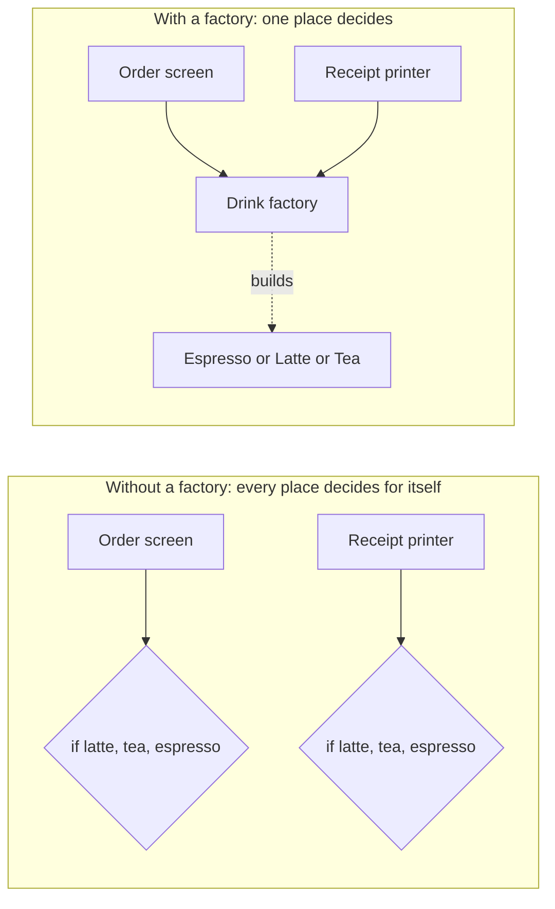
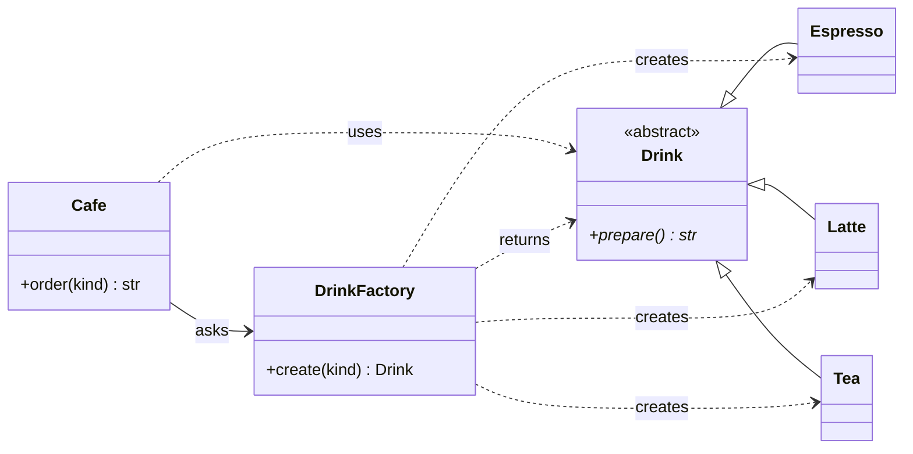
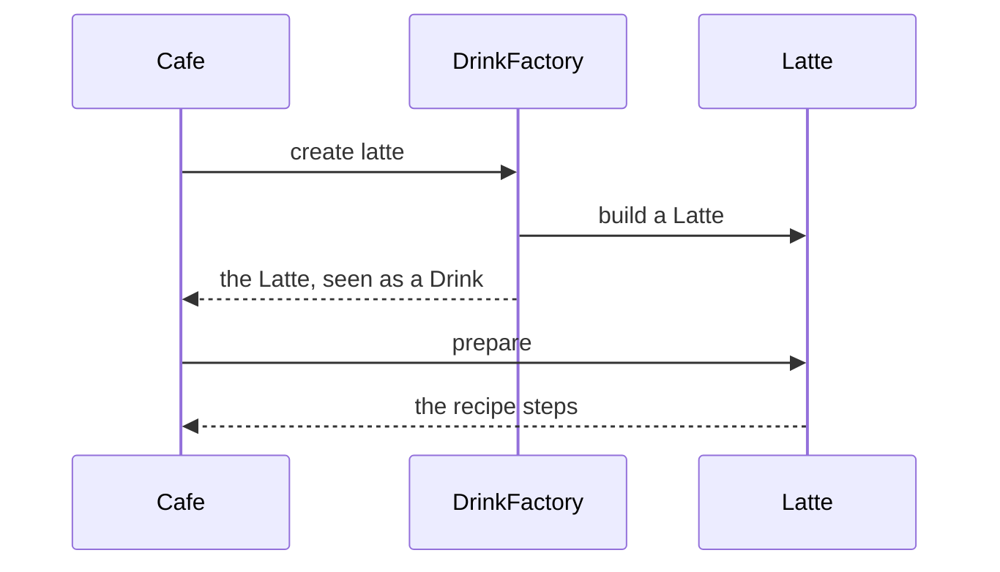
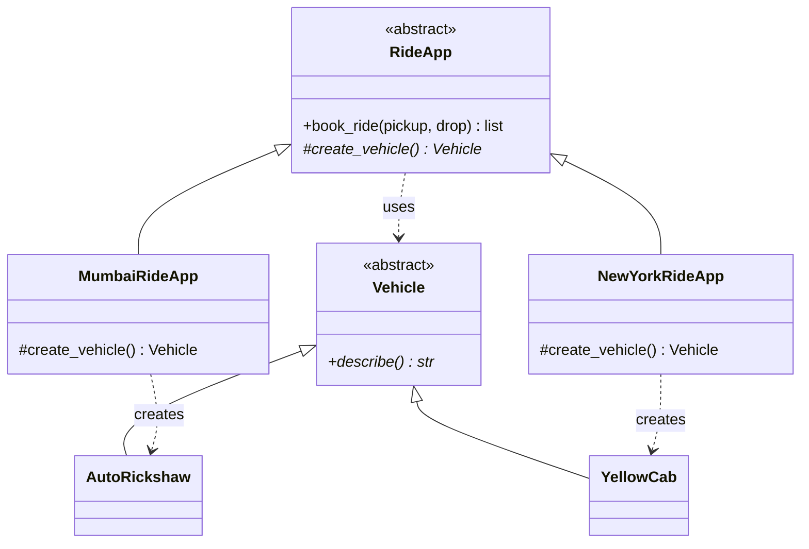
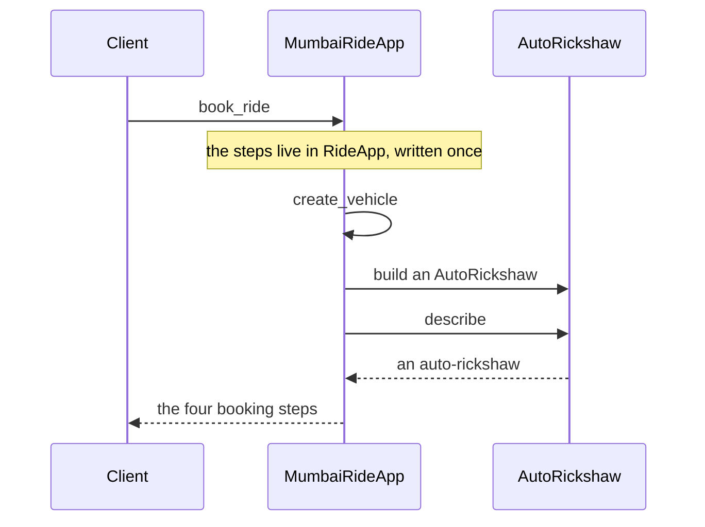
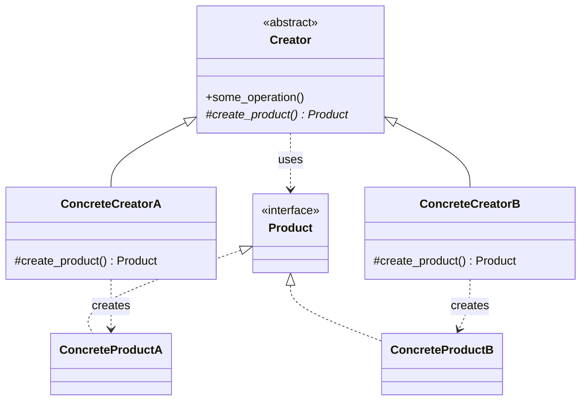
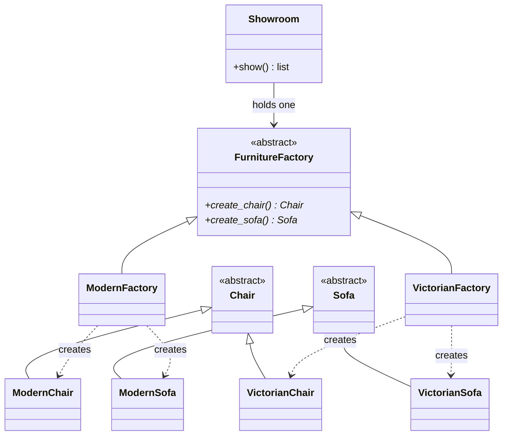
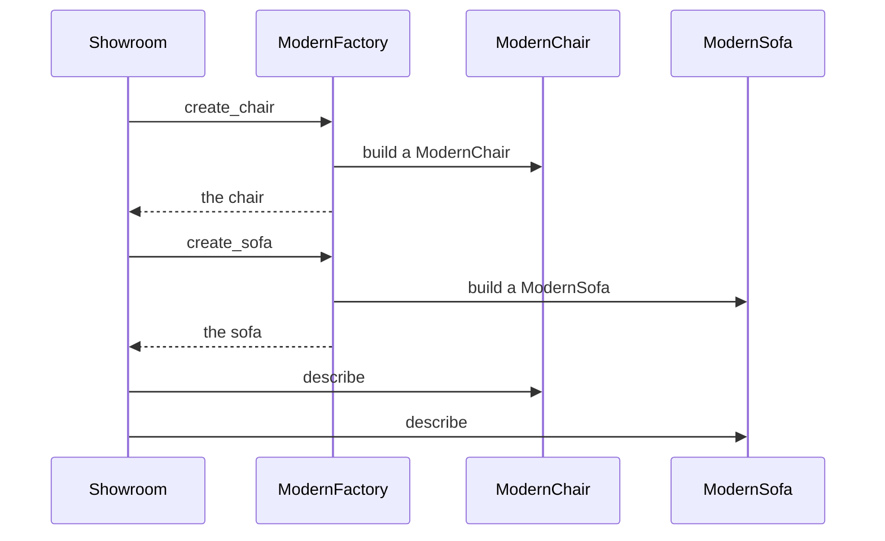
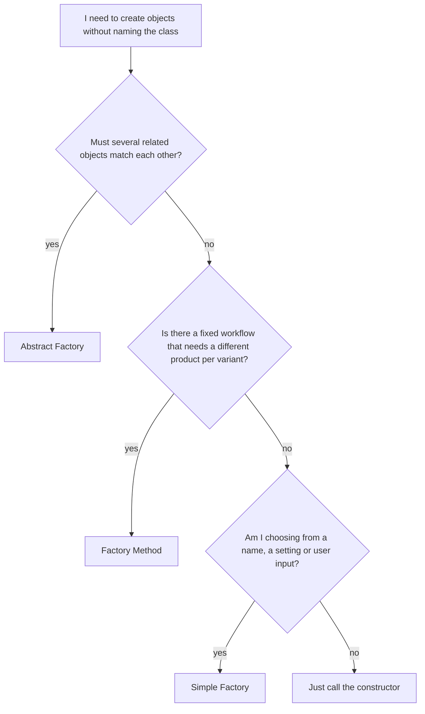
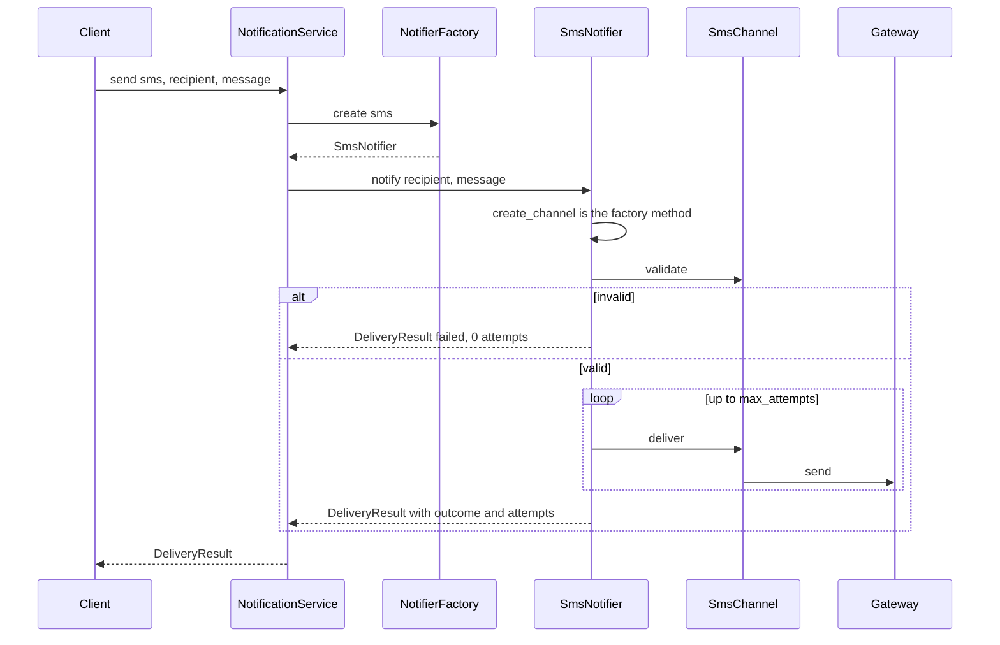

# Factory Design Pattern

**What you will learn**

- The problem factories solve, explained from scratch.
- The **three flavours** of factory, one section each: **Simple Factory**, **Factory Method** and **Abstract Factory**. For every flavour you get an everyday picture, a small runnable example, diagrams, its pros and cons, and when to use it (and when not to).
- How to tell the three apart, and how to pick one.
- A worked, tested **Notification Service** design that uses them together.
- Where factories appear in real Python code, and how to talk about them in an interview.

**How to read this page.** If Factory is new to you, read sections 1 to 7 in order. Each flavour builds on the one before it. Section 8 is a longer, realistic design, and you can come back to it after the basics.

The examples live next to this page as real `.py` files with tests. Everything was run on Python 3.12 and the output shown is real. Code blocks with a file title are the real files, and a test checks that they match. Blocks without a title are either small illustrations that were run separately, or short excerpts of a real file named next to them.

---

## 1. The problem

A coffee shop's program needs to make drinks. The quickest way to write it is with a chain of `if` statements:

```python
def make_drink(kind: str) -> str:
    if kind == "espresso":
        return "Pulling a shot of espresso"
    if kind == "latte":
        return "Pulling a shot, steaming milk, pouring a latte"
    if kind == "tea":
        return "Steeping a tea bag"
    raise ValueError(f"we do not serve {kind!r}")


def price(kind: str) -> int:
    if kind == "espresso":
        return 120
    if kind == "latte":
        return 180
    if kind == "tea":
        return 90
    raise ValueError(f"we do not serve {kind!r}")


print(make_drink("latte"))
print(price("latte"))
```

Output (the prices are just example numbers):

```text
Pulling a shot, steaming milk, pouring a latte
180
```

It works. But notice that the same `if` chain appears **twice**, and it will soon appear in the receipt printer, the menu screen and the stock checker too. Then:

1. **Every new drink means hunting down every chain.** Add "cold brew" and you must find and change each copy. Miss one and you have a bug that only shows up when a customer orders cold brew.
2. **The code that takes orders knows about every drink.** It has to know all the names, and all the details of how each one is made.
3. **It is hard to test.** You cannot test the order screen without dragging in every drink.
4. **Recipe details are mixed into everything.** Code that should be about *orders* is full of *how to make a latte*.



*Left: each part of the program repeats the same decision. Right: they all ask one factory, and only the factory knows how to build each drink.*

What we want is **one place that knows how to build things**, so the rest of the program can just say what it needs. That is the idea behind every kind of "factory".

## 2. Words you will see

A few plain-English definitions, so nothing later is a mystery:

| Word | What it means | Example |
|------|---------------|---------|
| **Class** | A blueprint for making objects | `Latte` |
| **Object** (or **instance**) | A real thing built from a class | The latte you are holding |
| **Create** (or **instantiate**) | Build an object from a class | `Latte()` |
| **Interface** (or **abstract class**) | A **promise** about what something can do, without saying how | "Every `Drink` can `prepare()`" |
| **Concrete class** | A real, ready-to-use class that keeps that promise | `Latte`, as opposed to the general idea of a `Drink` |
| **Subclass** | A class that builds on another one | `Latte` is a subclass of `Drink` |
| **Product** | The thing a factory makes | A `Drink` |
| **Client** | The code that *uses* the products | The `Cafe` |
| **Factory** | Code whose job is to create objects | `DrinkFactory` |

In Python, the promise is written with `ABC` (short for "abstract base class") and `@abstractmethod`. It means: "any class that wants to be a `Drink` **must** provide `prepare()`". You will see this in every example below.

!!! tip "Why promises matter here"
    The whole trick of factories is that the **client only knows the promise** ("it is some kind of `Drink`") and never the concrete class ("it is a `Latte`"). That is what lets you change or add drinks without touching the client.

## 3. The big picture: one idea, three flavours

Every factory pattern does the same basic thing: **it moves the decision "which class do I build?" out of the code that uses the object, into one dedicated place.** The three flavours differ in *how* that place is arranged:

| Flavour | In one line | Real-life picture | Section |
|---------|-------------|-------------------|---------|
| **Simple Factory** | One helper builds the right thing when you ask by name | The counter at a coffee shop | [4](#4-flavour-1-simple-factory) |
| **Factory Method** | A base class runs fixed steps and lets each subclass choose what to build | A ride-hailing app with a different vehicle in each city | [5](#5-flavour-2-factory-method) |
| **Abstract Factory** | One factory builds a whole set of matching things | A furniture showroom with themed collections | [6](#6-flavour-3-abstract-factory) |

Simple Factory is not one of the 23 patterns in the famous *Design Patterns* book by the "Gang of Four" (Gamma, Helm, Johnson and Vlissides, 1994, usually shortened to **GoF**). It is such a common habit that people learn it first. Factory Method and Abstract Factory *are* in the book, and you will see their official definitions in their sections.

Each of the next three sections follows the same layout, so you always know where to look:

1. **In one sentence**
2. **A real-life picture**
3. **The example** (real code and its real output)
4. **Read it step by step**
5. **The pictures** (diagrams)
6. **Pros and cons**
7. **When to use it, and when not to**
8. **Try it yourself**

## 4. Flavour 1: Simple Factory

### In one sentence

> A **simple factory** is one helper that you ask for something **by name**, and it builds the right thing for you.

### A real-life picture

You walk up to a coffee counter and say "one latte, please". You do not go into the kitchen, find the milk and work the machine. The barista **knows which recipe matches "latte"** and hands you the finished drink. The next customer says "tea", and the same counter gives them something different.

The barista is the factory. The customer is the client. The customer never needs to know *how* a latte is made.

### The example

This is the coffee shop from section 1, fixed. Read it once quickly, then follow the step-by-step notes below.

```python title="factory_flavours/simple_factory.py"
from abc import ABC, abstractmethod


class Drink(ABC):
    """What every drink can do. The rest of the program only knows this much."""

    @abstractmethod
    def prepare(self) -> str: ...


class Espresso(Drink):
    def prepare(self) -> str:
        return "Pulling a shot of espresso"


class Latte(Drink):
    def prepare(self) -> str:
        return "Pulling a shot, steaming milk, pouring a latte"


class Tea(Drink):
    def prepare(self) -> str:
        return "Steeping a tea bag"


class DrinkFactory:
    """The simple factory: give it a name, get back the right drink."""

    def create(self, kind: str) -> Drink:
        if kind == "espresso":
            return Espresso()
        if kind == "latte":
            return Latte()
        if kind == "tea":
            return Tea()
        raise ValueError(f"we do not serve {kind!r}")


class Cafe:
    """The code that uses drinks. It never mentions Espresso, Latte or Tea."""

    def __init__(self, factory: DrinkFactory) -> None:
        self._factory = factory

    def order(self, kind: str) -> str:
        drink = self._factory.create(kind)
        return drink.prepare()


if __name__ == "__main__":
    cafe = Cafe(DrinkFactory())
    print(cafe.order("latte"))
    print(cafe.order("tea"))
    try:
        cafe.order("soup")
    except ValueError as problem:
        print(f"Sorry: {problem}")
```

Run it with `python factory_flavours/simple_factory.py`. The output:

```text
Pulling a shot, steaming milk, pouring a latte
Steeping a tea bag
Sorry: we do not serve 'soup'
```

### Read it step by step

1. **`Drink`** is the promise: every drink can `prepare()`.
2. **`Espresso`, `Latte` and `Tea`** are the real drinks. Each keeps the promise in its own way.
3. **`DrinkFactory.create("latte")`** is the *only* place that knows which name matches which class. This is the simple factory.
4. **`Cafe.order()`** asks the factory for a drink, then calls `prepare()`. Look closely: the words `Espresso`, `Latte` and `Tea` **never appear inside `Cafe`**.
5. If someone asks for `"soup"`, the factory says no, in one place, with one clear message.

### The pictures



*How to read it: `Cafe` asks `DrinkFactory` (solid arrow) and only *uses* the general `Drink` (dashed arrow). The factory is the only one that *creates* the real drinks. The triangles show that `Espresso`, `Latte` and `Tea` are all kinds of `Drink`. New to the notation? See [UML Basics: Class Diagrams](../../concept/uml-basics.md).*

And here is what happens when the cafe orders a latte, step by step in time:



*The cafe never builds anything. It asks, receives a `Drink`, and uses it.*

### Pros and cons

**Pros**

- **One place decides.** All the "which class?" logic lives in one spot, so there are no copies to keep in step.
- **The client stays simple.** `Cafe` does not import or mention any concrete drink.
- **Easy to understand.** It is only a helper with an `if` chain. You can explain it in a minute.
- **Easy to test the client.** Hand the cafe a *fake* factory (the test `test_the_cafe_only_talks_to_the_factory` does exactly this) and you never need real drinks.
- **A good home for building details.** Settings, cups, or credentials needed to build a thing can live in the factory instead of leaking everywhere.

**Cons**

- **Adding a product means editing the factory.** A new drink needs a new `if` branch inside `DrinkFactory`. The program is *not* fully "open for extension without changing old code".
- **The factory can grow into a monster.** Fifty drinks means fifty branches, and the factory ends up knowing about everything.
- **Names are plain text.** `"latte"` is a string, so a typo like `"lattee"` is only caught when the program runs.
- **It has no structure for sharing steps.** If making drinks needs a common workflow, a simple factory does not help with that (Factory Method does).

### When to use it, and when not to

| Use it when | Skip it when |
|-------------|--------------|
| Several callers need to create the same kinds of object | There is only one class and no realistic second one |
| The choice depends on a name, a setting, or user input | The `if` chain appears in exactly one place and will not grow |
| You want creation details in one place | Building the object is a single trivial call such as `Point(1, 2)` |

### Try it yourself

**Question:** You want to add a "cold brew". Which lines of the example must change?

**Answer:** Two things: write a new `ColdBrew(Drink)` class, and add one more `if kind == "cold brew"` branch to `DrinkFactory.create`. `Cafe` does not change at all, which is the benefit. But `DrinkFactory` *did* change, which is the drawback.

A common fix is to store a **dictionary** of name to class inside the factory, so adding a drink means adding one entry instead of editing an `if` chain. Section 8 does exactly that.

!!! note "Remember"
    A simple factory answers "**which class should I build for this name?**" and keeps that answer in one place.

**Next:** the simple factory picks by name. But what if a whole *workflow* is identical everywhere and only *what gets created* changes? That is the next flavour.

## 5. Flavour 2: Factory Method

### In one sentence

> **Factory Method** is a base class that runs a fixed set of steps, and leaves one step, "**which object do I create?**", for each subclass to fill in.

### A real-life picture

Think of a **ride-hailing app** in different cities. Booking a ride is the same everywhere: estimate the fare, send a vehicle, track the trip, take the payment. But *which vehicle arrives* depends on the city: an auto-rickshaw in Mumbai, a yellow cab in New York, a tuk-tuk in Bangkok.

- The **booking steps are written once**, in the main app.
- The **choice of vehicle is left to each city's version** of the app.

The main app says "send a vehicle", and each city answers "here is what *we* send". That answer is the factory method.

### The problem it solves

Without it, you would copy the four booking steps into an app for every city. Then a change to "take the payment" has to be repeated in every copy. Or you would write one big app full of `if city == "Mumbai"` checks, which grows with every new city. Factory Method lets you write the steps **once** and vary only the creation.

### The example

```python title="factory_flavours/factory_method.py"
from abc import ABC, abstractmethod


class Vehicle(ABC):
    @abstractmethod
    def describe(self) -> str: ...


class AutoRickshaw(Vehicle):
    def describe(self) -> str:
        return "an auto-rickshaw"


class YellowCab(Vehicle):
    def describe(self) -> str:
        return "a yellow cab"


class RideApp(ABC):
    """Every city runs the same booking steps. Only the vehicle differs."""

    def book_ride(self, pickup: str, drop: str) -> list[str]:
        vehicle = self.create_vehicle()  # the factory method: the city decides
        return [
            f"Estimate the fare from {pickup} to {drop}",
            f"Send {vehicle.describe()} to {pickup}",
            "Track the trip",
            "Take the payment",
        ]

    @abstractmethod
    def create_vehicle(self) -> Vehicle:
        """Each city's app says which vehicle to create."""


class MumbaiRideApp(RideApp):
    def create_vehicle(self) -> Vehicle:
        return AutoRickshaw()


class NewYorkRideApp(RideApp):
    def create_vehicle(self) -> Vehicle:
        return YellowCab()


if __name__ == "__main__":
    for city, app in [("Mumbai", MumbaiRideApp()), ("New York", NewYorkRideApp())]:
        print(f"--- {city}")
        for step in app.book_ride("Central Station", "the airport"):
            print(step)
```

Run it with `python factory_flavours/factory_method.py`. The output:

```text
--- Mumbai
Estimate the fare from Central Station to the airport
Send an auto-rickshaw to Central Station
Track the trip
Take the payment
--- New York
Estimate the fare from Central Station to the airport
Send a yellow cab to Central Station
Track the trip
Take the payment
```

### Read it step by step

1. **`Vehicle`** is the promise: every vehicle can `describe()` itself.
2. **`RideApp`** is the base class. Its `book_ride` method holds the four steps, **written once**.
3. Inside `book_ride`, the second step calls **`self.create_vehicle()`**. The base class does not say *how*. It just asks.
4. **`create_vehicle`** is marked `@abstractmethod`, which means: "every city's app **must** answer this". This method is the **factory method**.
5. **`MumbaiRideApp`** answers with an `AutoRickshaw`. **`NewYorkRideApp`** answers with a `YellowCab`.
6. Run `book_ride` in either city: the steps are identical, and only the vehicle line changes.

### The pictures



*How to read it: the two city apps are kinds of `RideApp` (triangles). `RideApp` only *uses* the general `Vehicle`. Each city app *creates* its own real vehicle. The `#` in front of `create_vehicle` means "for subclasses to fill in".*



*The client calls `book_ride`. Partway through, the app calls its own `create_vehicle`, and the city's answer decides what is built.*

**The textbook picture.** The general shape of the pattern, with the official names, looks like this. Match each name to the example above:



| Official name | Meaning | In the ride example |
|---------------|---------|---------------------|
| **Product** | The promise of the thing being created | `Vehicle` |
| **Concrete product** | A real one | `AutoRickshaw`, `YellowCab` |
| **Creator** | The base class with the fixed steps and the abstract "create" method | `RideApp` |
| **Concrete creator** | A subclass that answers "what do I create?" | `MumbaiRideApp`, `NewYorkRideApp` |
| **Factory method** | The "create" method itself | `create_vehicle` |

### The official definition

The GoF book describes Factory Method like this:

> **"Define an interface for creating an object, but let subclasses decide which class to instantiate. Factory Method lets a class defer instantiation to subclasses."**

In plain words:

| Phrase | What it means |
|--------|---------------|
| **"Define an interface for creating an object"** | Declare a method, such as `create_vehicle()`, that returns "some kind of vehicle" |
| **"let subclasses decide which class to instantiate"** | Each subclass chooses the real class: `MumbaiRideApp` picks `AutoRickshaw` |
| **"lets a class defer instantiation to subclasses"** | The base class does all the shared work but *postpones* the "which one to build?" decision to its subclasses |

### How is this different from a Simple Factory?

| | Simple Factory | Factory Method |
|---|----------------|----------------|
| **Who decides what is built?** | The **caller**, by passing a name (`"latte"`) | The **subclass you chose** (`MumbaiRideApp`) |
| **Where does the choice live?** | In one `if` chain in the factory | Spread across subclasses, one small method each |
| **Is there a shared workflow?** | No, the factory only builds | Yes, the base class runs fixed steps around the creation |
| **How do you add a variant?** | Edit the factory | Write a new subclass, and change nothing that exists |

### Pros and cons

**Pros**

- **Shared steps are written once.** Fix "take the payment" in one place and every city gets it.
- **New variants need no edits to old code.** A new city means a new subclass. The test `test_a_new_city_needs_only_a_new_subclass` adds Bangkok without touching `RideApp`.
- **The base class stays clean.** It never mentions `AutoRickshaw` or `YellowCab`.
- **A handy hook for tests.** A test can override `create_vehicle` to return a fake vehicle and check the *whole* workflow without real ones.

**Cons**

- **One subclass per variant.** The number of classes grows with the number of cities. Many of those subclasses are just a few lines that say "create my thing".
- **It depends on inheritance.** The subclasses are tied to their base class, and the choice is fixed when you create the object. You cannot switch a Mumbai app into a New York one later.
- **It can be confusing at first.** The flow jumps between the base class and the subclass, so beginners often ask "where is this method called from?"
- **Often more than you need in Python.** Because a class or function can be passed around, you can sometimes pass "how to create the vehicle" as an argument instead of writing a subclass. Section 8 shows this shortcut.

### When to use it, and when not to

| Use it when | Skip it when |
|-------------|--------------|
| A fixed workflow needs a different product each time | You only need to pick a class by name (use a simple factory) |
| A base class cannot know in advance which concrete class it needs | There is no shared workflow, only creation |
| You want subclasses, or tests, to plug in their own products | Only one or two tiny variants exist and are unlikely to grow |

### Try it yourself

**Question:** Add a city, Bangkok, where a tuk-tuk arrives. Which classes do you write, and what stays untouched?

**Answer:** Write a `TukTuk(Vehicle)` class and a `BangkokRideApp(RideApp)` class whose `create_vehicle` returns `TukTuk()`. `RideApp` and everything else stay untouched. That is the benefit. The cost is that even a tiny variant needs *two* new classes.

!!! note "Remember"
    Factory Method answers "**this workflow is always the same, but which object it creates depends on the subclass**".

**Next:** Factory Method creates **one** kind of thing. What if you must create several kinds of things that all have to *match* each other?

## 6. Flavour 3: Abstract Factory

### In one sentence

> An **abstract factory** is a factory that builds a whole **set of matching things**, so they always go together.

### A real-life picture

Picture a **furniture showroom** with themed collections. Choose the "Modern" collection and you get a modern chair, a modern sofa, a modern table, and they all match. You would never want a carved Victorian chair next to a slim modern sofa.

- Each **collection** is a factory.
- The **furniture pieces** are what it makes.
- Because you pick **one collection**, everything you get is guaranteed to match.

### The problem it solves

Suppose the showroom program creates each piece on its own:

```text
chair = ModernChair()
sofa = VictorianSofa()      # oops: a mismatch, and nothing stopped it
```

Nothing prevents mixing styles by mistake. And changing the whole room from Modern to Victorian means finding every place a chair *and* a sofa are created. With an abstract factory you make **one** decision, "which collection?", and every piece follows.

### The example

```python title="factory_flavours/abstract_factory.py"
from abc import ABC, abstractmethod
from typing import ClassVar


class Chair(ABC):
    style: ClassVar[str]

    @abstractmethod
    def describe(self) -> str: ...


class Sofa(ABC):
    style: ClassVar[str]

    @abstractmethod
    def describe(self) -> str: ...


class ModernChair(Chair):
    style = "modern"

    def describe(self) -> str:
        return "a slim metal chair"


class ModernSofa(Sofa):
    style = "modern"

    def describe(self) -> str:
        return "a low grey sofa"


class VictorianChair(Chair):
    style = "victorian"

    def describe(self) -> str:
        return "a carved wooden chair"


class VictorianSofa(Sofa):
    style = "victorian"

    def describe(self) -> str:
        return "a velvet sofa with curled arms"


class FurnitureFactory(ABC):
    """One factory per style. Each one builds a whole matching set."""

    @abstractmethod
    def create_chair(self) -> Chair: ...

    @abstractmethod
    def create_sofa(self) -> Sofa: ...


class ModernFactory(FurnitureFactory):
    def create_chair(self) -> Chair:
        return ModernChair()

    def create_sofa(self) -> Sofa:
        return ModernSofa()


class VictorianFactory(FurnitureFactory):
    def create_chair(self) -> Chair:
        return VictorianChair()

    def create_sofa(self) -> Sofa:
        return VictorianSofa()


class Showroom:
    """The code that uses the furniture. It never says which style it got."""

    def __init__(self, factory: FurnitureFactory) -> None:
        self._factory = factory

    def show(self) -> list[str]:
        chair = self._factory.create_chair()
        sofa = self._factory.create_sofa()
        return [f"Chair: {chair.describe()}", f"Sofa: {sofa.describe()}"]


if __name__ == "__main__":
    for name, factory in [
        ("Modern", ModernFactory()),
        ("Victorian", VictorianFactory()),
    ]:
        print(f"--- {name} showroom")
        for line in Showroom(factory).show():
            print(line)
```

Run it with `python factory_flavours/abstract_factory.py`. The output:

```text
--- Modern showroom
Chair: a slim metal chair
Sofa: a low grey sofa
--- Victorian showroom
Chair: a carved wooden chair
Sofa: a velvet sofa with curled arms
```

### Read it step by step

1. **`Chair` and `Sofa`** are two promises: the two *kinds* of product.
2. **`ModernChair`, `ModernSofa`, `VictorianChair` and `VictorianSofa`** are the four real classes: two styles times two kinds.
3. **`FurnitureFactory`** is the promise for a *whole factory*: "I can make a chair **and** a sofa".
4. **`ModernFactory`** and **`VictorianFactory`** each build only their own style. So whatever you get from one factory always matches.
5. **`Showroom`** is handed **one** factory. It asks for a chair and a sofa, and it cannot mix styles because it only *has* one factory.
6. To change the whole look, hand the showroom a **different factory**. Nothing else changes.

### The pictures



*How to read it: the showroom holds one `FurnitureFactory` and only knows the general `Chair` and `Sofa`. Each real factory creates a matching pair. The two columns of classes are the two "families".*



*Both pieces come from the same factory, so they match.*

### The official definition

The GoF book describes Abstract Factory like this:

> **"Provide an interface for creating families of related or dependent objects without specifying their concrete classes."**

In plain words:

| Phrase | What it means |
|--------|---------------|
| **"Provide an interface for creating"** | Declare a factory promise with one create-method per kind of product (`create_chair`, `create_sofa`) |
| **"families of related or dependent objects"** | Sets of things that must match: all modern, or all Victorian |
| **"without specifying their concrete classes"** | The client never writes `ModernChair`, so swapping the family is one change |

### How is this different from Factory Method?

| | Factory Method | Abstract Factory |
|---|----------------|------------------|
| **What does it create?** | **One** kind of product | A **family** of products (chair *and* sofa) |
| **How is it used?** | You **override a method** in a subclass (inheritance) | You **hold a factory object** and call its methods (composition) |
| **Main goal** | Let a fixed workflow choose its product | Make sure related products **match** |
| **Relationship** | A single creation hook | Each `create_...` method on an abstract factory is *itself* a factory method |

### Pros and cons

**Pros**

- **Products always match.** One factory means one family, so a Victorian sofa can never end up next to a modern chair.
- **Swapping a whole family is one change.** Give the showroom a different factory.
- **The client stays ignorant of the concrete classes.** `Showroom` never says `Modern` or `Victorian`.
- **All creation of related objects is in one place** per family.
- **New families are easy.** A new style is a new factory and new product classes. The test `test_a_new_family_works_with_the_showroom_unchanged` adds a Scandinavian one without changing `Showroom`.

**Cons**

- **Adding a new *kind* of product is painful.** To add a table, you change `FurnitureFactory` **and every concrete factory**. The test `test_a_factory_must_make_every_kind_of_product` shows the rigidity: a factory that forgets to make a sofa cannot even be created.
- **Many classes.** Here, 2 kinds times 2 styles gives 4 product classes plus 2 factories plus 3 promises. With 3 kinds and 3 styles it is 9 products.
- **More complex** than the other two. It is easy to over-engineer.
- **Only worth it for real families.** If nothing has to match, it is just extra layers.

### When to use it, and when not to

| Use it when | Skip it when |
|-------------|--------------|
| Several objects must be from the same family and must match | You only ever create one kind of object |
| You may switch the whole family (a theme, a platform, a vendor) | There is only one family, and there will not be a second |
| Callers should not know which family they are using | The "family" is really just a single setting |

### Try it yourself

**Question:** You want to add a **table** to the showroom. Which files or classes change?

**Answer:** Write a `Table` promise and two real tables (`ModernTable`, `VictorianTable`). Then add a `create_table` method to `FurnitureFactory` **and** to both `ModernFactory` and `VictorianFactory`. If the showroom should display tables, update `Showroom.show` too. That is a lot of edits for one new product, and it is the main cost of Abstract Factory.

!!! note "Remember"
    Abstract Factory answers "**I need several things, and they must all belong to the same family**".

## 7. Comparing the three

Here are all three side by side:

| | Simple Factory | Factory Method | Abstract Factory |
|---|----------------|----------------|------------------|
| **In one line** | One helper builds by name | A subclass decides inside a fixed workflow | One factory builds a matching set |
| **Creates** | One kind of thing | One kind of thing | Several kinds, as a family |
| **Who decides** | The caller (by name) | The subclass | The factory you hold |
| **Built with** | A function or class with an `if` chain (or a dictionary) | Inheritance: override a method | Composition: pass in a factory object |
| **Adding a new variant** | Edit the factory | Add a subclass | Add a new factory and new products |
| **Adding a new kind of product** | Edit the factory | Not the point | Edit the abstract factory **and all factories** |
| **Everyday picture** | Coffee counter | Ride app per city | Furniture showroom |
| **In the GoF book** | No | Yes | Yes |
| **Reach for it when** | Pick a class from a name or setting | A fixed workflow needs a different product per variant | Several objects must match |

**Which one do I need?** Answer these questions in order:



*The last branch matters: if nothing varies, a factory is needless extra work.*

**How the three fit together.** They are not rivals. Real designs mix them:

- An abstract factory's `create_...` methods are **factory methods**.
- A simple factory is often used to **choose which** creator or abstract factory to use ("give me the `ModernFactory` for this setting").
- The Notification Service in the next section uses a simple factory to pick by name and a Factory Method for the shared workflow.

!!! note "Python is friendly to factories"
    In Python, classes and functions can be passed around like any other value. So a class such as `Latte` already **is** a tiny factory: calling `Latte()` builds a latte. Very often a plain function, or a dictionary from name to class, does the job of a whole factory class. The Notification Service below keeps the textbook form *and* the Python shortcut side by side, so you can compare them.

## 8. Worked example: Design a Notification Service

You now know all three flavours. Time to see them in a real low-level design problem. Most products send notifications through several channels, and "design a notification system" is a common interview question. This design uses a **simple factory with a registry** to pick a channel by name, and a **Factory Method** for the shared delivery workflow. Section 8.6 explains why it does *not* need an Abstract Factory, and what would change that.

The full source is in this folder as real Python files with tests. Everything below explains *why* it looks the way it does.

| File | Purpose |
|------|---------|
| `notifications/channel.py` | The products: `Channel` and its three implementations |
| `notifications/notifier.py` | The creators: `Notifier` with the factory method, plus its subclasses |
| `notifications/factory.py` | The simple factory with a registry: name in, notifier out |
| `notifications/service.py` | The client that application code calls |
| `notifications/gateway.py`, `errors.py`, `result.py` | The outside world, the error types and the result |
| `demo.py` | A runnable demo |
| `tests/` | `pytest` tests |

### 8.1 Requirements

**Functional**

- Send a message to a recipient on a chosen channel: **email**, **SMS** or **push**.
- Each channel has its own rules. An email needs an address, an SMS needs an E.164 phone number and at most 160 characters, and a push needs a device token.
- Retry when the provider has a temporary failure, and give up after a limit.
- Send one message on **every channel a user has an address for**, using their saved preferences.
- Report the outcome of every send.

**Non-functional**

- **Extensible**: adding a channel (Slack, WhatsApp) must not require editing existing classes (Open/Closed Principle).
- **Testable**: application code must be testable without real email or SMS servers.
- **Robust**: a bad address or a stale channel name on one channel must not stop the other channels.

**Out of scope** (good follow-ups, see [8.9](#89-extending-it-and-interview-follow-ups)): real provider integrations, backoff between retries, asynchronous sending, templates, delivery receipts, persistence.

### 8.2 Finding the classes

Underline the nouns, then give each class one job:

| Class | Its one job | What it does *not* know |
|-------|-------------|-------------------------|
| `NotificationService` | The entry point for application code: sends on one channel, or on all of a user's channels | Any concrete class |
| `NotifierFactory` | Turns a channel **name** into a ready `Notifier` | How sending works |
| `Notifier` (creator) | The delivery workflow: build the channel, validate, send with retries, report | Which concrete channel it is dealing with |
| `EmailNotifier`, `SmsNotifier`, `PushNotifier` | Decide which channel to build and carry that channel's retry budget | The workflow's details |
| `Channel` (product) | One way of reaching a person: its validation rules and its message format | Retries, or how it was chosen |
| `Gateway` | The outside world (SMTP server, SMS provider) | Anything about notifications |
| `DeliveryResult` | The outcome of one send | Everything else |

### 8.3 Class diagram

!!! tip "New to class diagrams?"
    See [UML Basics: Class Diagrams](../../concept/uml-basics.md) for what every box, arrow and diamond means.


*Reading the diagram: the service asks the factory for a `Notifier` by name. `Notifier` is the Factory Method **creator**: its workflow calls `create_channel()`, and each subclass overrides that to build its own `Channel`. `NotifierFactory` is the simple factory that maps names to notifiers. `CallableNotifier` is the Pythonic alternative to writing one subclass per channel.*

### 8.4 What happens on `service.send("sms", ...)`



*The loop stops at the first success. A `TransientChannelError` from the gateway triggers another attempt; when the budget runs out, the result says so.*

### 8.5 Design decisions and tradeoffs

This is the part interviewers care about most. Each row is a real choice with a real cost:

| # | Decision | Chosen | Alternative | What it costs us |
|---|----------|--------|-------------|------------------|
| 1 | Where the delivery workflow lives | In `Notifier.notify()`: validate, retry, report | In the service, or copied into each channel | The workflow needs a base class, and that base class must not know concrete channels |
| 2 | How the workflow gets its channel | **Factory Method**: `create_channel()` overridden per subclass | `if channel == "email"` inside the workflow | One small subclass per channel (three lines each) |
| 3 | How a name becomes a notifier | A **simple factory with a registry**: `dict[str, creator]` | An `if/elif` chain in the factory | Names are strings, so a typo is caught at run time. The error message lists the valid names to soften that |
| 4 | Where the registry lives | An **instance** built at start-up and passed in | A global registry filled by decorators | A little wiring code. In return there is no hidden global state, and each test gets its own factory (see the [Singleton tradeoffs](../singleton-design-pattern/README.md#8-tradeoffs-and-criticism)) |
| 5 | Registry thread-safety | Register at start-up, then only read | A lock around every access | You must not register while serving traffic |
| 6 | What `create_channel()` returns each call | A **fresh channel** every time | Cache one channel per notifier | Cheap here. If building a channel opened a connection, you would cache it |
| 7 | Reporting failures | Return a `DeliveryResult`, never raise for bad input or exhausted retries | Raise exceptions | Callers must look at the result. In return, one failed channel cannot abort the others |
| 8 | Unknown channel name | `send()` **raises** `UnknownChannelError`, but `broadcast()` turns it into a failed result | Always raise, or always swallow | Two behaviours to learn. It fits the two uses: a direct call with a bad name is a bug, while stored preferences can be stale |
| 9 | Retry policy | A `max_attempts` class attribute, overridable per notifier | One global setting | It lets each channel carry its own budget, at the price of more places to look |
| 10 | Shipping a Pythonic variant | `CallableNotifier(make_channel)` next to the subclasses | Subclasses only | Two ways to do the same thing. Worth it because the comparison is the lesson (see 8.6) |

Smaller choices:

- `DeliveryResult` is a **frozen dataclass**: a result cannot change after it is created.
- `Gateway` is a **`Protocol`**, so any object with a `send(address, text)` method qualifies. Tests use `RecordingGateway`, and production would supply an SMTP or SMS gateway.
- `Channel.validate()` **raises** `InvalidNotification`, and `Notifier.notify()` turns that into a result. Validation stays simple inside the channel, and the reporting policy stays in one place.

### 8.6 Choosing the factory flavour

Which of the three flavours does this design need? Compare the realistic options:

| Option | Adding a "Slack" channel means | Verdict for this design |
|--------|--------------------------------|-------------------------|
| `if/elif` on the channel name | Editing every chain, in every file that has one | The problem from section 1 (the coffee shop's repeated `if` chains). Avoid |
| Simple factory as an `if/elif` inside one function | Editing that one function | Fine for a small, stable set. Breaks Open/Closed |
| **Simple factory with a registry** | Registering one more entry at start-up | **Chosen** for selecting by name |
| **Factory Method** (`Notifier` subclasses) | One `Channel` class + one `Notifier` subclass + one register line | **Chosen** for the workflow: it shares the retry logic and lets each notifier carry its own policy |
| Callable instead of a subclass (`CallableNotifier`) | One `Channel` class + one register line | Less code. Loses the "a subclass can override more than the creation step" flexibility |
| Abstract Factory | Depends on the families | **Not needed** here. See below |

Notice that the last two rows are honest competitors. For a design this small, `CallableNotifier` is enough, and many Python teams would ship only that. The subclass form earns its keep when a concrete notifier needs to override *more* than creation (a custom retry policy, extra logging, a different validation order), and it is the shape interviewers expect you to recognise.

**Why not an Abstract Factory?** Abstract Factory is for **families of objects that must match**. Here each channel produces a single kind of object. It would become the right tool the day each channel also needs, say, its own *message formatter* and its own *rate limiter*, and those must be consistent with the channel. Then you would have `ChannelKit` factories (`EmailKit`, `SmsKit`) that create the sender, formatter and limiter together, so an SMS formatter can never be paired with an email sender. Do not add that structure until the requirement exists.

!!! tip "Interview tip"
    Say the flavours out loud as you choose: "I would start with a registry-based simple factory to pick by name. The delivery workflow is shared but the channel differs, so that is a Factory Method. I would only reach for Abstract Factory if channels needed matching families of objects." That shows you know the vocabulary *and* when each one applies.

### 8.7 Testing, and what the tests prove

| Test file | What it proves |
|-----------|----------------|
| `test_channels.py` | Each channel accepts good input and rejects bad addresses, empty text and over-long text (SMS is exactly 160, push exactly 200), and formats its own message |
| `test_notifier.py` | First-try success; retries until success; gives up after `max_attempts`; invalid input is never sent; each notifier has its own retry budget; the factory method is a test seam; `CallableNotifier` matches a subclass |
| `test_factory.py` | Correct notifier per name; a fresh one per call; helpful unknown-name error; duplicate names rejected; **a brand-new channel works through the factory without changing existing code** |
| `test_service.py` | Routing by name; `send` raises for unknown names; `broadcast` keeps going when one channel is unknown or invalid |
| `test_flavours.py` | The three small teaching examples in sections 4 to 6: each factory builds the right thing and refuses bad input; the coffee cafe can be tested with a fake factory; every city sends its own vehicle while the booking steps stay identical; **a new city and a new furniture style plug in without editing existing classes**; a half-finished furniture factory cannot be created |
| `test_factory_docs_in_sync.py` | The code on this page equals the files |

Two of these deserve a closer look.

**The factory method as a test seam.** Because `create_channel()` is an overridable hook, a test can subclass `Notifier`, return a scripted channel, and exercise the *whole workflow* with no gateway at all:

```python
class TestNotifier(Notifier):
    def __init__(self) -> None:
        super().__init__()
        self.channel = ScriptedChannel()

    def create_channel(self) -> Channel:
        return self.channel
```

(The full test is in `tests/test_notifier.py`.) This is a real benefit of the pattern, not just decoration.

**The open/closed check.** `test_new_channel_needs_no_change_to_existing_code` defines a `SlackChannel` and `SlackNotifier` *inside the test*, registers them with the factory, and sends through it. If adding a channel required editing the library, that test could not be written.

I also checked that the tests can fail. For the three small examples in sections 4 to 6 I broke the code on purpose in nine ways (for example, a latte that builds an espresso, a ride app that ignores its factory method, a modern factory that builds a Victorian sofa), and every one was caught. For the Notification Service I broke the code on purpose in nine more ways in a scratch copy (no retry, validation skipped, SMS limit ignored, duplicate names allowed, the unknown-name error hiding valid names, `broadcast` letting an unknown channel escape, the factory reusing one notifier, a wrong SMS retry budget, and the gateway not being passed to channels). Every one was caught by at least one test.

### 8.8 The code

Each block below is the real file from this folder.

**Errors and the result**

```python title="notifications/errors.py"
class InvalidNotification(ValueError):
    """The recipient or message is not acceptable for this channel. Never retried."""


class TransientChannelError(Exception):
    """A delivery attempt failed in a way that may succeed if retried."""


class UnknownChannelError(LookupError):
    """No notifier is registered under the requested channel name."""
```

```python title="notifications/result.py"
from dataclasses import dataclass


@dataclass(frozen=True, slots=True)
class DeliveryResult:
    """What happened to one notification. Failures are reported, not raised."""

    delivered: bool
    channel: str
    detail: str
    attempts: int
```

**The outside world.** `Gateway` is the contract. `ConsoleGateway` prints, and `RecordingGateway` remembers what it was asked to send, which is what tests use.

```python title="notifications/gateway.py"
import sys
from typing import Protocol, TextIO


class Gateway(Protocol):
    """The outside world: an SMTP server, an SMS provider, a push service.

    Implementations raise `TransientChannelError` for failures worth retrying.
    """

    def send(self, address: str, text: str) -> None: ...


class ConsoleGateway:
    """Prints instead of sending. Handy for demos and local development."""

    def __init__(self, stream: TextIO | None = None) -> None:
        self._stream = stream  # None means "current sys.stdout", looked up on use

    def send(self, address: str, text: str) -> None:
        print(f"to {address}: {text}", file=self._stream or sys.stdout)


class RecordingGateway:
    """Remembers everything it was asked to send. Handy for tests."""

    def __init__(self) -> None:
        self.sent: list[tuple[str, str]] = []

    def send(self, address: str, text: str) -> None:
        self.sent.append((address, text))
```

**The products.** Each channel has its own validation rules and its own message format:

```python title="notifications/channel.py"
import re
from abc import ABC, abstractmethod
from typing import ClassVar

from .errors import InvalidNotification
from .gateway import Gateway


class Channel(ABC):
    """The product: one way of reaching a person, with its own rules."""

    name: ClassVar[str]

    def __init__(self, gateway: Gateway) -> None:
        self._gateway = gateway

    @abstractmethod
    def validate(self, recipient: str, message: str) -> None:
        """Raise `InvalidNotification` if this channel cannot deliver this."""

    @abstractmethod
    def deliver(self, recipient: str, message: str) -> None:
        """Hand the message to the gateway. May raise `TransientChannelError`."""


class EmailChannel(Channel):
    name = "email"
    _ADDRESS: ClassVar[re.Pattern[str]] = re.compile(r"[^@\s]+@[^@\s]+\.[^@\s]+")

    def validate(self, recipient: str, message: str) -> None:
        if not self._ADDRESS.fullmatch(recipient):
            raise InvalidNotification(f"not an email address: {recipient!r}")
        if not message.strip():
            raise InvalidNotification("email body is empty")

    def deliver(self, recipient: str, message: str) -> None:
        self._gateway.send(recipient, f"[email] Subject: Notification | {message}")


class SmsChannel(Channel):
    name = "sms"
    MAX_LENGTH: ClassVar[int] = 160  # the classic single-message limit
    _NUMBER: ClassVar[re.Pattern[str]] = re.compile(r"\+[1-9]\d{7,14}")  # E.164

    def validate(self, recipient: str, message: str) -> None:
        if not self._NUMBER.fullmatch(recipient):
            raise InvalidNotification(f"not an E.164 phone number: {recipient!r}")
        if not message.strip():
            raise InvalidNotification("sms text is empty")
        if len(message) > self.MAX_LENGTH:
            raise InvalidNotification(
                f"sms text is {len(message)} characters, the limit is {self.MAX_LENGTH}"
            )

    def deliver(self, recipient: str, message: str) -> None:
        self._gateway.send(recipient, f"[sms] {message}")


class PushChannel(Channel):
    name = "push"
    MAX_LENGTH: ClassVar[int] = 200  # illustrative limit for this tutorial
    _TOKEN: ClassVar[re.Pattern[str]] = re.compile(r"[A-Za-z0-9_-]{8,}")

    def validate(self, recipient: str, message: str) -> None:
        if not self._TOKEN.fullmatch(recipient):
            raise InvalidNotification(f"not a device token: {recipient!r}")
        if not message.strip():
            raise InvalidNotification("push text is empty")
        if len(message) > self.MAX_LENGTH:
            raise InvalidNotification(
                f"push text is {len(message)} characters, the limit is {self.MAX_LENGTH}"
            )

    def deliver(self, recipient: str, message: str) -> None:
        self._gateway.send(recipient, f"[push] {message}")
```

**The creators.** `Notifier.notify()` is the fixed workflow. `create_channel()` is the factory method, and the three subclasses are the concrete creators. `CallableNotifier` at the bottom is the Pythonic alternative:

```python title="notifications/notifier.py"
from abc import ABC, abstractmethod
from collections.abc import Callable

from .channel import Channel, EmailChannel, PushChannel, SmsChannel
from .errors import InvalidNotification, TransientChannelError
from .gateway import ConsoleGateway, Gateway
from .result import DeliveryResult


class Notifier(ABC):
    """The creator: owns the delivery workflow, leaves *which channel* to subclasses."""

    max_attempts: int = 3

    def __init__(self, gateway: Gateway | None = None) -> None:
        self._gateway: Gateway = gateway or ConsoleGateway()

    @abstractmethod
    def create_channel(self) -> Channel:
        """The factory method: each subclass decides which channel to build."""

    def notify(self, recipient: str, message: str) -> DeliveryResult:
        channel = self.create_channel()  # the workflow never names a concrete class
        try:
            channel.validate(recipient, message)
        except InvalidNotification as problem:
            return DeliveryResult(False, channel.name, str(problem), attempts=0)

        detail = ""
        for attempt in range(1, self.max_attempts + 1):
            try:
                channel.deliver(recipient, message)
            except TransientChannelError as failure:
                detail = str(failure)
            else:
                return DeliveryResult(True, channel.name, "delivered", attempt)
        return DeliveryResult(
            False,
            channel.name,
            f"gave up after {self.max_attempts} attempts: {detail}",
            attempts=self.max_attempts,
        )


class EmailNotifier(Notifier):
    def create_channel(self) -> Channel:
        return EmailChannel(self._gateway)


class SmsNotifier(Notifier):
    max_attempts = 5  # example policy: a channel can carry its own retry budget

    def create_channel(self) -> Channel:
        return SmsChannel(self._gateway)


class PushNotifier(Notifier):
    max_attempts = 2

    def create_channel(self) -> Channel:
        return PushChannel(self._gateway)


class CallableNotifier(Notifier):
    """The Pythonic variant: pass the factory in, instead of writing a subclass."""

    def __init__(
        self,
        make_channel: Callable[[Gateway], Channel],
        gateway: Gateway | None = None,
        max_attempts: int = 3,
    ) -> None:
        super().__init__(gateway)
        self._make_channel = make_channel
        self.max_attempts = max_attempts

    def create_channel(self) -> Channel:
        return self._make_channel(self._gateway)
```

**The simple factory with a registry.** Names go in, ready-to-use notifiers come out:

```python title="notifications/factory.py"
from collections.abc import Callable
from typing import Self

from .errors import UnknownChannelError
from .gateway import Gateway
from .notifier import EmailNotifier, Notifier, PushNotifier, SmsNotifier

NotifierCreator = Callable[[], Notifier]


class NotifierFactory:
    """A simple factory with a registry: channel name in, ready-to-use notifier out.

    Register everything at start-up. Afterwards it is only read, so it needs no lock.
    """

    def __init__(self) -> None:
        self._creators: dict[str, NotifierCreator] = {}

    def register(self, name: str, creator: NotifierCreator) -> None:
        if name in self._creators:
            raise ValueError(f"channel {name!r} is already registered")
        self._creators[name] = creator

    def create(self, name: str) -> Notifier:
        try:
            creator = self._creators[name]
        except KeyError:
            available = ", ".join(self.names) or "none"
            raise UnknownChannelError(
                f"unknown channel {name!r} (available: {available})"
            ) from None
        return creator()

    @property
    def names(self) -> tuple[str, ...]:
        return tuple(sorted(self._creators))

    @classmethod
    def with_defaults(cls, gateway: Gateway | None = None) -> Self:
        factory = cls()
        factory.register("email", lambda: EmailNotifier(gateway))
        factory.register("sms", lambda: SmsNotifier(gateway))
        factory.register("push", lambda: PushNotifier(gateway))
        return factory
```

**The client.** It knows channel names and the `Notifier` interface, and nothing else:

```python title="notifications/service.py"
from collections.abc import Mapping

from .errors import UnknownChannelError
from .factory import NotifierFactory
from .result import DeliveryResult


class NotificationService:
    """The client: knows channel *names* and the `Notifier` interface, nothing else."""

    def __init__(self, factory: NotifierFactory) -> None:
        self._factory = factory

    def send(self, channel: str, recipient: str, message: str) -> DeliveryResult:
        """Send on one channel. An unknown channel is a bug, so it raises."""
        return self._factory.create(channel).notify(recipient, message)

    def broadcast(
        self, addresses: Mapping[str, str], message: str
    ) -> list[DeliveryResult]:
        """Send on every channel a user has an address for, e.g. from saved preferences.

        Stored preferences can be stale, so an unknown channel becomes a failed
        result instead of stopping the channels that still work.
        """
        results: list[DeliveryResult] = []
        for channel, recipient in addresses.items():
            try:
                results.append(self.send(channel, recipient, message))
            except UnknownChannelError as problem:
                results.append(DeliveryResult(False, channel, str(problem), attempts=0))
        return results
```

**Using it.**

```python title="demo.py"
from notifications import NotificationService, NotifierFactory


def main() -> None:
    service = NotificationService(NotifierFactory.with_defaults())

    # The service only knows channel names. Which classes get built is the factory's job.
    print(service.send("email", "asha@example.com", "Your order has shipped"))

    # A user's saved preferences drive several channels at once.
    preferences = {
        "email": "asha@example.com",
        "sms": "+919876543210",
        "push": "device-token-1234",
        "fax": "555-0100",  # a channel we no longer support
    }
    for result in service.broadcast(preferences, "Your order has shipped"):
        status = "ok    " if result.delivered else "FAILED"
        print(f"{status} {result.channel:<5} {result.detail}")

    # Bad input is reported per channel, not raised.
    print(service.send("sms", "12345", "hello"))


if __name__ == "__main__":
    main()
```

Run it with `python demo.py` from this folder. The output:

```text
to asha@example.com: [email] Subject: Notification | Your order has shipped
DeliveryResult(delivered=True, channel='email', detail='delivered', attempts=1)
to asha@example.com: [email] Subject: Notification | Your order has shipped
to +919876543210: [sms] Your order has shipped
to device-token-1234: [push] Your order has shipped
ok     email delivered
ok     sms   delivered
ok     push  delivered
FAILED fax   unknown channel 'fax' (available: email, push, sms)
DeliveryResult(delivered=False, channel='sms', detail="not an E.164 phone number: '12345'", attempts=0)
```

**Running the tests**

```bash
pip install pytest
pytest
```

From this folder or from the repository root, both work.

### 8.9 Extending it, and interview follow-ups

**Adding a channel** takes one of two routes, and both are covered by tests:

- *Classic:* write a `SlackChannel` and a `SlackNotifier` subclass, then `factory.register("slack", ...)`. Two classes.
- *Pythonic:* write a `TelegramChannel`, then `factory.register("telegram", lambda: CallableNotifier(TelegramChannel, gateway))`. One class.

Follow-up questions and where the design would go:

| Follow-up | Direction |
|-----------|-----------|
| "Wait between retries" | Add exponential backoff with jitter inside `notify()`, with the sleep function injected so tests run instantly |
| "If email fails, fall back to SMS" | A fallback chain: try channels in priority order until one succeeds (Chain of Responsibility on top of the factory) |
| "Each channel also needs its own template and rate limiter" | Now the objects must match, so introduce an **Abstract Factory** (`ChannelKit` per channel) that creates sender, formatter and limiter together |
| "Send thousands per second" | Put messages on a queue and have workers call `notify()`. The factory and workflow stay the same |
| "Do not send the same notification twice" | Add an idempotency key to the request and check it before sending |
| "Pick the channel from user preferences" | Already what `broadcast()` does. Add a preference order and stop after the first success |
| "New provider for SMS" | Write a new `Gateway`. Channels and notifiers do not change, which is the payoff of the `Gateway` protocol |

## 9. Where to use it

Use a factory when **creation logic is complicated, varies, or should be hidden** behind an interface.

| Use case | Which flavour | Why |
|----------|---------------|-----|
| **Parsers or exporters chosen by file type** (CSV, JSON, PDF) | Simple factory with a registry | The extension picks the class, callers just call `parse()` |
| **Payment methods** (card, UPI, wallet) | Simple factory, or Factory Method if there is a shared checkout workflow | Each method has its own rules but the flow is the same |
| **Notification channels** (this page) | Registry + Factory Method | Shared retry workflow, per-channel rules |
| **Database drivers** | Abstract Factory | Connection, cursor and transaction objects must all belong to the same vendor |
| **UI toolkits per platform or theme** | Abstract Factory | Buttons, menus and dialogs must match |
| **Game objects** (enemies per level) | Factory Method | The level's logic is fixed, the enemy differs |
| **Test doubles** | Factory Method | Override the creation hook to inject a fake |

**Factories you have already used in Python**

I ran each of these on Python 3.12:

| Example | What it shows |
|---------|---------------|
| `dict.fromkeys(...)`, `datetime.fromisoformat(...)`, `int.from_bytes(...)` | **Named constructors**: class methods that build an object from a particular kind of input. A close cousin of Factory Method, not the GoF pattern itself |
| `collections.namedtuple("Point", "x y")` | A factory *function* that creates a whole new class |
| `logging.getLogger("db")` | A registry factory: the same name returns the same logger every time |
| `shutil.make_archive(base_name, format)` | Simple factory by name. The supported formats here are `bztar`, `gztar`, `tar`, `xztar` and `zip` |
| `multiprocessing.get_context("spawn")` | An **Abstract Factory**: the context gives you `Process`, `Queue` and `Lock`, and `Process` is a `SpawnProcess` for one context and a `ForkProcess` for another |

Outside the standard library, `sqlalchemy.create_engine("postgresql://...")` returns an engine for whichever database dialect the URL names.

### When *not* to use it

- **There is one concrete class and no realistic second one.** Calling the constructor is clearer.
- **The `if/elif` lives in exactly one place and the cases are stable.** A factory adds a layer for no gain. Wait for the third variant.
- **Construction is trivial and never changes.** A factory around `Point(x, y)` is noise.
- **You are building a framework "just in case".** Speculative flexibility has a cost: more classes to read and more places to look.

## 10. Tradeoffs and criticism

Factories are widely used and widely overused. You should be able to argue both sides.

| Benefit | Cost |
|---------|------|
| Callers depend on an interface, not concrete classes | **More indirection**: "where does this object come from?" now takes two hops to answer |
| New variants plug in without editing existing code | **Class explosion**: Factory Method needs a creator subclass per product, and the parallel hierarchies must be kept in step |
| Creation logic (config, credentials, wiring) lives in one place | The factory can become a **dumping ground** that knows about everything |
| Easy to substitute fakes in tests | **Stringly-typed** selection: `"emial"` is a typo that only fails at run time |
| Shared workflow written once (Factory Method) | **Inheritance coupling**: subclasses depend on the base class's internals |

### Parallel class hierarchies

In the design above, every new channel needs a `Channel` *and* a `Notifier` subclass. Look at how thin the subclasses are: three lines that only say "build my channel". That is the honest cost of the textbook Factory Method, and the reason many Python codebases pass a callable instead.

`CallableNotifier` in the code above is that alternative. `CallableNotifier(EmailChannel, gateway)` behaves exactly like `EmailNotifier(gateway)`, because a class is already a function that builds an instance. One test checks that both produce the same result, and another registers a new channel with no notifier subclass at all.

The subclass form still wins when a concrete notifier must override **more** than creation (retry policy, logging, a different order of checks), or when you want the subclass hierarchy to mirror the product hierarchy for readers.

### Global registries

A tempting shortcut is a module-level dictionary that channels add themselves to with a decorator. It saves the wiring code, but it is **global mutable state**: import order matters, tests leak into each other, and you cannot have two differently configured factories. This design builds the registry as an ordinary object and passes it in, which keeps it testable. The Singleton page discusses the same trap in depth: see [tradeoffs and criticism](../singleton-design-pattern/README.md#8-tradeoffs-and-criticism).

### Testing code that uses factories

Inject the factory rather than importing it, so a test can hand in a factory that returns fakes. `NotificationService` takes a `NotifierFactory` in its constructor for exactly this reason. Where a class builds its own collaborators through a factory method, override that method in a test subclass (see 8.7).

## 11. Interview tips

!!! tip "Interview tip: how to structure your answer"
    1. Start from the problem: callers are tied to concrete classes and `if/elif` chains multiply.
    2. Name the three flavours and place your solution among them.
    3. Give the definition in your own words, then point at the moving parts: a product interface, a creator, and what varies.
    4. Volunteer the drawbacks, and say when you would *not* use a factory.

Common questions and short model answers:

| Question | Short answer |
|----------|--------------|
| Factory Method vs Abstract Factory? | Factory Method creates **one** product and works through **inheritance**: a subclass overrides one method. Abstract Factory creates a **family** of related products and works through **composition**: you hold a factory object and call several of its methods |
| Simple Factory vs Factory Method? | A simple factory is one function or class that picks what to create from an input. Factory Method is a hook in a base class that subclasses override, and the base class's workflow uses the result |
| How do you add a new type without editing the factory? | Use a registry: `register(name, creator)` at start-up, so the factory itself never changes. A hard-coded `if/elif` violates Open/Closed |
| Factory vs Builder? | A factory decides **which class** to create. A builder assembles **one complex object** step by step |
| Factory vs Strategy? | A factory *creates* objects. [Strategy](../strategy-design-pattern/README.md) is about interchangeable *behaviour*. They combine well: a factory often creates the right strategy |
| Why not just call the constructor? | Sometimes you should. A factory pays off when the concrete class varies, when creation needs config or wiring, or when you want to return a cached or subclass instance |
| What is a "static factory method" or named constructor? | A class method such as `datetime.fromisoformat(...)`: a descriptive name, and freedom to validate, cache, or return a subclass. It is related to, but not the same as, the GoF Factory Method |
| How do you unit test code that uses a factory? | Inject the factory so a test can supply fakes, or override the factory method in a test subclass |
| What changes in Python? | Classes and functions are first-class, so `dict[str, Callable]` and `functools.partial` often replace creator hierarchies. Say so, and still be able to draw the classic UML |
| Should the factory be a Singleton? | Usually you build **one** at start-up and pass it in (dependency injection), which gives you one instance without the global-access costs. See the [Singleton page](../singleton-design-pattern/README.md) |
| Does the factory need to be thread-safe? | Reading a registry that was filled at start-up is safe. If you register at run time, guard the dictionary with a lock |

## 12. Key takeaways

- A factory **hides which concrete class is created** behind an interface, so callers depend on the interface only.
- **Simple Factory** picks by input, **Factory Method** lets subclasses decide inside a shared workflow, and **Abstract Factory** creates matching families.
- The official Factory Method definition: *"Define an interface for creating an object, but let subclasses decide which class to instantiate."*
- The official Abstract Factory definition: *"Provide an interface for creating families of related or dependent objects without specifying their concrete classes."*
- Use a **registry** so new variants plug in without editing the factory (Open/Closed).
- In Python, a class or function can often play the factory. Know the textbook form, and know when the shortcut is better.
- **Do not add a factory until something actually varies.** Wait for the second or third variant.
- Build the factory once, **inject** it, and avoid global registries.
- **Test your tests**: break the code on purpose and check that a test fails.

## References

- Gamma, Helm, Johnson, Vlissides. *Design Patterns: Elements of Reusable Object-Oriented Software*. Addison-Wesley, 1994. (Source of the Factory Method and Abstract Factory intent statements quoted above.)
- Python documentation: [`abc`](https://docs.python.org/3/library/abc.html), [`typing.Protocol`](https://docs.python.org/3/library/typing.html#typing.Protocol), [`dataclasses`](https://docs.python.org/3/library/dataclasses.html), [`collections.namedtuple`](https://docs.python.org/3/library/collections.html#collections.namedtuple), [`logging.getLogger`](https://docs.python.org/3/library/logging.html#logging.getLogger), [`shutil.make_archive`](https://docs.python.org/3/library/shutil.html#shutil.make_archive), [`multiprocessing.get_context`](https://docs.python.org/3/library/multiprocessing.html#multiprocessing.get_context).
- SQLAlchemy documentation: [Engine configuration](https://docs.sqlalchemy.org/en/20/core/engines.html).
