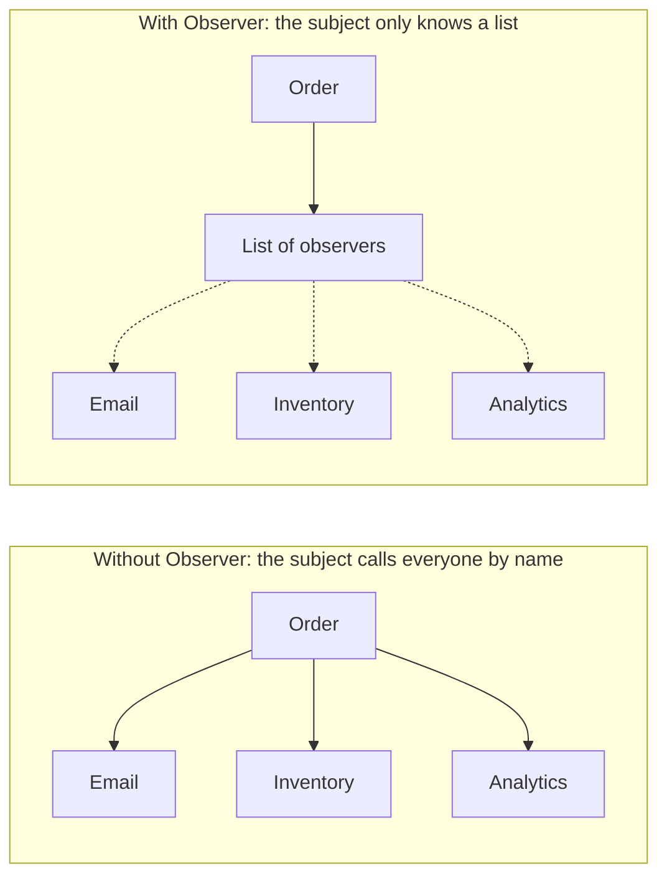
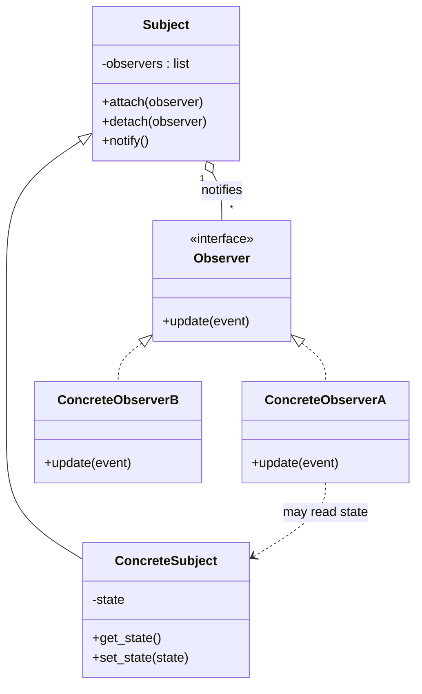
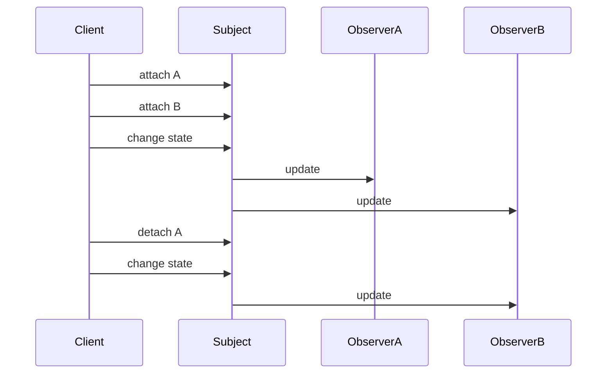
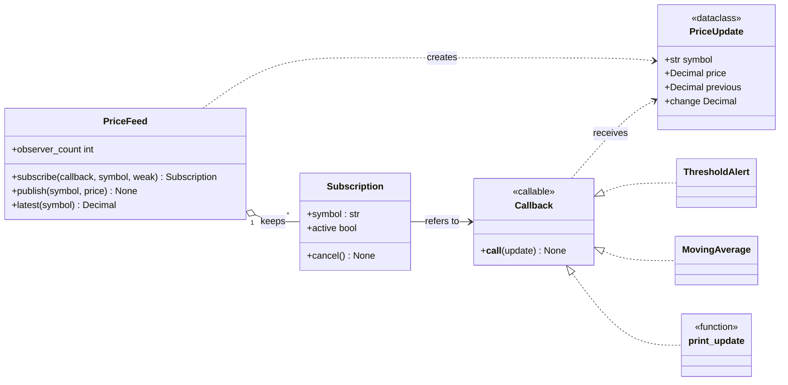
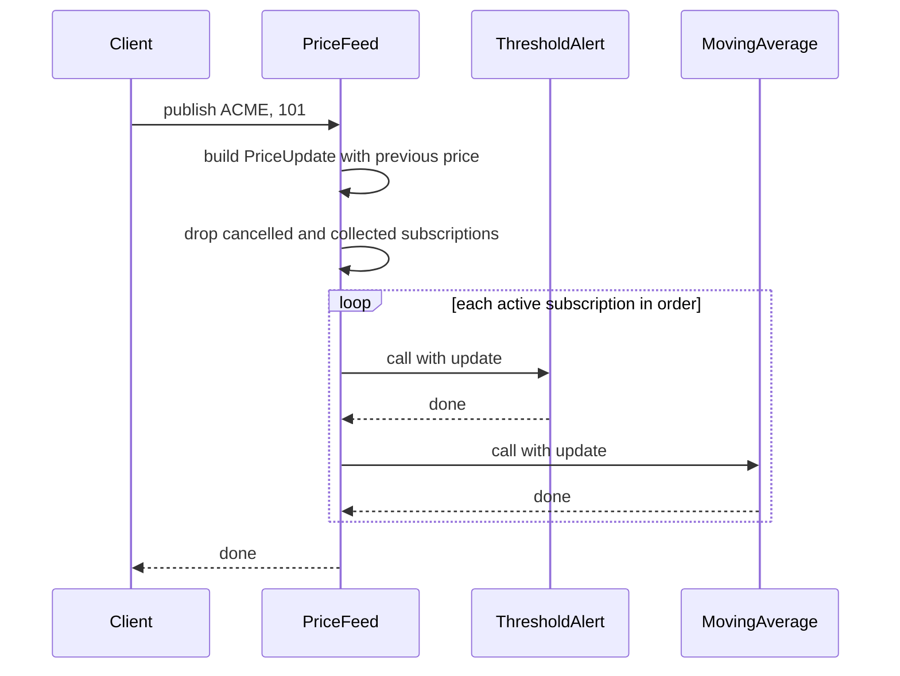
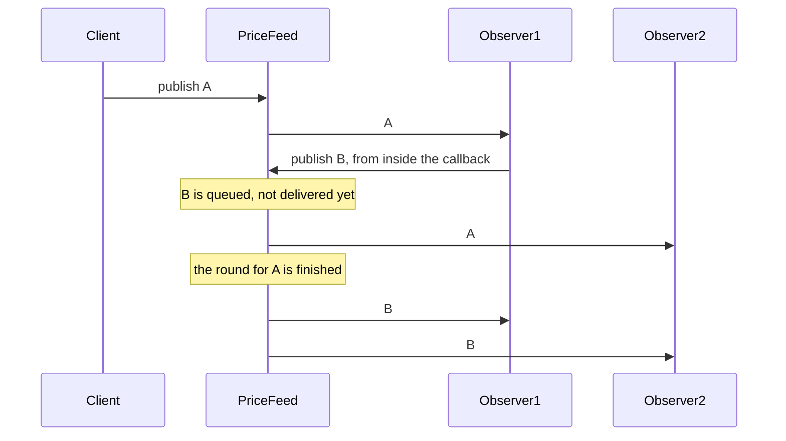

# Observer Design Pattern

**What you will learn**

- The problem Observer solves, in plain language.
- The official (Gang of Four) definition, explained phrase by phrase.
- How Observer differs from its look-alikes: Publish-Subscribe, Mediator and Strategy.
- How to apply it in a real design: a **stock price feed with alerts**, with class and sequence diagrams, decisions and tradeoffs, and runnable, tested Python 3.12 code.
- The classic Observer pitfalls, each **demonstrated** with real code: forgotten listeners that leak memory, updates arriving out of order, one failing observer, and changing subscriptions while notifying.
- Where the pattern is used, where it is overkill, and how to talk about it in an interview.

The price feed source lives next to this page as real `.py` files with tests. Everything was run on Python 3.12 and the output shown is real. Code blocks with a file title are the real files, and a test checks that they match. Blocks without a title are small illustrations that were run separately.

---

## 1. The problem

When an order ships, three other parts of the system must react: send an email, reserve stock in the inventory and record an analytics event. The quickest way is for the `Order` to call all three itself:

```python
class Order:
    def __init__(self, order_id: int) -> None:
        self.order_id = order_id
        self.status = "placed"

    def ship(self) -> None:
        self.status = "shipped"
        # Order knows about email, inventory and analytics, by name
        print(f"email: order {self.order_id} has shipped")
        print(f"inventory: reserve stock for order {self.order_id}")
        print(f"analytics: record shipment of order {self.order_id}")


Order(7).ship()
```

Output:

```text
email: order 7 has shipped
inventory: reserve stock for order 7
analytics: record shipment of order 7
```

It works, but the `Order` class now knows about every part of the system that cares about it:

1. **Every new dependent edits `Order`.** Adding "notify the warehouse app" means opening the order code again. The class that models an order keeps collecting unrelated duties.
2. **Dependents cannot be switched on or off.** Turning off analytics in a test, or for one customer, needs more `if` statements.
3. **`Order` cannot be tested alone.** Every dependent comes along with it.
4. **The alternative is worse.** If instead each dependent *polls* ("has order 7 shipped yet?" every second), most checks find nothing new, and updates still arrive late.



*Left: the order is hard-wired to each dependent. Right: the order holds a list of "things to tell", and who is on the list is decided elsewhere.*

What we want is for the subject to say "**something changed**" to whoever is interested, without knowing who they are or what they do. That is the Observer pattern.

## 2. An everyday analogy

Think of a **YouTube channel**. The creator uploads a video. Everyone who *subscribed* gets a notification. The creator does not know each subscriber by name, and does not care what each one does about it: one watches now, one saves it for later, one ignores it. Viewers subscribe and unsubscribe whenever they like, and the creator's job never changes.

Another one: a **magazine subscription**. The publisher prints one issue and the post office delivers a copy to every subscriber on the list. Add a subscriber, and the printing does not change.

The ideas hiding in these examples are the whole pattern: a **one-to-many** relationship, **subscribe and unsubscribe at will**, and **the sender does not know the receivers**.

## 3. What Observer is, in plain words

> The **subject** keeps a list of **observers**. When the subject's state changes, it tells every observer on the list, through one common method.

| Part | Job | In the order example |
|------|-----|----------------------|
| **Subject** (also called publisher or observable) | Holds the state, keeps the list of observers, and notifies them on change | `Order` |
| **Observer** (also called subscriber or listener) | Says what should happen when it is told | `EmailNotifier`, `InventoryUpdater`, `Analytics` |
| **Attach and detach** | Adding and removing observers, at any time | `order.attach(...)`, `order.detach(...)` |
| **Notify** | The subject calls every observer's update method | `order.ship()` |

Here is the order example rewritten with Observer:

```python
from typing import Protocol


class OrderObserver(Protocol):
    def order_shipped(self, order_id: int) -> None: ...


class Order:  # the subject
    def __init__(self, order_id: int) -> None:
        self.order_id = order_id
        self.status = "placed"
        self._observers: list[OrderObserver] = []

    def attach(self, observer: OrderObserver) -> None:
        self._observers.append(observer)

    def detach(self, observer: OrderObserver) -> None:
        self._observers.remove(observer)

    def ship(self) -> None:
        self.status = "shipped"
        for observer in list(self._observers):
            observer.order_shipped(self.order_id)


class EmailNotifier:
    def order_shipped(self, order_id: int) -> None:
        print(f"email: order {order_id} has shipped")


class InventoryUpdater:
    def order_shipped(self, order_id: int) -> None:
        print(f"inventory: reserve stock for order {order_id}")


class Analytics:
    def order_shipped(self, order_id: int) -> None:
        print(f"analytics: record shipment of order {order_id}")


order = Order(7)
order.attach(EmailNotifier())
order.attach(InventoryUpdater())
order.ship()

print("--- a new dependent joins, and Order is untouched")
order.attach(Analytics())
order.ship()
```

Output:

```text
email: order 7 has shipped
inventory: reserve stock for order 7
--- a new dependent joins, and Order is untouched
email: order 7 has shipped
inventory: reserve stock for order 7
analytics: record shipment of order 7
```

`Order` never mentions email, inventory or analytics. Adding a dependent means writing a class and calling `attach`, and no existing line changes.

## 4. The official definition

The pattern comes from *Design Patterns: Elements of Reusable Object-Oriented Software* (Gamma, Helm, Johnson and Vlissides, 1994, the "Gang of Four" or GoF book). Its statement of intent is:

> **"Define a one-to-many dependency between objects so that when one object changes state, all its dependents are notified and updated automatically."**

Phrase by phrase:

| Phrase | What it means in practice | Why it is there |
|--------|---------------------------|-----------------|
| **"a one-to-many dependency"** | One subject, any number of observers that depend on it | The subject is the single source of truth, and many parts need to follow it |
| **"between objects"** | The subject and observers are separate objects | They can change and be tested independently |
| **"when one object changes state"** | The trigger is a change in the subject | Observers hear about changes, they do not have to keep asking |
| **"all its dependents are notified"** | Every registered observer is told, through one common interface | The subject treats them all alike and does not know what they do |
| **"and updated automatically"** | Nobody has to remember to call each one by hand | Adding an observer needs no change in the subject's code |

!!! note "Two names for related ideas"
    You will also hear **Publish-Subscribe** (or *pub/sub*). It is close to Observer, but usually adds a *broker* between the two sides. Section 5 compares them.

## 5. Structure



*Reading the diagram: the subject **has** many observers (open diamond) but only through the `Observer` interface. Concrete observers realize that interface (dashed line, hollow triangle). An observer may read the subject's state when notified (dashed arrow). New to the notation? See [UML Basics: Class Diagrams](../../concept/uml-basics.md).*

| Role | Meaning | In the price feed design |
|------|---------|--------------------------|
| **Subject** | Holds state, keeps observers, notifies them | `PriceFeed` |
| **Observer** | The thing that is told | Any callable taking a `PriceUpdate` |
| **Concrete observers** | The reactions | `ThresholdAlert`, `MovingAverage`, `print_update` |
| **Event** | What is passed when notifying | `PriceUpdate` |



*The client registers observers, and every state change reaches everyone currently on the list. After `detach`, A hears nothing more.*

### Push or pull?

When the subject notifies, how does the observer get the data?

| Model | How it works | Good | Bad |
|-------|--------------|------|-----|
| **Push** | The subject sends the details in the notification (`update(event)`) | Observers need no reference to the subject. The event is a clear contract | The subject must guess what observers need, and may send too much |
| **Pull** | The subject only says "I changed". Observers ask it for what they want | Each observer takes only what it needs | Observers must hold the subject, and can read a state that has changed again since |

The price feed uses **push**: a `PriceUpdate` carries the symbol, the new price and the previous price. The feed also offers `latest(symbol)` for observers that want to pull.

### Observer and its look-alikes

| Pattern | Who knows whom | Typical scope | How it differs |
|---------|----------------|---------------|----------------|
| **Observer** | The subject holds its observers directly | One process, usually synchronous | The subject *is* the source of the event, and calls its observers itself |
| **Publish-Subscribe** | Publishers and subscribers only know a **broker** or event bus and a topic name | Often asynchronous, and can cross processes and machines | One more layer of decoupling: the sender does not even hold a list. Message queues work this way |
| **Mediator** | Objects talk **through** a central coordinator that decides who reacts | Within one object group | The mediator contains the coordination logic. Observer has no logic about who reacts |
| **Strategy** | The context holds one object and calls it | One context, one strategy | Strategy swaps *how* something is done. Observer broadcasts *that* something happened, to many. See the [Strategy page](../strategy-design-pattern/README.md) |

### Python: a function is already an observer

As with Strategy, if an observer is **one operation without state**, a plain function is enough, and no interface class is needed:

```python
from collections.abc import Callable

type ShippedCallback = Callable[[int], None]


class Order:
    def __init__(self, order_id: int) -> None:
        self.order_id = order_id
        self._on_shipped: list[ShippedCallback] = []

    def on_shipped(self, callback: ShippedCallback) -> None:
        self._on_shipped.append(callback)

    def ship(self) -> None:
        for callback in self._on_shipped:
            callback(self.order_id)


def send_email(order_id: int) -> None:
    print(f"email: order {order_id} has shipped")


order = Order(7)
order.on_shipped(send_email)
order.on_shipped(
    lambda order_id: print(f"analytics: record shipment of order {order_id}")
)
order.ship()
```

Output:

```text
email: order 7 has shipped
analytics: record shipment of order 7
```

Same behaviour, and no `OrderObserver` class. An observer that needs **state** (a running average, "have I already alerted?") is better as a class with a `__call__` method, and the design below has both kinds.

## 6. Worked example: Design a Stock Price Feed with Alerts

Time to use the pattern on a real low-level design problem. A price feed receives new prices for stock symbols. Several independent parts of an application care: an alert that fires when a price crosses a level, a moving average for a chart, and a log line. The feed must not know about any of them.

The full source is in this folder as real Python files with tests. Everything below explains *why* it looks the way it does.

| File | Purpose |
|------|---------|
| `pricefeed/events.py` | The event observers receive: `PriceUpdate` |
| `pricefeed/feed.py` | The subject: `PriceFeed`, and the `Subscription` handle |
| `pricefeed/observers.py` | Example observers: `ThresholdAlert`, `MovingAverage`, `print_update` |
| `demo.py` | A runnable demo |
| `tests/` | `pytest` tests |

### 6.1 Requirements

**Functional**

- Publish a new price for a symbol, and notify every interested observer.
- Observers **subscribe** to one symbol, or to all symbols, and can **unsubscribe** at any time.
- Each notification carries the symbol, the new price and the previous price.
- The feed remembers the latest price per symbol.
- Provide example observers: a **threshold alert** that fires once per crossing, a **moving average**, and a plain logging function.

**Non-functional**

- **Decoupled**: the feed must not know what its observers do, and new observers must not require editing it.
- **Robust**: one failing observer must not stop the others, and observers may subscribe or unsubscribe *during* a notification.
- **Predictable**: observers are notified in subscription order, and every observer sees updates in the same order.
- **No leaks**: an observer that is forgotten must be able to be garbage collected.

**Out of scope** (good follow-ups, see [6.10](#610-extending-it-and-interview-follow-ups)): thread safety, asynchronous delivery, batching, persistence and replay.

### 6.2 Finding the classes

| Class or function | Its one job | What it does *not* know |
|-------------------|-------------|-------------------------|
| `PriceFeed` (subject) | Stores the latest prices, keeps the subscriptions, and delivers each update | What any observer does with an update |
| `Subscription` | The handle a subscriber gets back: it can cancel, and it reports whether it is still active | The feed's other subscribers |
| `PriceUpdate` (event) | An immutable record of one change: symbol, price, previous price | Who will read it |
| Observers (`ThresholdAlert`, `MovingAverage`, `print_update`) | One reaction each | The feed, or each other |

The observer "interface" is just a **callable that takes a `PriceUpdate`**. `print_update` is a function because it has no state. `ThresholdAlert` and `MovingAverage` are classes with `__call__` because they remember things between updates.

### 6.3 Class diagram

!!! tip "New to class diagrams?"
    See [UML Basics: Class Diagrams](../../concept/uml-basics.md) for what every box, arrow and diamond means.



*Reading the diagram: `PriceFeed` is the Observer **subject**. It keeps `Subscription` objects, and each refers to an observer, which is anything callable with a `PriceUpdate`. The feed creates a `PriceUpdate` per publish. The two classes and one function on the right are interchangeable observers.*

### 6.4 What happens on `feed.publish(...)`



*The feed builds one event, prunes dead subscriptions, then calls each observer in the order they subscribed. It never inspects what an observer does.*

### 6.5 Design decisions and tradeoffs

This is the part interviewers care about most. Each row is a real choice with a real cost:

| # | Decision | Chosen | Alternative | What it costs us |
|---|----------|--------|-------------|------------------|
| 1 | What observers receive | **Push** an immutable `PriceUpdate` (with the previous price) | Pull: observers query the feed | Observers see exactly the change that happened, not a later state. The feed decides what is in the event |
| 2 | What an observer is | **Any callable**: function, lambda, bound method, object with `__call__` | An `Observer` interface (Protocol or ABC) | No explicit type to inherit, so the contract is only "callable taking a `PriceUpdate`". In return, the simplest observer is one line |
| 3 | How to unsubscribe | `subscribe` returns a **`Subscription` handle** with `cancel()` and `with` support | `unsubscribe(callback)` | You must keep the handle. In return there is no ambiguity when the same callback is subscribed twice, and lambdas can be cancelled |
| 4 | Filtering | The feed filters by **symbol** at subscription time | Every observer filters for itself | A little logic in the feed. Observers still defend themselves (`ThresholdAlert` ignores other symbols) so they stay correct if subscribed to everything |
| 5 | Changing subscriptions during a notification | Deliver to a **snapshot**. A new subscriber starts with the *next* update. A cancelled one is skipped **immediately** | Deliver to the live list | Two small rules to learn. Without them, changing the list mid-loop skips or repeats observers |
| 6 | An observer raises an exception | **Catch it**, report through an injected error handler (default: logging), and carry on | Let it propagate | Errors can be missed if nobody watches the log. Propagating would let one broken observer starve all the others |
| 7 | An observer publishes another update | The nested update is **queued** and delivered after the current one | Deliver it immediately (depth-first) | A nested update is delayed slightly. Without queueing, some observers would see the two updates in the opposite order to others |
| 8 | Order of notification | **Subscription order**, and tested | Leave it unspecified | It is a promise the feed must keep. Observers should still not *depend* on it, but tests become deterministic |
| 9 | Ownership of observers | **Strong** references by default, `weak=True` opt-in | Always weak | With strong references a forgotten observer leaks. With weak ones, the observer must be owned by someone else, or it disappears at once (see 6.6) |
| 10 | Delivery style | **Synchronous**: `publish` returns after every observer ran | A queue and worker thread | A slow observer slows the publisher. In return the behaviour is simple and deterministic |
| 11 | Threads | **Not thread-safe**, and documented | A lock inside the feed | Callers must add a lock if several threads publish or subscribe |
| 12 | Feedback from observers | **None**: fire and forget | Observers return a result or veto | The feed cannot know whether an observer succeeded, except through the error handler |

Smaller choices in the code:

- `PriceUpdate` is a **frozen dataclass**: one event object is shared by every observer, so no observer can change what another sees.
- Prices are `Decimal`, not `float`, so money is not rounded in surprising ways.
- Cancelling a subscription only sets a flag. The feed drops cancelled subscriptions from its list at the start of each delivery, which is safe even if the cancel happens *during* a delivery.

### 6.6 Observer's classic pitfalls, demonstrated

Observer looks simple, and its problems all appear at run time. Here is each one, how this design handles it, and the evidence:

| Pitfall | What goes wrong | How the design handles it | Evidence |
|---------|-----------------|---------------------------|----------|
| **The lapsed listener** | An observer that is never unsubscribed is held alive by the subject forever: a **memory leak** | `weak=True` holds the observer weakly, and dead subscriptions are dropped | Demo output below, and `test_feed_weak.py` |
| **Out-of-order updates** | An observer publishes a new update while being notified. Delivered at once, later observers see the *nested* update before the *original* one | Nested updates are **queued** so every observer sees the same order | `test_a_publish_from_inside_an_observer_keeps_one_order_for_all` |
| **One bad observer** | An exception in observer 2 stops observers 3 to 10 from being told | Each call is wrapped, errors go to a handler, and the round continues | Demo output below, and `test_a_failing_observer_does_not_stop_the_others` |
| **Changing the list while looping** | Subscribing or unsubscribing inside a callback skips or repeats observers | A snapshot for the round, plus a live "cancelled" check | `test_an_observer_added_mid_round_...` and `test_an_observer_cancelled_mid_round_...` |
| **Hidden control flow** | Reading `feed.publish(...)` tells you nothing about what happens next | `observer_count`, logging of failures, and the `Subscription` handles make the wiring inspectable | Not fully solved: this is the pattern's main readability cost |
| **Notification storms** | Many rapid updates each trigger expensive observers | Not handled: see the follow-ups (batching and coalescing) | Listed in 6.10 |

The order problem deserves a picture. Observer 1 reacts to update A by publishing update B:



*Both observers see A then B. If B were delivered immediately, Observer 2 would see B first and A second, and the two observers would disagree about what happened.*

### 6.7 Class or function for observers?

The same question as on the Strategy page, with the same answer:

| The observer is... | Use | Example in this design |
|--------------------|-----|------------------------|
| One stateless reaction | A **function** or `lambda` | `print_update`, a `lambda` that appends to a list |
| Stateful | A **class with `__call__`** | `ThresholdAlert` remembers whether it is already above the level. `MovingAverage` remembers recent prices |
| A method of an existing object | A **bound method** | `dashboard.on_price` (see the weak subscription demo) |

Two of these observers show why state matters. `ThresholdAlert` is **edge-triggered**: it fires once when the price *crosses* above the level, and re-arms when it falls back. A stateless function could not tell "just crossed" from "still above", and would alert on every update.

### 6.8 Testing, and what the tests prove

| Test file | What it proves |
|-----------|----------------|
| `test_feed_basics.py` | Delivery to every observer; symbol filtering; subscription order; publishing with nobody listening; previous price and change; `latest`; the same callback subscribed twice |
| `test_feed_delivery.py` | Cancel is idempotent; `with` cancels on exit; cancel and subscribe **during** a round; a failing observer, with a custom and with the default handler; **one order for all observers on a nested publish**; the feed recovers afterwards; dead subscriptions are dropped |
| `test_feed_weak.py` | A strong subscription **keeps the observer alive**; a weak one lets it be collected and is never called afterwards; a weak lambda vanishes at once |
| `test_observers.py` | The alert fires once per crossing and re-arms; a price exactly at the level does not count; other symbols are ignored; the moving average window; `print_update` output |
| `test_observer_extensibility.py` | **A brand-new observer defined outside the library plugs in unchanged**; functions, lambdas, objects and bound methods all work |
| `test_observer_docs_in_sync.py` | The code on this page equals the files |

I also checked that the tests can fail. I broke the code on purpose in 15 ways in a scratch copy, and every one was caught by at least one test: nested updates delivered immediately, a cancelled observer still called mid-round, iterating the live list, a failing observer breaking the round, the previous price read after it was overwritten, `latest` never stored, `weak=True` ignored, dead subscriptions never dropped, `cancel` that toggles instead of sets, a `with` block that does not cancel, the symbol filter ignored, reverse notification order, an alert that fires on every update, an alert that fires at exactly the level, and a moving average that keeps everything.

One of these was easy to miss. Dropping dead subscriptions from the list is invisible through `observer_count`, which only counts active ones. So a separate test looks at the list itself. A test can only catch what it can observe.

### 6.9 The code

Each block below is the real file from this folder.

**The event.** Immutable, so every observer can safely share it.

```python title="pricefeed/events.py"
from dataclasses import dataclass
from decimal import Decimal


@dataclass(frozen=True, slots=True)
class PriceUpdate:
    """What observers receive: the new price, and the price it replaced."""

    symbol: str
    price: Decimal
    previous: Decimal | None

    @property
    def change(self) -> Decimal | None:
        return None if self.previous is None else self.price - self.previous
```

**The subject.** `subscribe` returns a `Subscription`. `publish` queues the update, and `_deliver` walks a snapshot of the subscriptions.

```python title="pricefeed/feed.py"
import logging
import weakref
from collections import deque
from collections.abc import Callable
from decimal import Decimal
from types import MethodType, TracebackType
from typing import Self

from .events import PriceUpdate

type Callback = Callable[[PriceUpdate], None]
type ErrorHandler = Callable[[Callback, Exception], None]

_log = logging.getLogger(__name__)


def _log_error(callback: Callback, error: Exception) -> None:
    _log.error("observer %r failed: %s", callback, error, exc_info=error)


def _strong_ref(callback: Callback) -> Callable[[], Callback | None]:
    def deref() -> Callback | None:
        return callback  # this reference keeps the observer alive

    return deref


def _weak_ref(callback: Callback) -> Callable[[], Callback | None]:
    if isinstance(callback, MethodType):  # a bound method: hold its object weakly
        return weakref.WeakMethod(callback)
    return weakref.ref(callback)


class Subscription:
    """The handle `subscribe` returns. Cancelling it stops all further deliveries."""

    def __init__(self, ref: Callable[[], Callback | None], symbol: str | None) -> None:
        self._ref = ref
        self.symbol = symbol
        self._cancelled = False

    def target(self) -> Callback | None:
        """The observer, or None if cancelled or (for weak ones) garbage collected."""
        return None if self._cancelled else self._ref()

    @property
    def active(self) -> bool:
        return self.target() is not None

    def cancel(self) -> None:
        self._cancelled = True  # safe to call twice, and safe mid-delivery

    def __enter__(self) -> Self:
        return self

    def __exit__(
        self,
        exc_type: type[BaseException] | None,
        exc: BaseException | None,
        traceback: TracebackType | None,
    ) -> None:
        self.cancel()


class PriceFeed:
    """The subject: holds the latest prices and tells subscribers about each change.

    Delivery is synchronous, in subscription order. Not thread-safe.
    """

    def __init__(self, error_handler: ErrorHandler | None = None) -> None:
        self._subscriptions: list[Subscription] = []
        self._latest: dict[str, Decimal] = {}
        self._queue: deque[PriceUpdate] = deque()
        self._delivering = False
        self._on_error = error_handler or _log_error

    def subscribe(
        self, callback: Callback, symbol: str | None = None, *, weak: bool = False
    ) -> Subscription:
        """Register an observer for one symbol, or for all symbols if `symbol` is None.

        A weak subscription does not keep the observer alive. Someone else must hold it.
        """
        subscription = Subscription(
            _weak_ref(callback) if weak else _strong_ref(callback), symbol
        )
        self._subscriptions.append(subscription)
        return subscription

    def publish(self, symbol: str, price: Decimal) -> None:
        update = PriceUpdate(symbol, price, self._latest.get(symbol))
        self._latest[symbol] = price
        self._queue.append(update)
        if self._delivering:
            return  # called from inside an observer: wait until the current round ends
        self._delivering = True
        try:
            while self._queue:
                self._deliver(self._queue.popleft())
        finally:
            self._delivering = False

    def latest(self, symbol: str) -> Decimal | None:
        return self._latest.get(symbol)

    @property
    def observer_count(self) -> int:
        return sum(1 for subscription in self._subscriptions if subscription.active)

    def _deliver(self, update: PriceUpdate) -> None:
        self._subscriptions = [s for s in self._subscriptions if s.active]
        for subscription in list(self._subscriptions):  # a snapshot of this round
            if subscription.symbol not in (None, update.symbol):
                continue
            callback = subscription.target()  # None if cancelled during this round
            if callback is None:
                continue
            try:
                callback(update)
            except Exception as error:  # noqa: BLE001 - one bad observer must not stop the rest
                self._on_error(callback, error)
```

**Example observers.** A function for the stateless one, and classes for the two that remember things.

```python title="pricefeed/observers.py"
from collections import deque
from collections.abc import Callable
from decimal import Decimal

from .events import PriceUpdate


def print_update(update: PriceUpdate) -> None:
    """A stateless observer is just a function."""
    change = "first price" if update.change is None else f"{update.change:+}"
    print(f"{update.symbol} {update.price} ({change})")


class ThresholdAlert:
    """Fires once each time the price rises from at-or-below the level to above it."""

    def __init__(
        self,
        symbol: str,
        above: Decimal,
        notify: Callable[[str], None] = print,
    ) -> None:
        self._symbol = symbol
        self._above = above
        self._notify = notify
        self._is_above = False  # the state that makes this observer a class

    def __call__(self, update: PriceUpdate) -> None:
        if update.symbol != self._symbol:
            return
        now_above = update.price > self._above
        if now_above and not self._is_above:
            self._notify(
                f"ALERT {self._symbol} rose above {self._above}: {update.price}"
            )
        self._is_above = now_above


class MovingAverage:
    """The average of the last `window` prices of one symbol."""

    def __init__(self, symbol: str, window: int) -> None:
        if window < 1:
            raise ValueError("window must be at least 1")
        self._symbol = symbol
        self._prices: deque[Decimal] = deque(maxlen=window)

    def __call__(self, update: PriceUpdate) -> None:
        if update.symbol == self._symbol:
            self._prices.append(update.price)

    @property
    def value(self) -> Decimal | None:
        if not self._prices:
            return None
        return sum(self._prices, Decimal(0)) / len(self._prices)
```

**Using it.** The demo runs the alerts, then shows a scoped subscription, a failing observer, and the leak that `weak=True` prevents:

```python title="demo.py"
import gc
import weakref
from decimal import Decimal

from pricefeed import (
    MovingAverage,
    PriceFeed,
    PriceUpdate,
    ThresholdAlert,
    print_update,
)


def price_alerts() -> None:
    feed = PriceFeed()
    alert = ThresholdAlert("ACME", above=Decimal(100))
    average = MovingAverage("ACME", window=3)
    feed.subscribe(alert, symbol="ACME")
    feed.subscribe(average, symbol="ACME")
    feed.subscribe(print_update)  # a plain function that sees every symbol

    for price in ["98", "101", "103", "99", "102"]:
        feed.publish("ACME", Decimal(price))
    feed.publish("GLOBEX", Decimal("55.50"))
    print(f"average of the last 3 ACME prices: {average.value:.2f}")


def scoped_subscription() -> None:
    feed = PriceFeed()
    with feed.subscribe(print_update):  # cancelled automatically when the block ends
        feed.publish("ACME", Decimal(1))
    feed.publish("ACME", Decimal(2))  # nobody is listening any more
    print(f"observers left: {feed.observer_count}")


def one_bad_observer() -> None:
    errors: list[str] = []
    seen: list[str] = []

    def fail(update: PriceUpdate) -> None:
        raise RuntimeError("boom")

    feed = PriceFeed(error_handler=lambda callback, error: errors.append(str(error)))
    feed.subscribe(fail)
    feed.subscribe(lambda update: seen.append(update.symbol))
    feed.publish("ACME", Decimal(1))
    print(f"one observer failed ({errors[0]}), the other still ran: {seen}")


class Dashboard:
    def on_price(self, update: PriceUpdate) -> None:
        pass


def forgotten_observer() -> None:
    strong_feed, weak_feed = PriceFeed(), PriceFeed()
    strong_dashboard, weak_dashboard = Dashboard(), Dashboard()
    strong_ref = weakref.ref(strong_dashboard)
    weak_ref = weakref.ref(weak_dashboard)
    strong_feed.subscribe(strong_dashboard.on_price)
    weak_feed.subscribe(weak_dashboard.on_price, weak=True)

    del strong_dashboard, weak_dashboard  # the program forgets both dashboards
    gc.collect()
    print(
        f"strong subscription still keeps its dashboard alive: {strong_ref() is not None}"
    )
    print(f"weak subscription let its dashboard go: {weak_ref() is None}")
    weak_feed.publish("ACME", Decimal(1))  # prunes the dead subscription
    print(f"observers left on the weak feed: {weak_feed.observer_count}")


if __name__ == "__main__":
    price_alerts()
    scoped_subscription()
    one_bad_observer()
    forgotten_observer()
```

Run it with `python demo.py` from this folder. The output:

```text
ACME 98 (first price)
ALERT ACME rose above 100: 101
ACME 101 (+3)
ACME 103 (+2)
ACME 99 (-4)
ALERT ACME rose above 100: 102
ACME 102 (+3)
GLOBEX 55.50 (first price)
average of the last 3 ACME prices: 101.33
ACME 1 (first price)
observers left: 0
one observer failed (boom), the other still ran: ['ACME']
strong subscription still keeps its dashboard alive: True
weak subscription let its dashboard go: True
observers left on the weak feed: 0
```

Read the last three lines together: the strong subscription **still holds** its deleted dashboard, and the weak one let it go.

**Running the tests**

```bash
pip install pytest
pytest
```

From this folder or from the repository root, both work.

### 6.10 Extending it, and interview follow-ups

**Adding an observer** means writing a callable and calling `subscribe`. `tests/test_observer_extensibility.py` defines a `BigMoveDetector` outside the library and plugs it in without touching `PriceFeed`.

Follow-up questions and where the design would go:

| Follow-up | Direction |
|-----------|-----------|
| "Make it thread-safe" | Guard the subscription list and the queue with a lock, and take the snapshot under the lock. Do not hold the lock while calling observers, or a slow observer blocks everyone and a re-entrant call can deadlock |
| "A slow observer blocks the publisher" | Deliver asynchronously: put updates on a queue and let worker threads or tasks call observers. You gain speed and lose the simple "publish returns after everyone ran" guarantee |
| "Too many updates" | Batch or coalesce: keep only the latest price per symbol for a short window, then deliver once |
| "Observers care about different event kinds" | Subscribe by **event type** or topic, which moves toward Publish-Subscribe |
| "Observers must run in a set order or with priorities" | Add a priority to `subscribe`. Better: make the observers independent, so order does not matter |
| "Do not lose updates if an observer is down" | Persist events and let observers replay from an offset. That is a message queue, a high-level design topic |
| "Run only once" | A `once=True` option that cancels the subscription after its first delivery |
| "Retry a failing observer" | A smarter error handler: retry with backoff, then move the event to a dead-letter list |

## 7. Where to use it

Use Observer when **one thing changing should trigger reactions elsewhere, and the changing thing should not know who reacts**.

| Use case | Subject | Observers |
|----------|---------|-----------|
| **User interfaces (model and view)** | The data model | Every widget that shows it |
| **Event listeners** | A button, a timer, a socket | Handlers registered for its events |
| **Order and workflow status** | An order | Email, inventory, analytics (this page's problem) |
| **Monitoring and alerting** | A metric or price | Alert rules, dashboards, loggers |
| **Logging** | A logger | Its handlers (the Logger design on the [Singleton page](../singleton-design-pattern/README.md) fans out the same way) |
| **Reactive spreadsheets and data binding** | A cell or field | Every formula or view that uses it |
| **Domain events** | An entity | Other parts of the application that react to changes |

**Observers you have already used in Python**

I ran these on Python 3.12:

| Example | What it shows |
|---------|---------------|
| `Future.add_done_callback(fn)` in `concurrent.futures` | The future is the subject and each callback an observer. Two callbacks ran in the order added (`A`, then `B`) once `set_result` was called, and a callback added *after* completion ran immediately |
| `logger.addHandler(handler)` and `removeHandler` in `logging` | One logger delivered a record to two handlers. After `removeHandler` on the second, only the first heard the next message |

Other well-known examples, which I did not run here: GUI toolkits and browser event listeners, and the third-party Django framework's signals.

### When *not* to use it

- **There is exactly one dependent and it will always be that one.** Call it directly.
- **The order and the result matter, and the reaction is part of the operation.** If "ship the order" is only complete when the payment capture succeeds, use an explicit call, not a fire-and-forget notification.
- **The flow is hard to follow already.** Many observers that publish further events create chains that are very difficult to debug. Consider an explicit workflow instead.
- **You need guaranteed delivery across machines.** Use a message queue, which is Publish-Subscribe with persistence, rather than an in-process list.

## 8. Tradeoffs and criticism

| Benefit | Cost |
|---------|------|
| The subject is decoupled from its dependents | **Hidden control flow**: a plain call now triggers behaviour you cannot see from the call site |
| Observers can be added and removed at run time | **Memory leaks** from forgotten subscriptions (the lapsed listener) |
| New reactions need no change in the subject | **Unpredictable order** and surprises if observers depend on one another or publish more events |
| Supports broadcast: one event, many reactions | **Cascades**: an observer's action triggers more notifications, and chains and loops become hard to reason about |
| Each observer is small and testable alone | **Error handling is unclear**: who deals with an observer's failure? |

### Push or pull, revisited

Push sends a self-contained event, so observers are decoupled from the subject and see the exact change. Its cost is that the event type becomes a shared contract: adding a field is easy, but changing one breaks every observer. Pull keeps events tiny, but observers must hold the subject and can read a later state than the one that triggered them. A common compromise, used here, is **push an event and also offer a small read method** (`latest`).

### Synchronous or asynchronous?

| | Synchronous (this design) | Asynchronous |
|---|---------------------------|--------------|
| `publish` returns when | Every observer has run | The event is queued |
| Order and consistency | Easy: observers finish before the next event | Harder: events overlap |
| Slow observer | Blocks the publisher | Only delays itself |
| Failure | Visible right away | Needs its own reporting |
| Fits | In-process reactions, UI updates | Slow reactions, fan-out to other services |

### How Observer relates to SOLID

| Principle | How this design follows it | Evidence |
|-----------|----------------------------|----------|
| **Single responsibility** | The feed stores prices and delivers events. Reactions live in observers | Separate classes, separate tests |
| **Open/Closed** | New observers are added without editing `PriceFeed` | `BigMoveDetector` in the extensibility test |
| **Liskov substitution** | Any callable taking a `PriceUpdate` can stand in for any other | Functions, lambdas, objects and bound methods all pass the same tests |
| **Dependency inversion** | The feed depends on "a callable taking a `PriceUpdate`", not on concrete observers | `PriceFeed` never imports `ThresholdAlert` |

## 9. Interview tips

!!! tip "Interview tip: how to structure your answer"
    1. Start with the problem: one object must trigger reactions in several others, and hard-wiring them couples everything.
    2. State the definition in your own words: *the subject keeps a list of observers and tells them all when it changes*.
    3. Name the roles: subject, observer, attach and detach, notify.
    4. Mention push versus pull, and that in Python a callable is an observer.
    5. Volunteer the pitfalls: leaks, ordering, exceptions and threads. Interviewers value engineers who know how it breaks.

Common questions and short model answers:

| Question | Short answer |
|----------|--------------|
| Observer vs Pub/Sub? | In Observer the subject holds its observers and calls them directly, usually in one process. In Pub/Sub a **broker** sits between publishers and subscribers, so they do not know each other, and it can be asynchronous and cross machines |
| Observer vs Mediator? | A mediator holds the coordination logic and decides who reacts. In Observer the subject only broadcasts, and each observer decides for itself |
| Observer vs Strategy? | Strategy swaps *how* one thing is done, chosen from outside. Observer tells *many* things that *something happened* |
| Push or pull? | Push sends the data in the notification, which decouples observers but fixes the event shape. Pull sends only "changed", and observers read what they need. Many designs push an event and also offer a getter |
| What is the lapsed listener problem? | A subject holds a strong reference to every observer. If an observer is never unsubscribed, it can never be garbage collected. Fix it by always unsubscribing, or by holding observers weakly |
| What if an observer throws? | Catch it around each call, report it, and continue, so one bad observer cannot starve the rest |
| What if an observer subscribes or unsubscribes during notification? | Iterate over a snapshot, and decide the rules: a new observer starts with the next event, and a cancelled one is skipped straight away |
| What if an observer triggers another notification? | Queue it and deliver after the current round, so all observers see events in the same order. Or forbid it |
| Is the order of notification guaranteed? | Only if you promise it. Say so, but tell observers not to rely on it |
| How do you make it thread-safe? | Lock the subscription list and take a snapshot under the lock, but call the observers **outside** the lock to avoid deadlocks and blocking |
| How would you test it? | Test observers alone. Test the subject with fake observers that record what they receive, and check order, failures and mid-round changes |
| Is it just callbacks? | A callback list is the simplest Observer. The pattern adds the vocabulary and the rules around it: registration, ordering, errors, ownership |

## 10. Key takeaways

- Observer = **a subject keeps a list of observers and notifies them all when it changes**, without knowing what they do.
- The official definition: *"Define a one-to-many dependency between objects so that when one object changes state, all its dependents are notified and updated automatically."*
- It is **one-to-many**, and observers **subscribe and unsubscribe at run time**.
- In Python, **any callable is an observer**. Use a class with `__call__` when the observer has state.
- Prefer **push** with an immutable event, and offer a small getter for observers that want to pull.
- The design work is in the **edge cases**: forgotten listeners, one failing observer, changing the list mid-notification, and nested updates.
- **A subscription handle** beats "unsubscribe by callback": it is unambiguous and can be scoped with `with`.
- Watch for **hidden control flow** and cascades. If the reaction is part of the operation, call it explicitly.
- **Test your tests**: break the code on purpose and check that a test fails. Some behaviour needs its own test because nothing else shows it.

## References

- Gamma, Helm, Johnson, Vlissides. *Design Patterns: Elements of Reusable Object-Oriented Software*. Addison-Wesley, 1994. (Source of the Observer intent statement quoted above.)
- Python documentation: [`weakref`](https://docs.python.org/3/library/weakref.html) (including `WeakMethod`), [`concurrent.futures.Future.add_done_callback`](https://docs.python.org/3/library/concurrent.futures.html#concurrent.futures.Future.add_done_callback), [`logging.Logger.addHandler`](https://docs.python.org/3/library/logging.html#logging.Logger.addHandler), [`collections.deque`](https://docs.python.org/3/library/collections.html#collections.deque), [`dataclasses`](https://docs.python.org/3/library/dataclasses.html), [`decimal`](https://docs.python.org/3/library/decimal.html), [`typing.Protocol`](https://docs.python.org/3/library/typing.html#typing.Protocol).
