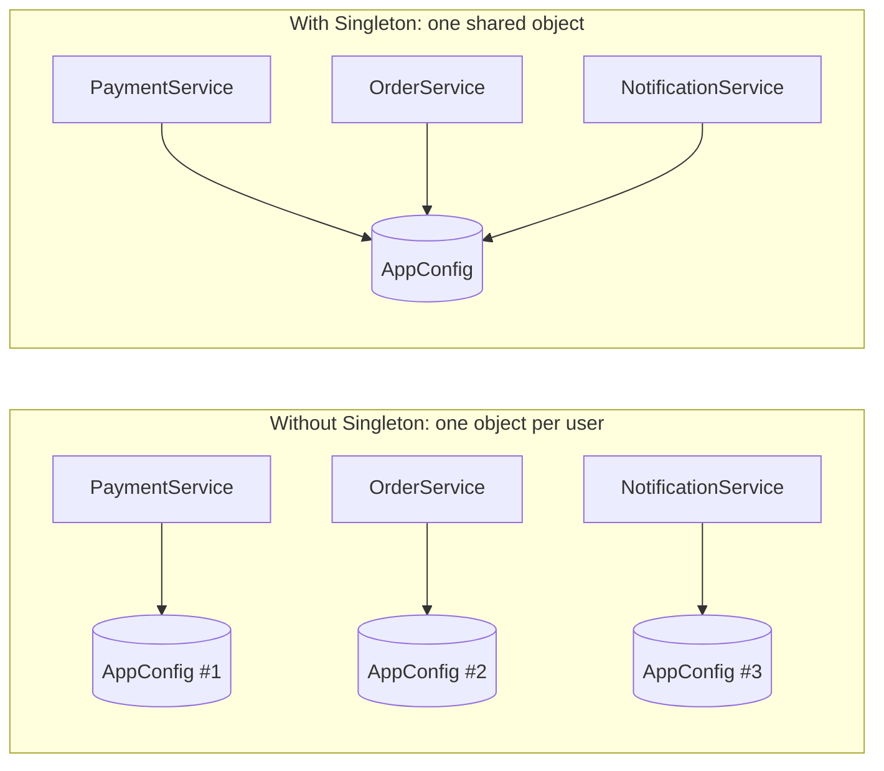
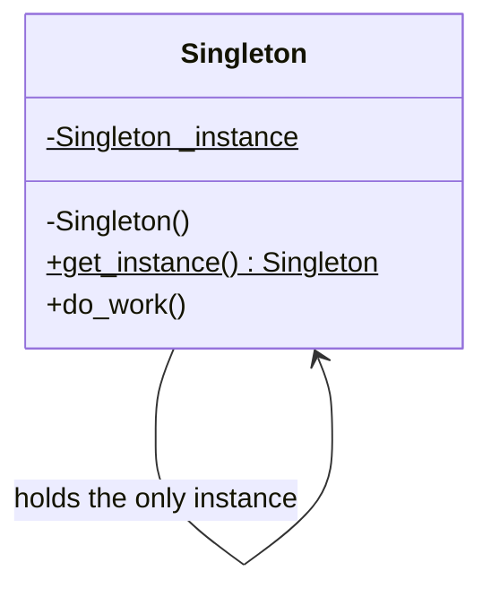
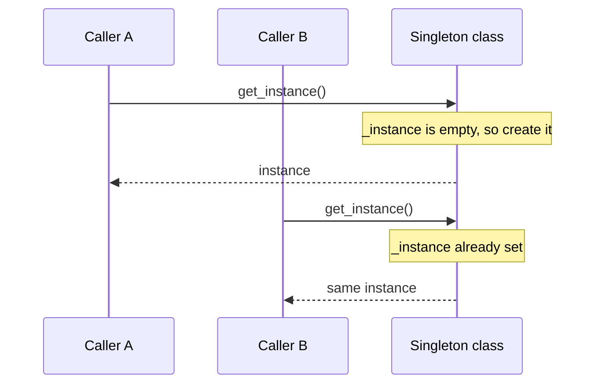
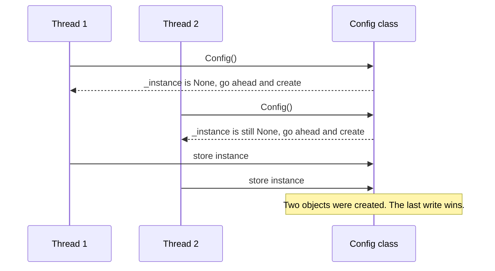
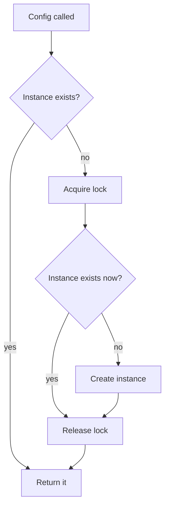

# Singleton Design Pattern

**What you will learn**

- The problem Singleton solves, in plain language.
- The official (Gang of Four) definition, explained phrase by phrase.
- How to build it in Python 3.12 step by step, including the thread-safety bug that most tutorials skip.
- Where it is used in real systems, where it should *not* be used, and how to talk about it in an interview.

All code on this page was run on Python 3.12, and the output shown is real.

---

## 1. The problem

Imagine an application with three services: payments, orders and notifications. Each of them needs the application configuration (database URL, feature flags, API keys). The simplest thing is for each service to create its own `AppConfig`:

```python
class PaymentService:
    def __init__(self) -> None:
        self.config = AppConfig()   # reads config.yaml from disk

class OrderService:
    def __init__(self) -> None:
        self.config = AppConfig()   # reads config.yaml again

class NotificationService:
    def __init__(self) -> None:
        self.config = AppConfig()   # and again...
```

This works, but it hides three problems:

1. **Waste**: the file is read and parsed three times (or three hundred times, if services are created per request).
2. **Inconsistency**: if one copy changes a value at runtime (say, turns on a feature flag), the other copies never see it.
3. **Resource conflicts**: some things simply must not be duplicated. Two loggers writing to the same file will interleave and corrupt lines. Two connection pools will each open their own connections and together exceed the database's connection limit.



*Left: three copies that can drift apart. Right: every service talks to the same single object.*

What we want is a class that **refuses to be created more than once** and hands out the same object to everyone who asks. That is the Singleton pattern.

## 2. An everyday analogy

Think of the **government of a country**. There is exactly one. You do not create a new government every time you need one; you refer to *the* government, and everyone means the same one. Two other examples:

- **The print spooler in an office**: all computers send jobs to one queue. If each computer had its own spooler, two people could print to the same printer at the same time and the pages would be mixed together.
- **The clock on the wall of a meeting room**: everyone in the room looks at the same clock, so everyone agrees on the time.

Two ideas are hiding in these examples: there is **exactly one** of the thing, and **everyone knows where to find it**. Those two ideas are the whole pattern.

## 3. What Singleton is, in plain words

> A Singleton is a class that guarantees **only one object of it ever exists**, and gives the rest of the program **one well-known way to get that object**.

| Guarantee | Meaning | Who enforces it |
|-----------|---------|-----------------|
| One instance | No matter how many times the code asks for it, the same object comes back | The class itself, not the callers |
| Well-known access | Any part of the program can reach it without someone passing it around | A static method, module variable or similar entry point |

Note the first row: the *class* enforces the rule. Saying "please only create one of these" in a code comment is a convention, not a Singleton.

## 4. The official definition

The pattern comes from the book *Design Patterns: Elements of Reusable Object-Oriented Software* (Gamma, Helm, Johnson and Vlissides, 1994, known as the "Gang of Four" or GoF book). Its statement of intent is:

> **"Ensure a class only has one instance, and provide a global point of access to it."**

That sentence is short, but each phrase carries weight:

| Phrase | What it means in practice | Why it is there |
|--------|---------------------------|-----------------|
| **"Ensure"** | It must be *guaranteed by the code*, not left to programmer discipline | Otherwise one careless `AppConfig()` call breaks the whole idea |
| **"a class only has one instance"** | At most one live object of that class (per process, see [tradeoffs](#8-tradeoffs-and-criticism)) | Shared state must be shared, and exclusive resources must not be duplicated |
| **"and provide"** | The class takes on a second job: distributing its own instance | Callers should not need to know how or when it was created |
| **"a global point of access"** | Any code can reach the instance from anywhere, without it being passed in | Convenient (no plumbing) but also the most criticised part, since it is global state |

!!! note "Is 'global' a good thing?"
    The *one instance* part is what you usually need. The *global access* part is a convenience that comes with a price: any code can now use or change the object, and nothing in a function's signature tells you it does. We come back to this in [tradeoffs](#8-tradeoffs-and-criticism).

## 5. Structure

Here is the classic UML picture of the pattern:



*`$` marks a static (class-level) member. The constructor is private so callers cannot create objects themselves; they must go through `get_instance()`.*

The class has three ingredients:

1. A **static field** that remembers the one instance.
2. A **restricted constructor**, so the outside world cannot just call `Singleton()` freely.
3. A **static accessor** (`get_instance()`) that creates the instance the first time and returns the stored one afterwards.

The flow of calls looks like this:



*The first call pays the creation cost. Every later call just returns the stored object.*

!!! note "Python does not have private constructors"
    Python cannot truly hide `__init__` the way some other languages can. So in Python the pattern is implemented by *intercepting object creation* (`__new__`, a metaclass) or by *not exposing a class at all* (a module-level object). The next section shows both.

## 6. Building it step by step in Python 3.12

We start with the simplest thing that works, find where it breaks, and fix it.

### Step 1: The module-level object (the Pythonic default)

In Python, a module is executed **once**, the first time it is imported. Every later `import` gets the same already-loaded module. So an object created at module level is automatically a singleton.

```python title="config.py"
class AppConfig:
    def __init__(self) -> None:
        print("Loading config...")  # runs once, on first import
        self.db_url = "postgres://localhost/app"
        self.debug = False


config = AppConfig()
```

```python title="service_a.py"
from config import config


def describe() -> str:
    return f"A sees debug={config.debug}"
```

```python title="service_b.py"
from config import config


def switch_debug_on() -> None:
    config.debug = True
```

```python title="main.py"
import service_a
import service_b

service_b.switch_debug_on()
print(service_a.describe())
```

Output:

```text
Loading config...
A sees debug=True
```

"Loading config..." appears **once** even though two modules import `config`, and service A sees the change made by service B. That is a singleton, with no special code.

!!! tip "Interview tip"
    In Python, saying "I would just use a module-level instance" is often the best first answer, and shows you know the language. Then say *when* you would need more (lazy creation, or a class that must guard against being instantiated twice).

Limitations: the object is created at import time (**eager**), even if it is never used, and nothing stops someone from writing `AppConfig()` again. If you need laziness or enforcement, read on.

### Step 2: Enforcing one instance with `__new__`

`__new__` is the method Python calls to *create* an object (before `__init__` sets it up). If we take control of it, we can return the same object every time.

```python
from typing import Self


class Logger:
    _instance: Self | None = None
    messages: list[str]

    def __new__(cls) -> Self:
        if cls._instance is None:
            instance = super().__new__(cls)
            instance.messages = []
            cls._instance = instance
        return cls._instance

    def log(self, message: str) -> None:
        self.messages.append(message)


a = Logger()
b = Logger()
a.log("first")
b.log("second")
print(a is b)
print(a.messages)
```

Output:

```text
True
['first', 'second']
```

`a` and `b` are the *same* object, so a message logged through one is visible through the other.

!!! warning "Common mistake: `__init__` runs every time"
    Python calls `__init__` on the returned object **every time** you write `Logger()`, even when `__new__` returns an existing instance. If you put your setup in `__init__`, the state is silently reset:

    ```python
    class BrokenLogger:
        _instance: Self | None = None

        def __new__(cls) -> Self:
            if cls._instance is None:
                cls._instance = super().__new__(cls)
            return cls._instance

        def __init__(self) -> None:
            self.messages: list[str] = []  # runs on EVERY BrokenLogger() call


    BrokenLogger().messages.append("important")
    print(BrokenLogger().messages)
    ```

    Output:

    ```text
    []
    ```

    The "important" message is gone. That is why the version above does its setup inside `__new__`, only when the instance is first created.

### Step 3: The bug: two threads, two "singletons"

The code in step 2 looks right, but it has a race condition. Suppose two threads call `Config()` at the same moment, before the instance exists:



*Both threads checked "does it exist?" before either had finished creating it.*

We can reproduce this. The `time.sleep` stands in for slow setup work (reading a file, opening a socket) and makes the timing problem happen every time:

```python
import threading
import time
from typing import Self


class Config:
    _instance: Self | None = None

    def __new__(cls) -> Self:
        if cls._instance is None:
            time.sleep(0.1)  # simulate slow setup (reading a file, opening a socket)
            cls._instance = super().__new__(cls)
        return cls._instance


instances: list[Config] = []


def worker() -> None:
    instances.append(Config())


threads = [threading.Thread(target=worker) for _ in range(5)]
for t in threads:
    t.start()
for t in threads:
    t.join()

print("distinct instances created:", len({id(i) for i in instances}))
```

Output:

```text
distinct instances created: 5
```

Five threads, five "singletons". Without the `sleep` the window is tiny, so the bug would appear only rarely in production, which is exactly what makes concurrency bugs so unpleasant to debug.

### Step 4: The fix: a lock with double-checked locking

We protect creation with a lock, so only one thread can be inside the "create it" section. But taking a lock on *every* call would slow down the common case (the instance already exists). The standard trick is **double-checked locking**: check once without the lock (fast path), and check again inside the lock (safe path).



*The second check exists because another thread may have created the instance while we were waiting for the lock.*

```python
import threading
import time
from typing import Self


class Config:
    _instance: Self | None = None
    _lock = threading.Lock()

    def __new__(cls) -> Self:
        if cls._instance is None:  # 1st check: fast path, no lock
            with cls._lock:
                if cls._instance is None:  # 2nd check: only one thread gets here first
                    time.sleep(0.1)  # simulate slow setup
                    cls._instance = super().__new__(cls)
        return cls._instance
```

Running the same five-thread test against this class:

```text
distinct instances created: 1
```

!!! tip "Interview tip"
    "Make your Singleton thread-safe" is the classic follow-up question. Draw the two-thread race (like the diagram above), then explain double-checked locking and why the *second* check is needed. That one explanation covers most of what interviewers want here.

### Step 5: Reuse it: a metaclass

If you have several singleton classes (`Logger`, `Cache`, `Settings`), copying the lock code into each is repetitive. A **metaclass** (the "class of a class") can hold the logic once. It intercepts `Cache()` calls and decides whether to create a new object.

```python
import threading
from typing import Any, ClassVar


class SingletonMeta(type):
    _instances: ClassVar[dict[type, Any]] = {}
    _lock = threading.Lock()

    def __call__(cls, *args: Any, **kwargs: Any) -> Any:
        if cls not in cls._instances:
            with cls._lock:
                if cls not in cls._instances:
                    cls._instances[cls] = super().__call__(*args, **kwargs)
        return cls._instances[cls]


class Cache(metaclass=SingletonMeta):
    def __init__(self) -> None:
        print("Cache initialised")  # runs exactly once
        self.data: dict[str, str] = {}


class Settings(metaclass=SingletonMeta):
    pass


c1 = Cache()
c2 = Cache()
c1.data["k"] = "v"
print(c1 is c2, c2.data)
print("Cache and Settings are separate singletons:", id(Cache()) != id(Settings()))
```

Output:

```text
Cache initialised
True {'k': 'v'}
Cache and Settings are separate singletons: True
```

Two nice properties: `__init__` runs **once** (the step 2 problem is gone, because the metaclass skips creation entirely on later calls), and each class gets its own single instance.

### A tempting shortcut that is *not* safe: `functools.cache`

A lazy singleton can also be written as a cached factory function:

```python
import functools

@functools.cache
def get_settings() -> Settings:
    return Settings()
```

It reads well, but `functools.cache` does **not** stop two threads from both running the function on the very first call. Running the five-thread test with a slow `Settings()` gives:

```text
distinct instances: 5
later calls same object: True
```

After the first call finishes the cache works, but the race window on that first call is real. It is fine when construction is cheap and fast, or when the first call happens at startup before threads exist. Otherwise, add a lock.

### Comparing the variants

| Variant | Lazy? | Thread-safe? | `__init__` runs once? | Easy to test? | Use when |
|---------|-------|--------------|-----------------------|---------------|----------|
| Module-level object | No (created at import) | Yes (module body runs once) | Yes | Yes (can be patched) | **Default choice in Python** |
| `__new__` only | Yes | **No** (race) | Only if setup is in `__new__` | Hard | Learning only |
| `__new__` + lock | Yes | Yes | Only if setup is in `__new__` | Hard | One-off singleton class |
| Metaclass + lock | Yes | Yes | Yes | Medium (needs reset) | Several singleton classes |
| `functools.cache` factory | Yes | **No** on first call | Yes | Yes (`cache_clear()`) | Cheap, startup-time setup |

## 7. Where to use it

The pattern fits things where **there should logically be only one**, or where **duplicating it causes harm**.

| Use case | What goes wrong with several instances |
|----------|----------------------------------------|
| **Logger** | Multiple loggers writing to the same file interleave or overwrite each other's output |
| **Application configuration** | Copies drift apart, and the file is read and parsed repeatedly |
| **Database connection pool** | Each pool opens its own connections, so together they exceed the database's connection limit |
| **Cache manager** | Separate caches each hold partial data, so hit rate drops and memory use doubles |
| **Thread pool / worker pool** | Several pools compete for the same CPU cores and oversubscribe the machine |
| **Hardware or device access** (printer spooler, GPU handle, serial port) | Two objects controlling the same device issue conflicting commands |
| **Service registry / feature-flag client** | Different parts of the program see different sets of services or flags |

A logger and a connection pool as Singletons, reusing `SingletonMeta` from above:

```python
import queue
import threading


class Logger(metaclass=SingletonMeta):
    def __init__(self) -> None:
        self._lines: list[str] = []
        self._write_lock = threading.Lock()

    def log(self, source: str, message: str) -> None:
        with self._write_lock:  # shared instance, so guard its state
            self._lines.append(f"[{source}] {message}")

    @property
    def lines(self) -> list[str]:
        return list(self._lines)


class ConnectionPool(metaclass=SingletonMeta):
    def __init__(self, size: int = 2) -> None:
        self._free: queue.Queue[str] = queue.Queue()
        for i in range(size):
            self._free.put(f"conn-{i}")

    def acquire(self) -> str:
        return self._free.get(timeout=1)

    def release(self, conn: str) -> None:
        self._free.put(conn)


Logger().log("payments", "charge started")
Logger().log("orders", "order placed")
print(Logger().lines)

pool_a = ConnectionPool(size=2)
pool_b = ConnectionPool(size=50)  # ignored: the pool already exists
conn = pool_a.acquire()
print(pool_a is pool_b, conn)
pool_b.release(conn)
```

Output:

```text
['[payments] charge started', '[orders] order placed']
True conn-0
```

Two things to notice. First, the payments and orders code never shared a `Logger` variable, yet their messages ended up in the same one. Second, `ConnectionPool(size=50)` silently ignored `size=50`, because the pool already existed. Constructor arguments are only honoured on the first call, which is a known trap of the pattern.

!!! note "Real world"
    You have already used singleton-like objects: Python's `logging.getLogger("name")` returns the *same* logger object for the same name, and `None`, `True` and `False` are singletons of their own types. Web frameworks commonly create one settings object and one database connection pool per process.

### When *not* to use it

- **Entities with identity or their own data**, such as `User`, `Order` or `Product`. There are many, by definition.
- **Anything you want to replace in tests** (a payment gateway, a clock). Singletons are hard to swap for fakes, see below.
- **Per-request or per-tenant state.** A singleton is shared by everyone, so per-user state stored in it leaks across users.
- **"Only one across all my servers".** A Singleton gives one instance *per process*. Global uniqueness (one leader, one scheduler) needs a distributed lock or leader election, which is a different problem.

## 8. Tradeoffs and criticism

Singleton is the most popular pattern and also the most criticised. You should be able to argue both sides.

| Benefit | Cost |
|---------|------|
| Guarantees a single shared instance | It is **global mutable state**: any code can change it, so bugs are hard to trace |
| Lazy creation saves startup time and memory | **Hidden dependencies**: a function's signature does not reveal that it uses the singleton |
| No need to pass the object through every layer | **Hard to unit test**: state leaks between tests, and you cannot easily substitute a fake |
| Controlled access to a shared resource | Mixes two responsibilities (the class's real job *and* managing its own lifetime), which bends the Single Responsibility Principle |
| Simple to explain | **One instance per process, not per system**: it does not span multiple workers or servers |

### Hidden dependencies and testing

Compare code that reaches out to a global with code that is *given* its dependency. (In this snippet `Logger` is a plain class that collects lines in a list, and `get_logger()` returns the one shared instance.)

```python
class HiddenOrderService:
    def place(self, order_id: int) -> None:
        get_logger().log(f"placed {order_id}")  # hidden: not in the signature


class OrderService:
    def __init__(self, logger: Logger) -> None:
        self.logger = logger  # dependency is explicit

    def place(self, order_id: int) -> None:
        self.logger.log(f"placed {order_id}")


fake = Logger()
OrderService(fake).place(7)
print(fake.lines)
```

Output:

```text
['placed 7']
```

The second version is easy to test: pass in a fake logger and inspect it. This leads to the usual modern advice: **keep "one instance" as a decision made in one place (at application start-up), and pass the object to whoever needs it** (dependency injection), instead of letting every class reach for a global. You keep the benefit of a single instance without the global access.

### One instance per *process*

Most production Python servers run several worker processes. Each process has its own memory, so each has its own "singleton":

```python
# Counter is a __new__-based singleton like Logger in step 2, with `value` starting at 0.
# The parent creates it, then starts a child process that uses it too.
def child() -> None:
    c = Counter()
    c.value += 100
    print(f"child   sees value={c.value}")
# ... parent starts the child, waits, then prints its own value
```

Output:

```text
child   sees value=100
parent  sees value=0
```

The child changed its copy to 100 and the parent's copy stayed at 0. If your "single" object holds state that must be shared across workers (a rate-limit counter, a cache), it has to live in something external such as Redis or a database, not in a Singleton.

## 9. Interview tips

!!! tip "Interview tip: how to structure your answer"
    1. Say what problem it solves (one shared instance, e.g. a logger or config).
    2. Give the definition in your own words, then name the two parts: *one instance* and *global access*.
    3. Mention the Python-specific answer (module-level object) before the class-based ones.
    4. Volunteer the drawbacks. Interviewers value engineers who know when *not* to use a pattern.

Common questions and short model answers:

| Question | Short answer |
|----------|--------------|
| How do you make it thread-safe? | Guard creation with a lock, and use double-checked locking so the lock is only taken while the instance does not exist yet. Or create it eagerly at import time. |
| Eager vs lazy initialisation? | Eager is simpler and inherently thread-safe but costs startup time and memory even if unused. Lazy defers the cost but needs synchronisation. |
| How would you unit test code that uses a Singleton? | Prefer injecting the dependency so a fake can be passed. If you must keep the singleton, provide a reset hook (for the metaclass version, clear its `_instances` dict in a test fixture). |
| Singleton vs a class with only static methods? | A Singleton is a real object: it can implement an interface, be passed as an argument, be substituted in tests and hold instance state. Static methods cannot. |
| Does Singleton work across multiple servers? | No, it is per process. Use an external store, or a distributed lock / leader election for "only one across the cluster". |
| Why do people call it an anti-pattern? | Global mutable state, hidden dependencies and poor testability. The fix is to keep a single instance but inject it. |
| What happens with subclasses? | In the `__new__` version it depends on creation order: if the base class was created first, `Child()` returns the *base* instance (I checked this). The metaclass version keeps one instance per class, so `Base()` and `Child()` are different objects, which is usually what you want. |

## 10. Key takeaways

- Singleton = **one instance** + **one well-known way to reach it**, enforced by the class itself.
- The official definition: *"Ensure a class only has one instance, and provide a global point of access to it."*
- In Python, the **module-level object** is the simplest and usually the right answer. Use a metaclass or `__new__` when you need laziness or enforcement.
- Creation must be **thread-safe**: use a lock with double-checked locking. `functools.cache` alone is not enough for slow constructors.
- In `__new__`-based versions, remember that **`__init__` runs on every call**.
- It is **per process**. Shared state across workers or servers needs external storage.
- Use it for loggers, configuration, connection pools, caches and device handles. Avoid it for entities, per-request state and anything you need to fake in tests.
- The modern compromise: create the one instance at start-up and **inject** it.

## References

- Gamma, Helm, Johnson, Vlissides. *Design Patterns: Elements of Reusable Object-Oriented Software*. Addison-Wesley, 1994. (Source of the Singleton intent statement quoted above.)
- Python documentation: [`functools.cache`](https://docs.python.org/3/library/functools.html#functools.cache), [`threading.Lock`](https://docs.python.org/3/library/threading.html#lock-objects), [data model: `__new__`](https://docs.python.org/3/reference/datamodel.html#object.__new__), [the import system](https://docs.python.org/3/reference/import.html).
