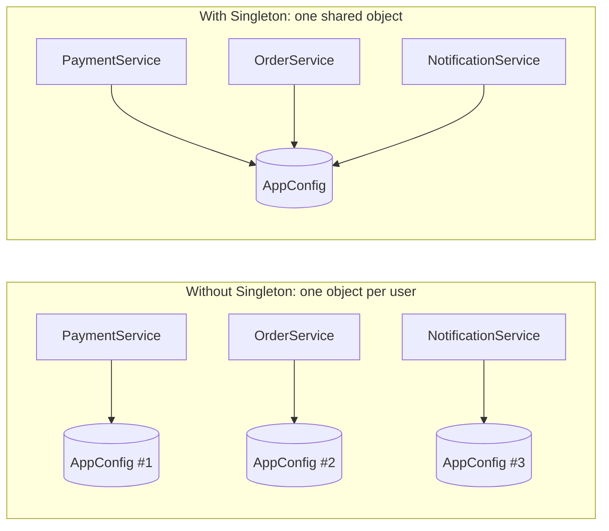
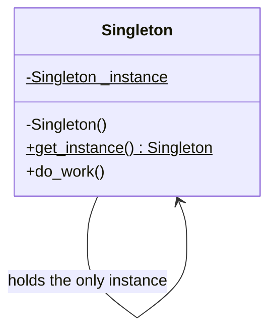
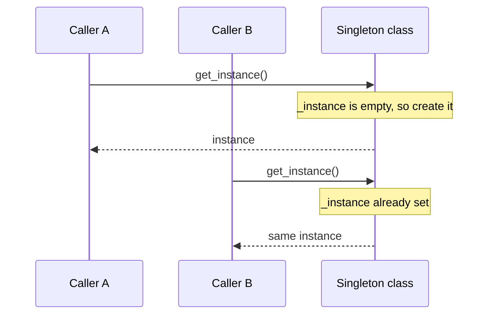
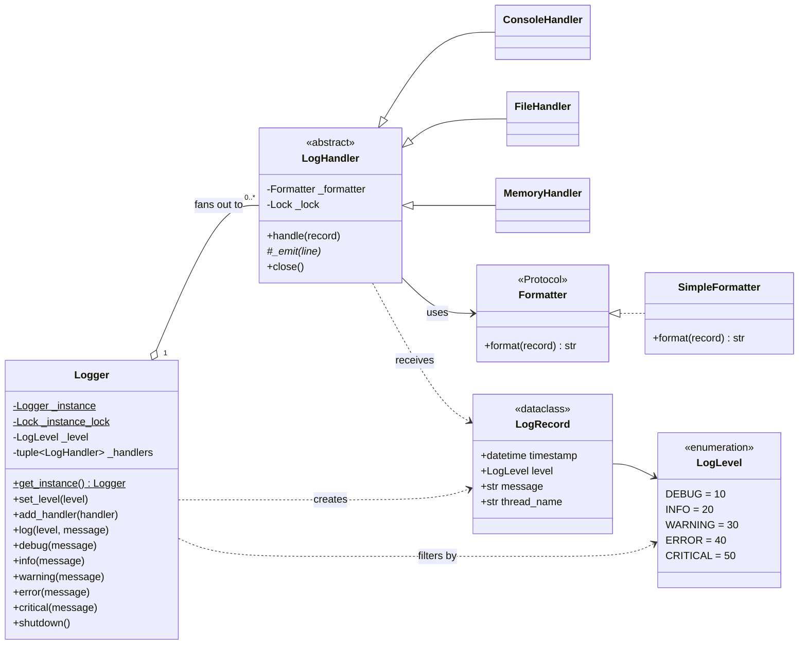
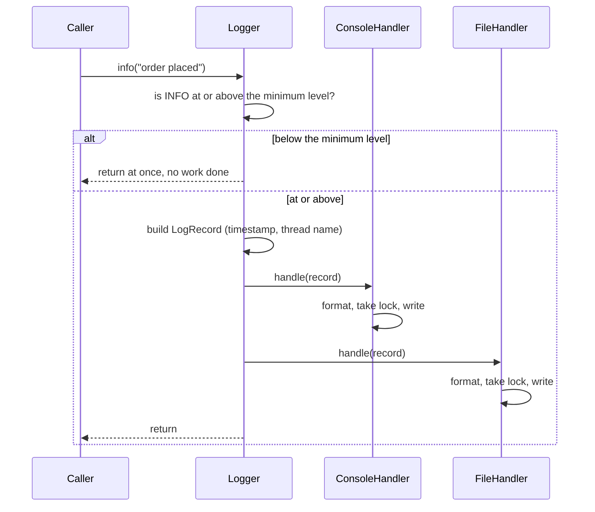
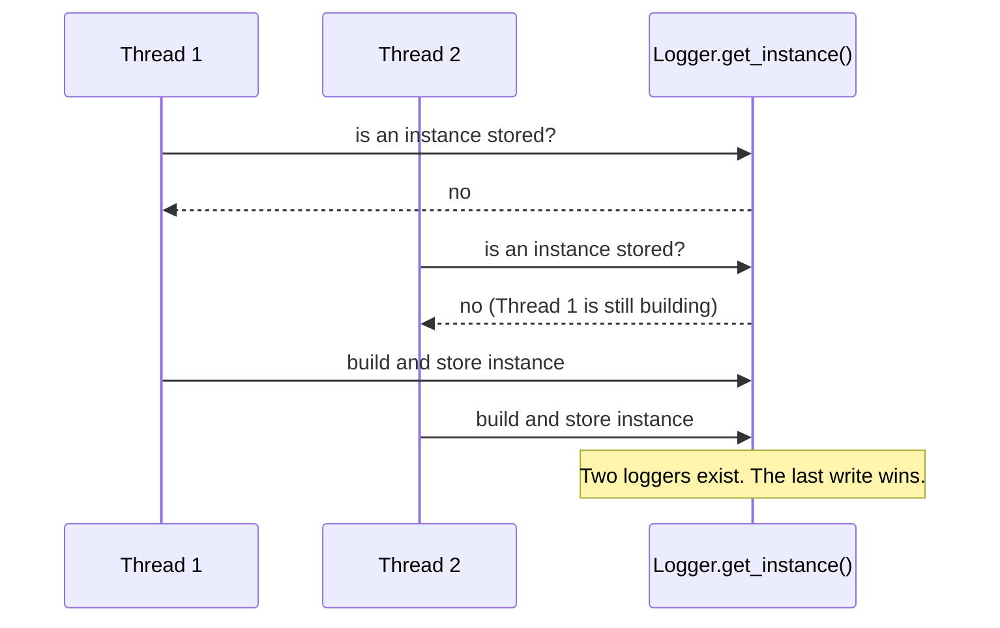
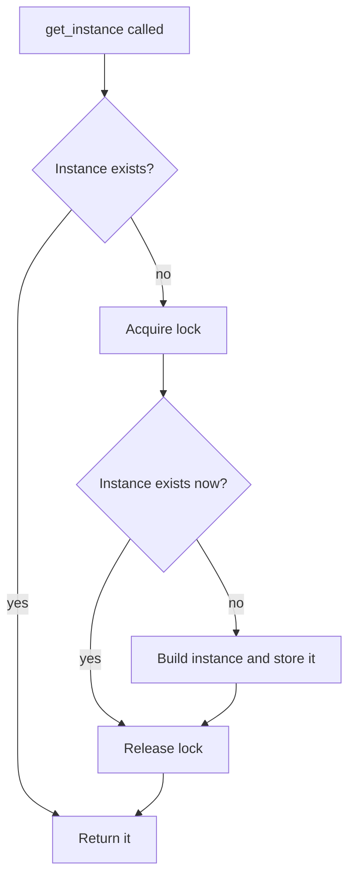

# Singleton Design Pattern

**What you will learn**

- The problem Singleton solves, in plain language.
- The official (Gang of Four) definition, explained phrase by phrase.
- How to apply it in a real design: a thread-safe, extensible **Logger** with a class diagram, decisions and tradeoffs, and runnable Python 3.12 code.
- Where it is used in real systems, where it should *not* be used, and how to talk about it in an interview.

The Logger source lives next to this page as real `.py` files with tests. Everything was run on Python 3.12, the output shown is real, and a test checks that the code on this page matches the files.

---

## 1. The problem

Imagine an application with three services: payments, orders and notifications. Each of them needs the application configuration (database URL, feature flags, API keys). The simplest thing is for each service to create its own `AppConfig`:

```python
class PaymentService:
    def __init__(self) -> None:
        self.config = AppConfig()  # reads config.yaml from disk


class OrderService:
    def __init__(self) -> None:
        self.config = AppConfig()  # reads config.yaml again


class NotificationService:
    def __init__(self) -> None:
        self.config = AppConfig()  # and again...
```

This works, but it hides three problems:

1. **Waste**: the file is read and parsed three times (or three hundred times, if services are created per request).
2. **Inconsistency**: if one copy changes a value at runtime (say, turns on a feature flag), the other copies never see it.
3. **Resource conflicts**: some things simply must not be duplicated. Two loggers writing to the same file will interleave and corrupt lines. Two connection pools will each open their own connections and together exceed the database's connection limit.



*Left: three copies that can drift apart. Right: every service talks to the same single object.*

What we want is a class that **refuses to be created more than once** and hands out the same object to everyone who asks. That is the Singleton pattern.

## 2. An everyday analogy

Think of the **government of a country**. There is exactly one. You do not create a new government every time you need one; you refer to *the* government, and everyone means the same one. Two other examples:

- **The print spooler in an office**: all computers send jobs to one queue. If each computer had its own spooler, two people could print to the same printer at the same time and the pages would be mixed together.
- **The clock on the wall of a meeting room**: everyone in the room looks at the same clock, so everyone agrees on the time.

Two ideas are hiding in these examples: there is **exactly one** of the thing, and **everyone knows where to find it**. Those two ideas are the whole pattern.

## 3. What Singleton is, in plain words

> A Singleton is a class that guarantees **only one object of it ever exists**, and gives the rest of the program **one well-known way to get that object**.

| Guarantee | Meaning | Who enforces it |
|-----------|---------|-----------------|
| One instance | No matter how many times the code asks for it, the same object comes back | The class itself, not the callers |
| Well-known access | Any part of the program can reach it without someone passing it around | A static method, module variable or similar entry point |

Note the first row: the *class* enforces the rule. Saying "please only create one of these" in a code comment is a convention, not a Singleton.

## 4. The official definition

The pattern comes from the book *Design Patterns: Elements of Reusable Object-Oriented Software* (Gamma, Helm, Johnson and Vlissides, 1994, known as the "Gang of Four" or GoF book). Its statement of intent is:

> **"Ensure a class only has one instance, and provide a global point of access to it."**

That sentence is short, but each phrase carries weight:

| Phrase | What it means in practice | Why it is there |
|--------|---------------------------|-----------------|
| **"Ensure"** | It must be *guaranteed by the code*, not left to programmer discipline | Otherwise one careless `AppConfig()` call breaks the whole idea |
| **"a class only has one instance"** | At most one live object of that class (per process, see [tradeoffs](#8-tradeoffs-and-criticism)) | Shared state must be shared, and exclusive resources must not be duplicated |
| **"and provide"** | The class takes on a second job: distributing its own instance | Callers should not need to know how or when it was created |
| **"a global point of access"** | Any code can reach the instance from anywhere, without it being passed in | Convenient (no plumbing) but also the most criticised part, since it is global state |

!!! note "Is 'global' a good thing?"
    The *one instance* part is what you usually need. The *global access* part is a convenience that comes with a price: any code can now use or change the object, and nothing in a function's signature tells you it does. We come back to this in [tradeoffs](#8-tradeoffs-and-criticism).

## 5. Structure

Here is the classic UML picture of the pattern:



*`$` marks a static (class-level) member. The constructor is private so callers cannot create objects themselves; they must go through `get_instance()`.*

The class has three ingredients:

1. A **static field** that remembers the one instance.
2. A **restricted constructor**, so the outside world cannot just call `Singleton()` freely.
3. A **static accessor** (`get_instance()`) that creates the instance the first time and returns the stored one afterwards.

The flow of calls looks like this:



*The first call pays the creation cost. Every later call just returns the stored object.*

!!! note "Python does not have private constructors"
    Python cannot truly hide `__init__` the way some other languages can. So in Python the pattern is implemented by *blocking direct construction* and handing out the instance from a class method, by *intercepting object creation* (`__new__`, a metaclass), or by *not exposing a class at all* (a module-level object). Section 6 compares these on a real design.

## 6. Worked example: Design a Logger

Time to use the pattern on a real low-level design problem. A logger is the textbook Singleton case: every part of the program writes to it, and they must all end up in the same place.

The full source is in this folder as real Python files with tests. Everything below explains *why* it looks the way it does.

| File | Purpose |
|------|---------|
| `logger/level.py`, `record.py`, `formatter.py` | The small data and formatting classes |
| `logger/handler.py` | Destinations: console, file, in-memory |
| `logger/logger.py` | The Singleton `Logger` |
| `demo.py`, `demo_multiprocess.py` | Runnable demos |
| `tests/` | `pytest` tests, including thread-safety tests |

### 6.1 Requirements

**Functional**

- Log a message at one of five levels: `DEBUG`, `INFO`, `WARNING`, `ERROR`, `CRITICAL`.
- Drop messages below a configurable minimum level.
- Send each message to several destinations at once (for example console and file).
- Format each line with timestamp, level, thread name and message.
- Provide **one shared logger** for the whole application.

**Non-functional**

- **Thread-safe**: many threads log at once, and lines are never mixed together.
- **Extensible**: a new destination or format must not require editing the `Logger` class.
- **Robust**: a broken destination (disk full) must not crash the application or stop the other destinations.
- **Cheap when filtered**: a `debug` call that is switched off should cost almost nothing.

**Out of scope** (good follow-up questions, see [6.9](#69-extending-it-and-interview-follow-ups)): asynchronous logging, file rotation, named or hierarchical loggers, JSON output, per-destination levels, configuration files.

### 6.2 Finding the classes

A quick way to start an LLD problem is to underline the nouns in the requirements and give each a single responsibility:

| Class | Its one job | What it does *not* know |
|-------|-------------|-------------------------|
| `Logger` | Public entry point: filters by level, builds a record, hands it to every handler. Owns the single-instance rule | How lines are formatted, or where they go |
| `LogLevel` | Names the severities and orders them (`DEBUG < INFO < ...`) | Anything else |
| `LogRecord` | Holds one event: timestamp, level, message, thread | How it is printed |
| `Formatter` | Turns a record into a line of text | Where the line is written |
| `LogHandler` (`ConsoleHandler`, `FileHandler`, `MemoryHandler`) | Delivers a line to **one** destination, safely across threads | Levels, or how the line was built |

This separation is the Single Responsibility Principle at work, and it is what makes the design extensible: the parts that change independently (destinations, formats) are in different classes.

### 6.3 Class diagram



*Reading the diagram: `Logger` is the Singleton (the `$` members are class-level). It **has** any number of `LogHandler`s (open diamond) and creates `LogRecord`s. Handlers are a small inheritance family, and each **uses** a `Formatter`, which is a `Protocol` (a structural interface) with one implementation, `SimpleFormatter`.*

### 6.4 What happens on `log.info("order placed")`



*If a handler raises an exception, `Logger` catches it, reports it on `stderr`, and carries on with the remaining handlers.*

### 6.5 Design decisions and tradeoffs

This is the part interviewers care about most. Each row is a real choice with a real cost:

| # | Decision | Chosen | Alternative | What it costs us |
|---|----------|--------|-------------|------------------|
| 1 | Should there be one shared logger? | **Singleton**: one place to configure levels and destinations | Pass a logger into every class (dependency injection) | Global state and harder tests (see decision 9) |
| 2 | How to create the Singleton | `get_instance()` class method with a lock | Module-level object, metaclass, `__new__` (compared in [6.6](#66-creating-the-singleton-safely)) | A little more code than a module-level object |
| 3 | Where messages go | Separate **handler** classes (Strategy): `Logger` never knows about files or consoles | `if/else` on a destination type inside `Logger` | One extra class per destination; worth it, since adding one touches no existing code (Open/Closed Principle) |
| 4 | Locking a destination | **Template Method**: `LogHandler.handle()` formats, takes the lock, then calls the subclass's `_emit()` | Ask each subclass to lock for itself | Subclasses depend on the base class, but nobody can forget the lock |
| 5 | Locking scope | One lock **per handler** | One global lock for all logging | A slow file only blocks writers to that file, not the console. Order of lines between handlers is not guaranteed |
| 6 | Changing handlers at runtime | **Copy-on-write** tuple: `add_handler` swaps in a new tuple, `log` iterates the old one | Lock around every `log` call, or a plain list | Adding a handler is O(n), which is fine because it is rare and happens at start-up |
| 7 | Filtering | Check the level **first**, before creating a record | Filter inside each handler | The caller's f-string is still built before the call. The standard library avoids that with lazy `%s` arguments |
| 8 | Handler failures | `try/except` per handler, report on `stderr`, continue | Let the exception propagate | Swallowing errors can hide problems, but crashing the app because the disk is full is worse |
| 9 | Testing a Singleton | A `_reset_for_testing()` hook plus an autouse fixture | Dependency injection everywhere | A test-only method in production code |

Smaller choices in the data classes:

- `LogRecord` is a **frozen dataclass**: it cannot change after creation, so it is safe to share between handlers and threads.
- `Formatter` is a **`Protocol`**, so any object with a `format(record)` method works, with no inheritance needed. The trade is that a mistake shows up only when the object is used.
- `LogLevel` is an **`IntEnum`**, so `level < minimum` just works.
- `Logger` takes **no constructor arguments**. Configuration happens through `set_level` and `add_handler`. If the constructor took arguments, a second call with different ones would be silently ignored, which is a classic Singleton trap.

### 6.6 Creating the Singleton safely

Python has no private constructors, so we need two things: block direct construction, and build the one instance in a controlled place. Here is how the main options compare:

| Option | Lazy? | Thread-safe? | Verdict |
|--------|-------|--------------|---------|
| Module-level object (`logger = Logger()`) | No, built at import | Yes, a module body runs once | Simple and a perfectly good choice in real projects. Anyone can still call `Logger()` again |
| **`get_instance()` class method + lock** | Yes | Yes, with the lock | **Chosen**: it matches the classic UML, keeps the pattern visible, and gives a clean reset hook for tests |
| Metaclass | Yes | Yes, with a lock | Reusable across many singleton classes, but more magic than one class needs |
| Override `__new__` | Yes | Only with a lock | Avoid: `__init__` runs again on **every** `Logger()` call, silently resetting the state (I reproduced this) |
| `functools.cache` on a factory function | Yes | **No** on the first call | Avoid for slow constructors: five threads with a slow setup produced five different instances in my test |

!!! tip "Interview tip"
    In Python, "I would just use a module-level instance" is often the best *first* answer, and it shows you know the language. Then explain what you would use when you need laziness or a guard against `Logger()`.

**The race.** If two threads call `get_instance()` before the instance exists, both see "empty" and both build one:



**The fix** is a lock with **double-checked locking**: check without the lock (fast path for every call after the first), then check again inside the lock, because another thread may have built the instance while we waited.



Two details in the code matter. The instance is stored only **after** it is fully built, so no thread can ever see a half-initialised logger. And `_build()` is a separate method so a test can slow it down.

!!! warning "Testing a race: make the bug easy to hit"
    A race test that passes is not proof of anything if the race window is tiny. When I removed the lock and kept construction fast, an earlier version of this test passed 10 times out of 10. The real test therefore slows `_build()` down by 50 ms, releases 32 threads at once with a barrier, and asserts `_build()` ran **exactly once**. That version fails without the lock.

### 6.7 Thread safety on three levels

| What is shared | Danger | Protection |
|----------------|--------|------------|
| The instance itself | Two threads create two loggers | `_instance_lock` with double-checked locking (6.6) |
| The handler list | A thread adds a handler while another is logging | Copy-on-write tuple; writers take `_config_lock`, readers need none |
| Each destination | Two threads write at the same moment | One lock per handler, taken in `LogHandler.handle()` |

The minimum level is a single attribute assignment, which is atomic in CPython, so it needs no lock.

One honest detail about the third row. For `FileHandler` on CPython, a single `write()` call is effectively atomic, so removing the handler lock did **not** make my file-writing test fail (15 runs out of 15 passed). The lock still matters for handlers that emit in **more than one step**, and it makes correctness independent of that implementation detail. The test that proves it uses a handler that writes a line, pauses, then writes a separator. Without the lock the parts of different messages mix, and that test failed in all 5 runs I tried.

### 6.8 The code

Each block below is the real file from this folder. A test (`tests/test_singleton_docs_in_sync.py`) fails if this page and the files ever disagree.

**Severity levels**

```python title="logger/level.py"
from enum import IntEnum


class LogLevel(IntEnum):
    DEBUG = 10
    INFO = 20
    WARNING = 30
    ERROR = 40
    CRITICAL = 50
```

**The event record**

```python title="logger/record.py"
from dataclasses import dataclass
from datetime import datetime

from .level import LogLevel


@dataclass(frozen=True, slots=True)
class LogRecord:
    """One log event. Immutable, so it can be shared by every handler and thread."""

    timestamp: datetime
    level: LogLevel
    message: str
    thread_name: str
```

**Formatting.** The `Protocol` is the contract, and `SimpleFormatter` is one implementation.

```python title="logger/formatter.py"
from typing import Protocol

from .record import LogRecord


class Formatter(Protocol):
    """Turns a record into a line of text. Any object with this method qualifies."""

    def format(self, record: LogRecord) -> str: ...


class SimpleFormatter:
    """Example: 2026-09-19T10:15:30.123+00:00 [INFO    ] [MainThread] message"""

    def format(self, record: LogRecord) -> str:
        timestamp = record.timestamp.isoformat(timespec="milliseconds")
        level = f"{record.level.name:<8}"
        return f"{timestamp} [{level}] [{record.thread_name}] {record.message}"
```

**Destinations.** `handle()` is the Template Method (format, lock, emit). Subclasses implement only `_emit()`. `MemoryHandler` is deliberately tiny: it shows how little a new destination needs.

```python title="logger/handler.py"
import sys
import threading
from abc import ABC, abstractmethod
from pathlib import Path
from typing import TextIO

from .formatter import Formatter, SimpleFormatter
from .record import LogRecord


class LogHandler(ABC):
    """Decides *where* a record goes. Subclasses only implement `_emit`."""

    def __init__(self, formatter: Formatter | None = None) -> None:
        self._formatter: Formatter = formatter or SimpleFormatter()
        self._lock = threading.Lock()

    def handle(self, record: LogRecord) -> None:
        line = self._formatter.format(record)  # no lock needed to format
        with self._lock:  # one writer at a time, so lines never interleave
            self._emit(line)

    @abstractmethod
    def _emit(self, line: str) -> None: ...

    def close(self) -> None:
        """Release resources. Handlers that hold none can keep this default."""
        return


class ConsoleHandler(LogHandler):
    def __init__(
        self, stream: TextIO | None = None, formatter: Formatter | None = None
    ) -> None:
        super().__init__(formatter)
        self._stream = stream  # None means "current sys.stderr", looked up on use

    def _emit(self, line: str) -> None:
        print(line, file=self._stream or sys.stderr)


class FileHandler(LogHandler):
    def __init__(self, path: str | Path, formatter: Formatter | None = None) -> None:
        super().__init__(formatter)
        # kept open for the handler's lifetime and closed in close()
        self._file = Path(path).open("a", encoding="utf-8")  # noqa: SIM115

    def _emit(self, line: str) -> None:
        self._file.write(line + "\n")
        self._file.flush()  # a crash right after a log call must not lose the line

    def close(self) -> None:
        with self._lock:
            self._file.close()


class MemoryHandler(LogHandler):
    """Keeps lines in a list. Handy for tests, and a template for new handlers."""

    def __init__(self, formatter: Formatter | None = None) -> None:
        super().__init__(formatter)
        self.lines: list[str] = []

    def _emit(self, line: str) -> None:
        self.lines.append(line)
```

**The Singleton `Logger`**

```python title="logger/logger.py"
import sys
import threading
from datetime import UTC, datetime
from typing import Self

from .handler import LogHandler
from .level import LogLevel
from .record import LogRecord


class Logger:
    """The one application-wide logger. Get it with `Logger.get_instance()`."""

    _instance: Self | None = None
    _instance_lock = threading.Lock()

    _level: LogLevel
    _handlers: tuple[LogHandler, ...]
    _config_lock: threading.Lock

    def __init__(self) -> None:
        raise TypeError("Logger is a singleton: use Logger.get_instance()")

    @classmethod
    def get_instance(cls) -> Self:
        if cls._instance is None:  # 1st check: no lock on the common path
            with cls._instance_lock:
                if cls._instance is None:  # 2nd check: another thread may have won
                    cls._instance = cls._build()  # publish only when fully built
        return cls._instance

    @classmethod
    def _build(cls) -> Self:
        instance = object.__new__(cls)  # skips __init__, so the guard is not hit
        instance._level = LogLevel.INFO
        instance._handlers = ()
        instance._config_lock = threading.Lock()
        return instance

    # ---- configuration -------------------------------------------------

    @property
    def handlers(self) -> tuple[LogHandler, ...]:
        return self._handlers

    def set_level(self, level: LogLevel) -> None:
        self._level = level

    def add_handler(self, handler: LogHandler) -> None:
        with self._config_lock:
            # copy-on-write: log() can iterate the old tuple without a lock
            self._handlers = (*self._handlers, handler)

    def shutdown(self) -> None:
        with self._config_lock:
            handlers, self._handlers = self._handlers, ()
        for handler in handlers:
            handler.close()

    # ---- logging -------------------------------------------------------

    def log(self, level: LogLevel, message: str) -> None:
        if level < self._level:  # cheapest possible exit for filtered messages
            return
        record = LogRecord(
            timestamp=datetime.now(UTC),
            level=level,
            message=message,
            thread_name=threading.current_thread().name,
        )
        for handler in self._handlers:
            try:
                handler.handle(record)
            except Exception as exc:  # noqa: BLE001 - logging must never crash the app
                name = type(handler).__name__
                print(f"logging failed in {name}: {exc}", file=sys.stderr)

    def debug(self, message: str) -> None:
        self.log(LogLevel.DEBUG, message)

    def info(self, message: str) -> None:
        self.log(LogLevel.INFO, message)

    def warning(self, message: str) -> None:
        self.log(LogLevel.WARNING, message)

    def error(self, message: str) -> None:
        self.log(LogLevel.ERROR, message)

    def critical(self, message: str) -> None:
        self.log(LogLevel.CRITICAL, message)

    # ---- testing hook --------------------------------------------------

    @classmethod
    def _reset_for_testing(cls) -> None:
        with cls._instance_lock:
            if cls._instance is not None:
                cls._instance.shutdown()
            cls._instance = None
```

**Using it.** Three threads share one logger without anyone passing it around:

```python title="demo.py"
import tempfile
import threading
from pathlib import Path

from logger import ConsoleHandler, FileHandler, Logger, LogLevel


def worker(name: str) -> None:
    log = Logger.get_instance()  # same object in every thread, nothing passed in
    for i in range(2):
        log.info(f"{name} processed item {i}")


def main() -> None:
    log_file = Path(tempfile.mkdtemp()) / "app.log"

    log = Logger.get_instance()
    log.set_level(LogLevel.DEBUG)
    log.add_handler(ConsoleHandler())
    log.add_handler(FileHandler(log_file))

    log.debug("application starting")
    threads = [
        threading.Thread(target=worker, args=(f"worker-{n}",), name=f"worker-{n}")
        for n in range(3)
    ]
    for t in threads:
        t.start()
    for t in threads:
        t.join()

    print("same instance everywhere:", Logger.get_instance() is log)
    try:
        Logger()
    except TypeError as error:
        print("direct construction is blocked:", error)

    log.shutdown()
    print("lines in the log file:", len(log_file.read_text().splitlines()))


if __name__ == "__main__":
    main()
```

Run it with `python demo.py` from this folder. The output (timestamps will differ on your machine):

```text
2026-09-19T05:55:30.255+00:00 [DEBUG   ] [MainThread] application starting
2026-09-19T05:55:30.256+00:00 [INFO    ] [worker-0] worker-0 processed item 0
2026-09-19T05:55:30.256+00:00 [INFO    ] [worker-0] worker-0 processed item 1
2026-09-19T05:55:30.256+00:00 [INFO    ] [worker-1] worker-1 processed item 0
2026-09-19T05:55:30.257+00:00 [INFO    ] [worker-1] worker-1 processed item 1
2026-09-19T05:55:30.257+00:00 [INFO    ] [worker-2] worker-2 processed item 0
2026-09-19T05:55:30.257+00:00 [INFO    ] [worker-2] worker-2 processed item 1
same instance everywhere: True
direct construction is blocked: Logger is a singleton: use Logger.get_instance()
lines in the log file: 7
```

**Running the tests**

```bash
pip install pytest
pytest
```

| Test file | What it proves |
|-----------|----------------|
| `test_singleton.py` | One instance; `Logger()` is blocked; 32 racing threads build exactly one; reset works; the subclass trap (see [interview tips](#9-interview-tips)) |
| `test_logger.py` | Level filtering, fan-out to every handler, a failing handler does not stop the others, custom formatters plug in |
| `test_handlers.py` | File and console output; concurrent writes stay intact; the handler lock keeps multi-step emits together |
| `test_dependency_injection.py` | The injected-logger example in [section 8](#8-tradeoffs-and-criticism) |
| `test_singleton_docs_in_sync.py` | The code on this page equals the files |

### 6.9 Extending it, and interview follow-ups

**Adding a destination** means writing one subclass of `LogHandler` and implementing `_emit()`. `MemoryHandler` above is the whole recipe, and the `Logger` class does not change.

Follow-up questions and where the design would go:

| Follow-up | Direction |
|-----------|-----------|
| "Logging slows my request handlers" | Make handlers **asynchronous**: `Logger` puts records on a queue and a background thread drains it (the standard library has `QueueHandler` and `QueueListener` for this). Lower latency, but you must flush on shutdown or lose the last records on a crash |
| "Rotate files when they get big" | A `RotatingFileHandler` subclass that checks size in `_emit()` and swaps the file, still under the handler's lock |
| "Different levels per destination" | Give `LogHandler` its own minimum level and check it in `handle()` |
| "Per-module loggers, like `logging.getLogger('db')`" | Replace the single instance with a registry of named instances (a *multiton*), and keep the rest of the design |
| "Structured JSON logs" | A `JsonFormatter` implementing the `Formatter` protocol. No other class changes |
| "Avoid building expensive messages that are filtered out" | Accept lazy arguments (`log.debug("x=%s", x)`) and format only after the level check |
| "Correlate lines from one request" | Add a request id to `LogRecord`, filled from a `contextvars.ContextVar` |

!!! note "Real world"
    Python's standard `logging` module uses the same decomposition: `Logger`, `Handler`, `Formatter` and `LogRecord`. Its top-level `logging.root` object is a module-level singleton, and `logging.getLogger("name")` is the named-registry variant mentioned above.

!!! tip "Interview tip: running this in 40 minutes"
    Clarify requirements and scope (5 min), name the classes and their responsibilities (5), draw the class diagram (5), explain why Singleton and how you make it thread-safe (10), show the handler extension point (5), then write the code and answer follow-ups. State tradeoffs out loud as you choose, as in the table in 6.5.

## 7. Where to use it

The pattern fits things where **there should logically be only one**, or where **duplicating it causes harm**. The Logger in section 6 is the first row of this table.

| Use case | What goes wrong with several instances |
|----------|----------------------------------------|
| **Logger** | Handlers and levels are configured in different places, and several loggers writing to one file interleave or overwrite each other's output |
| **Application configuration** | Copies drift apart, and the file is read and parsed repeatedly |
| **Database connection pool** | Each pool opens its own connections, so together they exceed the database's connection limit |
| **Cache manager** | Separate caches each hold partial data, so hit rate drops and memory use doubles |
| **Thread pool / worker pool** | Several pools compete for the same CPU cores and oversubscribe the machine |
| **Hardware or device access** (printer spooler, GPU handle, serial port) | Two objects controlling the same device issue conflicting commands |
| **Service registry / feature-flag client** | Different parts of the program see different sets of services or flags |

The recipe is the same each time: a class that builds its one instance lazily and safely (6.6), keeps its own state thread-safe (6.7), and is configured after creation rather than through constructor arguments.

!!! note "Real world"
    You have already used singleton-like objects: `None`, `True` and `False` are singletons of their own types, and `logging.root` is a module-level singleton. Web frameworks commonly create one settings object and one database connection pool per process.

### When *not* to use it

- **Entities with identity or their own data**, such as `User`, `Order` or `Product`. There are many, by definition.
- **Anything you want to replace in tests** (a payment gateway, a clock). Singletons are hard to swap for fakes, see below.
- **Per-request or per-tenant state.** A singleton is shared by everyone, so per-user state stored in it leaks across users.
- **"Only one across all my servers".** A Singleton gives one instance *per process*. Global uniqueness (one leader, one scheduler) needs a distributed lock or leader election, which is a different problem.

## 8. Tradeoffs and criticism

Singleton is the most popular pattern and also the most criticised. You should be able to argue both sides.

| Benefit | Cost |
|---------|------|
| Guarantees a single shared instance | It is **global mutable state**: any code can change it, so bugs are hard to trace |
| Lazy creation saves startup time and memory | **Hidden dependencies**: a function's signature does not reveal that it uses the singleton |
| No need to pass the object through every layer | **Hard to unit test**: state leaks between tests, and you cannot easily substitute a fake |
| Controlled access to a shared resource | Mixes two responsibilities (the class's real job *and* managing its own lifetime), which bends the Single Responsibility Principle |
| Simple to explain | **One instance per process, not per system**: it does not span multiple workers or servers |

### Hidden dependencies and testing

Compare code that reaches out to the global `Logger` with code that is *given* its logger. This is a real test file from this folder:

```python title="tests/test_dependency_injection.py"
from typing import Protocol

from logger import Logger, MemoryHandler


class SupportsInfo(Protocol):
    def info(self, message: str) -> None: ...


class HiddenOrderService:
    def place(self, order_id: int) -> None:
        Logger.get_instance().info(f"placed {order_id}")  # hidden: not in the signature


class OrderService:
    def __init__(self, logger: SupportsInfo) -> None:
        self.logger = logger  # explicit: visible, and replaceable in tests

    def place(self, order_id: int) -> None:
        self.logger.info(f"placed {order_id}")


class FakeLogger:
    def __init__(self) -> None:
        self.messages: list[str] = []

    def info(self, message: str) -> None:
        self.messages.append(message)


def test_injected_logger_can_be_faked() -> None:
    fake = FakeLogger()
    OrderService(fake).place(7)
    assert fake.messages == ["placed 7"]


def test_hidden_dependency_needs_the_real_singleton() -> None:
    memory = MemoryHandler()
    Logger.get_instance().add_handler(memory)
    HiddenOrderService().place(7)
    assert memory.lines[0].endswith("placed 7")
```

`HiddenOrderService` works, but nothing in its signature says it needs a logger, and testing it means configuring the real singleton (and resetting it afterwards, which is what the autouse fixture in `conftest.py` does). `OrderService` states the dependency, and a two-line `FakeLogger` is enough to test it.

This leads to the usual modern advice: **keep "one instance" as a decision made in one place (at application start-up), and pass the object to whoever needs it** (dependency injection), instead of letting every class reach for the global. Note the small `SupportsInfo` protocol: because `OrderService` asks only for what it needs, a fake does not have to be a `Logger` at all, which matters since `Logger()` cannot even be constructed directly.

### One instance per *process*

Most production Python servers run several worker processes. Each process has its own memory, so each has its own "singleton". This demo configures the `Logger` in the parent, then starts a child process:

```python title="demo_multiprocess.py"
import multiprocessing as mp

from logger import Logger, MemoryHandler


def child() -> None:
    log = Logger.get_instance()  # a brand-new Logger: this process has its own memory
    print(f"child : handlers configured = {len(log.handlers)}")
    log.info("hello from the child")  # no handlers here, so this goes nowhere


if __name__ == "__main__":
    mp.set_start_method("spawn")
    memory = MemoryHandler()
    log = Logger.get_instance()
    log.add_handler(memory)
    log.info("hello from the parent")

    process = mp.Process(target=child)
    process.start()
    process.join()

    print(f"parent: handlers configured = {len(log.handlers)}")
    print(f"parent: lines received      = {len(memory.lines)}")
```

Output:

```text
child : handlers configured = 0
parent: handlers configured = 1
parent: lines received      = 1
```

The child got a brand-new `Logger` with **no handlers**, so its message went nowhere, and the parent never saw it. Anything that must be shared across workers (a rate-limit counter, a cache, or log lines in one place) needs an external system such as Redis, a database or a log collector, not a Singleton.

!!! note "Start method"
    The demo uses the `spawn` start method, the default on Windows and macOS. With `fork` (the default on Linux for Python 3.12) the child starts with a copy of the parent's memory, so it would inherit a *copy* of the configured logger. Either way the two loggers are separate objects.

## 9. Interview tips

!!! tip "Interview tip: how to structure your answer"
    1. Say what problem it solves (one shared instance, e.g. a logger or config).
    2. Give the definition in your own words, then name the two parts: *one instance* and *global access*.
    3. Mention the Python-specific answer (module-level object) before the class-based ones.
    4. Volunteer the drawbacks. Interviewers value engineers who know when *not* to use a pattern.

Common questions and short model answers:

| Question | Short answer |
|----------|--------------|
| How do you make it thread-safe? | Guard creation with a lock and use double-checked locking, so the lock is only taken while the instance does not exist yet. Store the instance only after it is fully built. Or create it eagerly at import time. Draw the two-thread race from 6.6 |
| Eager vs lazy initialisation? | Eager is simpler and inherently thread-safe but costs startup time and memory even if unused. Lazy defers the cost but needs synchronisation |
| How would you unit test code that uses a Singleton? | Prefer injecting the dependency so a fake can be passed. If you must keep the singleton, provide a reset hook and call it from a test fixture, as `_reset_for_testing()` does here |
| How do you test that creation is thread-safe? | Widen the race window (slow the constructor down), release many threads at once with a barrier, and assert the constructor ran exactly once. A test with a tiny window can pass even when the lock is missing |
| Singleton vs a class with only static methods? | A Singleton is a real object: it can implement an interface, be passed as an argument, be substituted in tests and hold instance state. Static methods cannot |
| Does Singleton work across multiple servers? | No, it is per process. Use an external store, or a distributed lock / leader election for "only one across the cluster" |
| Why do people call it an anti-pattern? | Global mutable state, hidden dependencies and poor testability. The fix is to keep a single instance but inject it |
| What happens with subclasses? | With the instance stored in a class attribute, a subclass inherits the base class's attribute. If the base was created first, `SubLogger.get_instance()` returns the **base** instance (`test_singleton.py` checks this). Storing instances in a dict keyed by class, as a metaclass does, gives one instance per class |
| Why not a class with a private constructor? | Python cannot enforce one. We raise in `__init__` and build the instance with `object.__new__` inside `get_instance()`. That stops accidents, not determined code |

## 10. Key takeaways

- Singleton = **one instance** + **one well-known way to reach it**, enforced by the class itself.
- The official definition: *"Ensure a class only has one instance, and provide a global point of access to it."*
- In Python, a **module-level object** is the simplest choice. A `get_instance()` class method with a lock gives laziness and a clear guard.
- Creation must be **thread-safe**: lock plus double-checked locking, and publish the instance only when it is fully built. `functools.cache` alone is not enough for slow constructors.
- Thread safety has layers: the instance, the shared configuration, and each shared resource. Handle each on purpose.
- **Test your concurrency tests**: remove the protection and check that the test fails.
- It is **per process**. Shared state across workers or servers needs external storage.
- Use it for loggers, configuration, connection pools, caches and device handles. Avoid it for entities, per-request state and anything you need to fake in tests.
- The modern compromise: create the one instance at start-up and **inject** it.

## References

- Gamma, Helm, Johnson, Vlissides. *Design Patterns: Elements of Reusable Object-Oriented Software*. Addison-Wesley, 1994. (Source of the Singleton intent statement quoted above.)
- Python documentation: [`logging`](https://docs.python.org/3/library/logging.html), [`logging.handlers` (`QueueHandler`, `QueueListener`)](https://docs.python.org/3/library/logging.handlers.html), [`threading`](https://docs.python.org/3/library/threading.html), [`functools.cache`](https://docs.python.org/3/library/functools.html#functools.cache), [data model: `__new__`](https://docs.python.org/3/reference/datamodel.html#object.__new__), [the import system](https://docs.python.org/3/reference/import.html), [`multiprocessing` start methods](https://docs.python.org/3/library/multiprocessing.html#contexts-and-start-methods).
