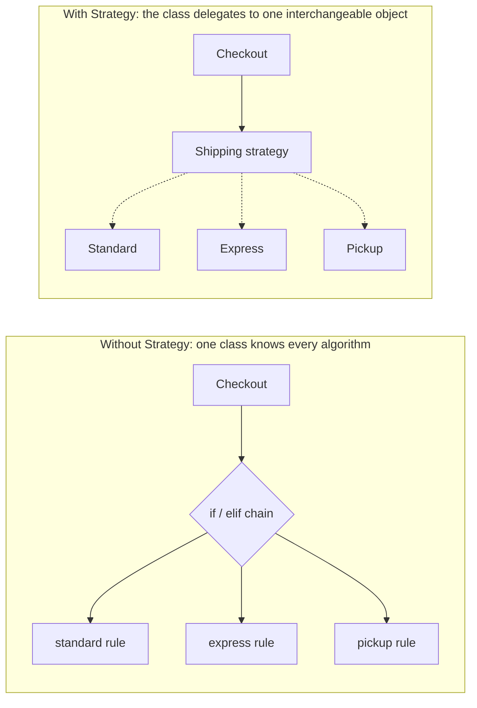
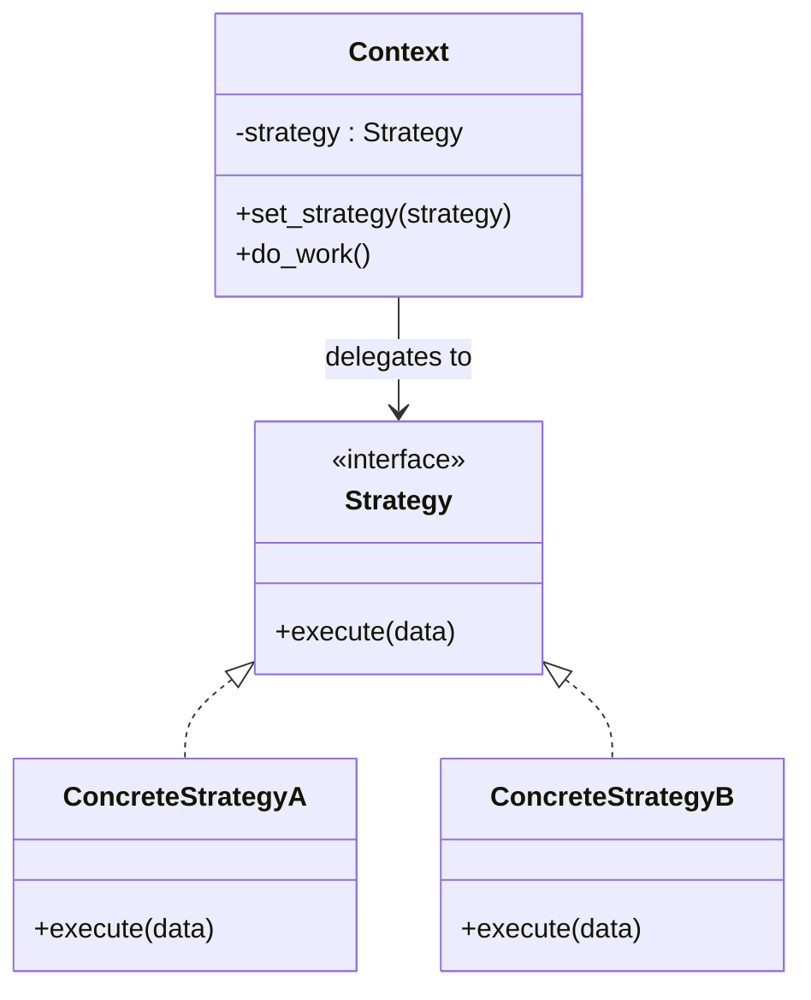
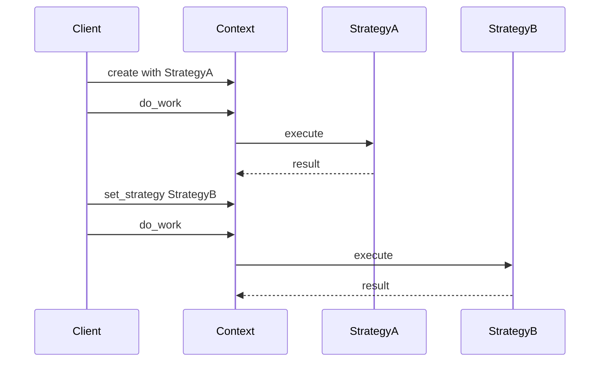
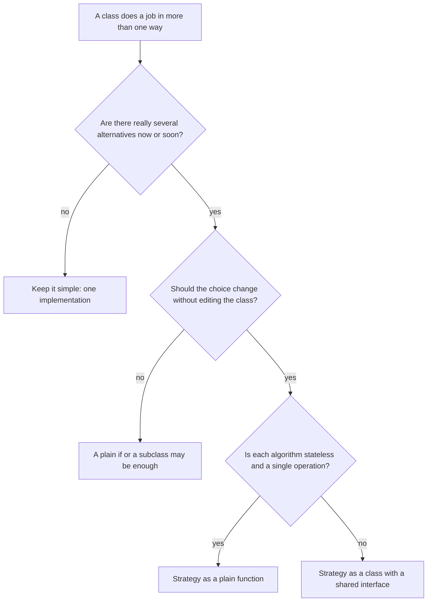
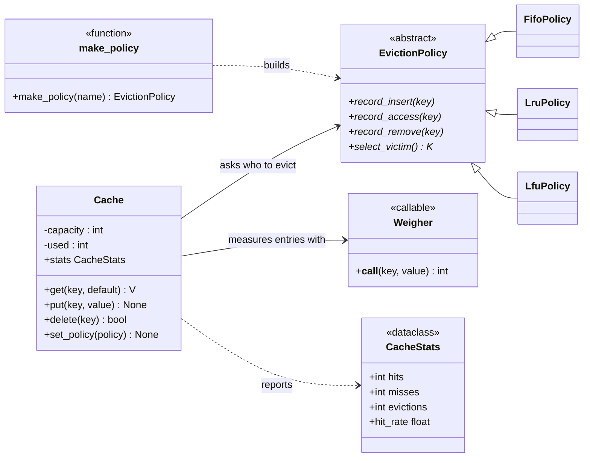
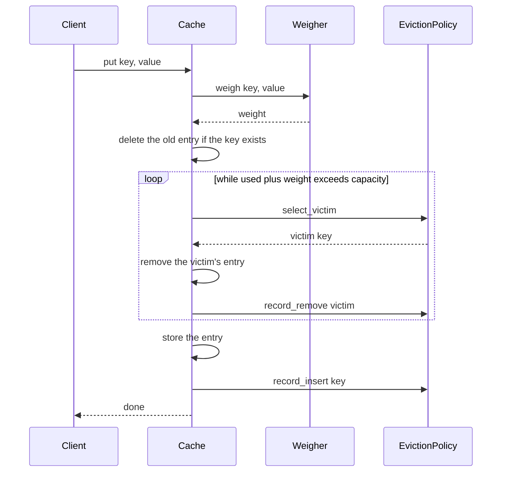

# Strategy Design Pattern

**What you will learn**

- The problem Strategy solves, in plain language.
- The official (Gang of Four) definition, explained phrase by phrase.
- How Strategy differs from its look-alikes: State, Template Method and Factory.
- How to apply it in a real design: an **in-memory cache with pluggable eviction policies** (LRU, LFU, FIFO), with class and sequence diagrams, decisions and tradeoffs, and runnable, tested Python 3.12 code.
- When a Strategy should be a **class** and when a plain **function** is enough, which matters a lot in Python.
- Where the pattern is used, where it is overkill, and how to talk about it in an interview.

The cache source lives next to this page as real `.py` files with tests. Everything was run on Python 3.12 and the output shown is real. Code blocks with a file title are the real files, and a test checks that they match. Blocks without a title are small illustrations that were run separately.

---

## 1. The problem

An online shop calculates the shipping cost with a chain of `if` statements:

```python
def shipping_cost(method: str, weight_kg: float) -> float:
    if method == "standard":
        return 40 + 10 * weight_kg
    if method == "express":
        return 90 + 20 * weight_kg
    if method == "pickup":
        return 0.0
    raise ValueError(f"unknown shipping method: {method}")


def delivery_days(method: str) -> int:
    if method == "standard":
        return 5
    if method == "express":
        return 1
    if method == "pickup":
        return 0
    raise ValueError(f"unknown shipping method: {method}")


print(shipping_cost("express", 2.0), delivery_days("express"))
```

Output:

```text
130.0 1
```

It works, and it is short. But look at what happens as the business grows:

1. **Every new method edits every chain.** Adding "same-day" means finding each `if` chain (cost, delivery days, the label on the invoice, the tracking page) and changing all of them. Missing one is a bug.
2. **The class that owns the chains keeps growing.** Each new rule adds branches to a function that was supposed to do something else.
3. **Rules cannot be tested alone.** To test the express formula you have to go through the whole function and its other branches.
4. **The choice is frozen into the code.** You cannot let a customer, a config file or an experiment pick the method without more branching.



*Left: the checkout contains all the rules and a branch to choose between them. Right: the checkout only holds "a shipping strategy" and calls it. Which one it holds is decided elsewhere.*

What we want is to **pull the part that varies (the algorithm) out into its own object**, so the class that uses it never changes when a new algorithm appears. That is the Strategy pattern.

## 2. An everyday analogy

Think of a **navigation app**. You enter a destination once. Then you choose *how* to get there: fastest route, shortest route, avoid tolls, or scenic. The app around it does not change: it shows the map, speaks the directions, reroutes when you miss a turn. Only the **route-finding algorithm** changes, and you can switch it halfway through the trip.

- The **app** is the part that stays the same. It says "give me a route" and does not care how the route was computed.
- Each **routing mode** is an interchangeable algorithm behind the same question: "route from A to B?"

Another one: **paying at a shop**. The cashier does the same job whether you hand over cash, a card or a phone. The checkout process stays the same, and the *payment method* is swapped in.

The two ideas in these examples are the whole pattern: **the same job, done by swappable algorithms, chosen from outside**.

## 3. What Strategy is, in plain words

> Strategy takes an algorithm out of the class that uses it and puts it in its own object with a common interface. The class then **delegates** to whichever algorithm object it was given.

| Part | Job | In the shipping example |
|------|-----|-------------------------|
| **Context** | The class that needs the job done. It holds a strategy and calls it | `Checkout` |
| **Strategy** (the interface) | The one question every algorithm answers | `cost(weight_kg)` |
| **Concrete strategies** | The interchangeable algorithms | `Standard`, `Express`, `Pickup` |
| **Client** | The code that picks a strategy and hands it to the context | The web handler, a config loader |

Here is the shipping example rewritten with Strategy:

```python
from typing import Protocol


class ShippingStrategy(Protocol):
    def cost(self, weight_kg: float) -> float: ...


class Standard:
    def cost(self, weight_kg: float) -> float:
        return 40 + 10 * weight_kg


class Express:
    def cost(self, weight_kg: float) -> float:
        return 90 + 20 * weight_kg


class Pickup:
    def cost(self, weight_kg: float) -> float:
        return 0.0


class Checkout:  # the context
    def __init__(self, shipping: ShippingStrategy) -> None:
        self.shipping = shipping

    def total(self, items_total: float, weight_kg: float) -> float:
        return items_total + self.shipping.cost(weight_kg)


checkout = Checkout(Express())
print(checkout.total(500.0, 2.0))

checkout.shipping = Pickup()  # swapped at run time, `Checkout` is untouched
print(checkout.total(500.0, 2.0))
```

Output:

```text
630.0
500.0
```

`Checkout` never mentions "express" or "pickup". Adding "same-day" means writing one new class, and no existing line changes.

## 4. The official definition

The pattern comes from *Design Patterns: Elements of Reusable Object-Oriented Software* (Gamma, Helm, Johnson and Vlissides, 1994, the "Gang of Four" or GoF book). Its statement of intent is:

> **"Define a family of algorithms, encapsulate each one, and make them interchangeable. Strategy lets the algorithm vary independently from clients that use it."**

That is dense, so here it is phrase by phrase:

| Phrase | What it means in practice | Why it is there |
|--------|---------------------------|-----------------|
| **"Define a family of algorithms"** | Several different ways to do the *same* job (three ways to price shipping, three ways to choose an eviction victim) | The pattern only makes sense when there are real alternatives |
| **"encapsulate each one"** | Each algorithm lives in its own class (or function), with its own data, away from the code that uses it | Each can be understood, changed and tested alone |
| **"and make them interchangeable"** | They all share one interface, so any of them can stand in for any other | The user of the strategy cannot tell which one it has |
| **"Strategy lets the algorithm vary independently"** | You can change or add an algorithm without touching the code that uses it | This is the Open/Closed Principle in action |
| **"from clients that use it"** | The context and its callers stay the same when the algorithm changes | Stable code stays stable |

## 5. Structure



*Reading the diagram: the context **holds** a strategy through the interface only (solid arrow) and never names a concrete class. Each concrete strategy **realizes** the interface (dashed line, hollow triangle). New to the notation? See [UML Basics: Class Diagrams](../../concept/uml-basics.md).*

| Role | Meaning | In the cache design |
|------|---------|---------------------|
| **Context** | Holds a strategy, delegates one decision to it | `Cache` |
| **Strategy** | The interface every algorithm implements | `EvictionPolicy` |
| **Concrete strategy** | One algorithm | `FifoPolicy`, `LruPolicy`, `LfuPolicy` |
| **Client** | Chooses the strategy and passes it in | Application start-up code, or `make_policy("lru")` |



*The client picks the algorithm and can swap it while the program runs. The context's own code is identical in both calls.*

### Strategy and its look-alikes

Several patterns have a similar shape (an object holds another object and delegates). They differ in **who decides** and **what varies**:

| Pattern | What varies | Who chooses it | How it differs from Strategy |
|---------|-------------|----------------|------------------------------|
| **Strategy** | A whole algorithm | The **client**, from outside | The strategies do not know each other, and the context does not change them by itself |
| **State** | Behaviour that depends on the object's state | The **object itself**, as it moves between states | The states know about each other and trigger the transitions |
| **Template Method** | One *step* of an algorithm | The subclass, at design time | Uses **inheritance**, so it cannot be swapped at run time. Strategy uses **composition** |
| **Factory Method / Simple Factory** | Which object gets created | The factory | A factory *creates* objects. Strategy is about *using* interchangeable ones. They combine well: a factory often builds the strategy (see the [Factory page](../factory-design-pattern/README.md)) |

**Do I need Strategy?**



*The last question is the Python one, and the next section shows why.*

### Python: a function is already a strategy

In languages where functions cannot be passed around, a strategy has to be an object. In Python, functions can be passed around. If a strategy is **one stateless operation**, a plain function does the job, with no interface class and no subclasses:

```python
from collections.abc import Callable

type ShippingCost = Callable[[float], float]


def standard(weight_kg: float) -> float:
    return 40 + 10 * weight_kg


def express(weight_kg: float) -> float:
    return 90 + 20 * weight_kg


def flat_rate(rate: float) -> ShippingCost:
    return lambda weight_kg: rate  # a closure builds a configured strategy


class Checkout:
    def __init__(self, shipping: ShippingCost) -> None:
        self.shipping = shipping

    def total(self, items_total: float, weight_kg: float) -> float:
        return items_total + self.shipping(weight_kg)


print(Checkout(express).total(500.0, 2.0))
print(Checkout(flat_rate(25.0)).total(500.0, 2.0))
```

Output:

```text
630.0
525.0
```

Same behaviour as the class version, in less code. You have used this all along:

```python
words = ["pear", "fig", "banana", "kiwi"]
print(sorted(words, key=len))
print(max(words, key=len))
```

Output:

```text
['fig', 'pear', 'kiwi', 'banana']
banana
```

`sorted` is the context, and the `key` function is the strategy: the sorting algorithm stays the same while *how items are compared* is swapped in. The next section shows a case where a function is **not** enough.

## 6. Worked example: Design a Cache with Pluggable Eviction

Time to use the pattern on a real low-level design problem. A cache keeps recently used data close at hand, but its memory is limited. When it is full and a new entry arrives, **something must be thrown out**, and the rule for choosing what is the eviction policy. Different applications want different rules, which makes this a textbook Strategy.

The full source is in this folder as real Python files with tests. Everything below explains *why* it looks the way it does.

| File | Purpose |
|------|---------|
| `cache/policy.py` | The strategy interface: `EvictionPolicy` |
| `cache/policies.py` | The concrete strategies: FIFO, LRU, LFU, plus `make_policy(name)` |
| `cache/cache.py` | The context: `Cache`, and the `CacheStats` result |
| `demo.py` | A runnable demo |
| `tests/` | `pytest` tests |

### 6.1 Requirements

**Functional**

- Store key-value entries with `put`, read them with `get`, remove them with `delete`.
- Hold a fixed **capacity**. When full, evict entries to make room.
- Choose the eviction rule from **LRU** (least recently used), **LFU** (least frequently used) and **FIFO** (first in, first out), and change it **at run time**.
- Let capacity mean either "number of entries" or "total size" (for example the length of the stored text).
- Report **hits, misses, evictions** and the hit rate.

**Non-functional**

- **Extensible**: a new eviction policy must not require editing `Cache` (Open/Closed Principle).
- **Fast**: `get` and `put` should be O(1) for LRU and FIFO, and close to it for LFU.
- **Testable**: each policy can be tested alone, without a cache.

**Out of scope** (good follow-ups, see [6.10](#610-extending-it-and-interview-follow-ups)): thread safety, time-based expiry, persistence, distributed caching.

### 6.2 Finding the classes

Two decisions vary here, and they differ in kind. That is the interesting part.

| Class or function | Its one job | What it does *not* know |
|-------------------|-------------|-------------------------|
| `Cache` (context) | Stores entries, counts hits and misses, and asks the policy who to evict | The rule for choosing a victim |
| `EvictionPolicy` (strategy interface) | The contract: hear about inserts, reads and removals, and name a victim | Values, sizes, or how the cache stores anything |
| `FifoPolicy`, `LruPolicy`, `LfuPolicy` | One eviction rule each, with its own bookkeeping | Each other, and the cache |
| **weigher** (a function) | "How much capacity does this entry cost?" | Everything except the entry it is given |
| `CacheStats` | The counters, plus the hit rate | How they were counted |
| `make_policy(name)` | Turns a name such as `"lru"` into a fresh policy | How the policy works |

Notice the two strategies. The **eviction policy is a class**: it has state (an access order, or counts) and four cooperating methods. The **weigher is a plain function**: it has no state and does one thing. Both are Strategy. The design uses the lightest form that fits each.

### 6.3 Class diagram

!!! tip "New to class diagrams?"
    See [UML Basics: Class Diagrams](../../concept/uml-basics.md) for what every box, arrow and diamond means.



*Reading the diagram: `Cache` is the Strategy **context**. It holds an `EvictionPolicy` and a weigher and depends on them only through their interfaces. The three policies are the concrete strategies. `make_policy` is a small factory that builds a policy from a name.*

### 6.4 What happens on `cache.put(key, value)` when the cache is full



*The cache never decides who to evict. It asks the policy, acts on the answer, and keeps the policy informed of every change so its bookkeeping stays true.*

### 6.5 Design decisions and tradeoffs

This is the part interviewers care about most. Each row is a real choice with a real cost:

| # | Decision | Chosen | Alternative | What it costs us |
|---|----------|--------|-------------|------------------|
| 1 | How the cache chooses a victim | **Strategy**: it asks an `EvictionPolicy` | An `if policy == "lru"` chain inside `Cache` | An extra interface and one class per rule. In return, adding a rule edits nothing that exists |
| 2 | How the interface is written | An **abstract base class** | A `typing.Protocol` | A policy must inherit from it. In return, a policy that forgets a method fails **when created**, not in the middle of a request |
| 3 | What a policy can see | **Keys only** | Give it the values, sizes, or the whole cache | Policies cannot use size (as a "greedy dual size" policy would). In return they stay small, reusable and independent of the storage |
| 4 | How the policy learns what happened | The cache **pushes events**: `record_insert`, `record_access`, `record_remove` | The policy inspects the cache when asked | The cache must call the hooks faithfully (a spy test checks the exact conversation). Pulling would couple every policy to the cache's internals |
| 5 | Who owns a policy instance | **One policy per cache**, never shared | One shared policy object | You cannot reuse an instance. A test shows sharing breaks (the policy offers a key the other cache never stored). `make_policy` builds a fresh one each call |
| 6 | The weigher | A plain **function** `(key, value) -> int` | A `Weigher` class hierarchy | Less ceremony, and callers can pass a `lambda`. It cannot hold state, which it does not need |
| 7 | Changing strategy at run time | `set_policy` **re-seeds** the new policy with the stored keys | Refuse to switch, or try to translate the old history | Recency and counts **restart**. Histories of different algorithms cannot be converted in general, so we say so |
| 8 | Overwriting an existing key | **Delete then insert**: it is a fresh entry | Update in place and count it as a read | Its LFU count restarts. In return there is one code path for new and existing keys |
| 9 | The `in` operator | A **peek**: no hit, no access | Count it as a read | Code that checks `key in cache` first does not distort the statistics or refresh the entry |
| 10 | LFU implementation | Keys grouped in **buckets by count** | A scan for the minimum on every eviction | `record_access` is O(1). Finding the victim costs O(number of distinct counts), which stays small. A fully O(1) LFU tracks the minimum count too |
| 11 | Threads | **Not thread-safe**, and documented | A lock inside `Cache` | Callers must add a lock if they share a cache. The Logger page shows how to think about locking |
| 12 | Choosing by name | A tiny factory, `make_policy(name)` | Let callers construct policies themselves | One more function. It gives configuration files a way to say `policy: lru` and reports unknown names with the valid ones |

Smaller choices in the code:

- `CacheStats` is a **frozen dataclass**: a snapshot that cannot change after it is returned.
- `Cache` and `EvictionPolicy` use **PEP 695 generics** (`class Cache[K: Hashable, V]`, new in Python 3.12), so a type checker knows what keys and values a cache holds.
- The default weigher makes every entry cost 1, so `capacity=100` simply means "100 entries".

### 6.6 No policy wins everywhere

Strategy is worth having because the right algorithm depends on the situation. This is measured, not asserted. Each cell is the cache hit rate for a cache of 3 entries replaying the same sequence of reads (the demo below produces it, and a test pins the exact numbers):

| Workload | What it looks like | FIFO | LRU | LFU |
|----------|--------------------|------|-----|-----|
| **Hot keys, then a scan** | `A` and `B` are read often, then six one-off keys stream past | 38% (6 of 16) | 38% (6 of 16) | **50%** (8 of 16) |
| **The popular set changes** | `X` and `Y` are hot, then the hot set becomes `P`, `Q`, `R` | **75%** (15 of 20) | **75%** (15 of 20) | 30% (6 of 20) |
| **One favourite among newcomers** | `A` is read again and again while new keys keep arriving | 29% (4 of 14) | **43%** (6 of 14) | **43%** (6 of 14) |

Why each result happens:

- **LFU wins the scan**, because the one-off keys have a count of 1 and get evicted first, while `A` and `B` keep their high counts. LRU and FIFO let the scan push the hot keys out.
- **LFU loses when the popular set changes**, because `X` and `Y` keep their old high counts forever and stay in the cache while the new keys fight over the one remaining slot. LRU forgets the old keys quickly and adapts.
- **FIFO loses to the favourite**, because it evicts `A` when it becomes the oldest *stored* entry, even though it was just read. It ignores reads entirely.

!!! note "Read these numbers with care"
    These are tiny, made-up workloads with a capacity of 3, chosen to make each effect visible. Real workloads are messier. The lesson is not "LRU is best", it is that **the best policy depends on the access pattern**, so measure yours. A common default is LRU, because recent use predicts near-future use well in many applications.

| Policy | Record a read | Choose a victim | Extra memory | Sensitive to |
|--------|---------------|-----------------|--------------|--------------|
| FIFO | O(1) | O(1) | One entry per key | Nothing about use: it ignores reads |
| LRU | O(1) | O(1) | One entry per key | Scans that flush hot keys |
| LFU | O(1) | O(number of distinct counts) | A count per key | Old popularity that never fades |

### 6.7 Strategy versus the alternatives

The same requirement could be met in other ways. Here is how they compare in *this* design:

| Option | Adding a "most recently used" policy means | Combining policy with a weigher | Verdict |
|--------|--------------------------------------------|---------------------------------|---------|
| `if/elif` on a policy name inside `Cache` | Editing `get`, `put` and `delete` | More branches everywhere | The problem from section 1. Avoid |
| Subclass per rule (`LruCache`, `LfuCache`) | One new subclass of `Cache` | A class for every combination: `LruWeightedCache`, `LfuWeightedCache`... | Choice is fixed when you create the object, and classes multiply |
| **Strategy objects** | One new `EvictionPolicy` class, and no existing edit | Free: any policy works with any weigher | **Chosen** |
| A function per policy | One new function | Free | Not enough here: a policy needs **state** (an order, counts) and **four cooperating methods** |

The last row is the class-or-function question. Compare the two strategies in this design:

| | Eviction policy | Weigher |
|---|-----------------|---------|
| State between calls? | Yes: an access order, or counts | No |
| Operations | Four, which must agree with each other | One |
| Natural form | A **class** | A **function** |
| How a caller supplies one | `Cache(3, LruPolicy())` | `Cache(10, policy, weigher=lambda k, v: len(v))` |

!!! tip "Interview tip"
    Say the rule out loud: "If the strategy is stateless and does one thing, I pass a function. If it keeps state or has several related methods, I make it a class behind an interface." It shows you understand Strategy *and* Python.

### 6.8 Testing, and what the tests prove

| Test file | What it proves |
|-----------|----------------|
| `test_policies.py` | Each policy alone picks the right victim (LRU, FIFO, LFU, including the tie-break); an empty policy raises; the interface cannot be instantiated, and a policy missing a method fails when created |
| `test_cache.py` | Storing, capacity, eviction counts; **the same history gives a different victim per policy**; overwriting; deletion; `in` is a peek; stats; the weigher (including one heavy entry evicting several light ones and an oversized entry being rejected); swapping the policy at run time; **a spy** that records the exact conversation between `Cache` and its policy |
| `test_policy_registry.py` | `make_policy` builds the right type, a fresh one each time, and lists valid names on an unknown one |
| `test_workloads.py` | The exact hit counts in the table in 6.6 |
| `test_strategy_extensibility.py` | **A brand-new policy defined outside the library plugs in without changing `Cache`**; the cache works with any policy; sharing one policy between caches breaks |
| `test_strategy_docs_in_sync.py` | The code on this page equals the files |

Two of these deserve a closer look.

**The same history, a different victim.** One test replays a single sequence of reads against all three policies and asserts a different eviction each time: FIFO removes `A` (the oldest stored), LRU removes `B` (the longest unread), and LFU removes `C` (read the fewest times). It is the strategy idea in one assertion: same context, same input, different algorithm, different result.

**The spy.** A test subclass of `LruPolicy` logs every call it receives, so the test can assert the whole conversation:

```text
insert A, insert B, access A, victim, remove B, insert C, remove A, insert A, remove C
```

That sequence is the contract between the context and the strategy: on a full `put`, ask for a victim, tell the policy it was removed, then tell it about the new key. If `Cache` forgot to report a removal, the policy's bookkeeping would drift from the real contents, and this test would fail.

I also checked that the tests can fail. I broke the code on purpose in 13 ways in a scratch copy: LRU ignoring reads, LFU picking the wrong tie-break or the *most* used key, LFU never dropping empty buckets, the cache not reporting hits or removals to the policy, evictions not counted, the weigher ignored, overwriting not restarting history, `in` counting as a read, `set_policy` forgetting the stored keys, an oversized entry accepted, and the registry error hiding the valid names. Every one was caught by at least one test.

### 6.9 The code

Each block below is the real file from this folder.

**The strategy interface.** Four methods: three events the cache reports, and one question it asks.

```python title="cache/policy.py"
from abc import ABC, abstractmethod
from collections.abc import Hashable


class EvictionPolicy[K: Hashable](ABC):
    """The strategy: decides *which* entry to evict when the cache is full.

    A policy keeps its own bookkeeping and sees only keys, never values. Each cache
    needs its own policy instance, because the bookkeeping describes that cache's entries.
    """

    @abstractmethod
    def record_insert(self, key: K) -> None:
        """A new key was stored."""

    @abstractmethod
    def record_access(self, key: K) -> None:
        """A stored key was read (a cache hit)."""

    @abstractmethod
    def record_remove(self, key: K) -> None:
        """A key left the cache, by eviction or by deletion."""

    @abstractmethod
    def select_victim(self) -> K:
        """Return the key to evict next. Raise `LookupError` if there is none."""
```

**The concrete strategies.** Each one has its own bookkeeping. `make_policy` at the bottom builds one from a name.

```python title="cache/policies.py"
from collections import OrderedDict, defaultdict
from collections.abc import Callable, Hashable
from typing import Any

from .policy import EvictionPolicy


class UnknownPolicyError(LookupError):
    """No eviction policy is known under the requested name."""


def _oldest[K: Hashable](order: OrderedDict[K, None]) -> K:
    try:
        return next(iter(order))
    except StopIteration:
        raise LookupError("no entries to evict") from None


class FifoPolicy[K: Hashable](EvictionPolicy[K]):
    """First in, first out: evict the entry that has been in the cache longest."""

    def __init__(self) -> None:
        self._order: OrderedDict[K, None] = OrderedDict()

    def record_insert(self, key: K) -> None:
        self._order[key] = None

    def record_access(self, key: K) -> None:
        return  # reads do not change the order

    def record_remove(self, key: K) -> None:
        del self._order[key]

    def select_victim(self) -> K:
        return _oldest(self._order)


class LruPolicy[K: Hashable](EvictionPolicy[K]):
    """Least recently used: evict the entry that has gone unread the longest."""

    def __init__(self) -> None:
        self._order: OrderedDict[K, None] = OrderedDict()

    def record_insert(self, key: K) -> None:
        self._order[key] = None

    def record_access(self, key: K) -> None:
        self._order.move_to_end(key)  # now the most recently used

    def record_remove(self, key: K) -> None:
        del self._order[key]

    def select_victim(self) -> K:
        return _oldest(self._order)


class LfuPolicy[K: Hashable](EvictionPolicy[K]):
    """Least frequently used: evict the entry read the fewest times.

    Ties go to the entry that has waited longest at that count. Keys are grouped in
    buckets by read count, so recording an access is O(1).
    """

    def __init__(self) -> None:
        self._count: dict[K, int] = {}
        self._buckets: defaultdict[int, OrderedDict[K, None]] = defaultdict(OrderedDict)

    def record_insert(self, key: K) -> None:
        self._count[key] = 1
        self._buckets[1][key] = None

    def record_access(self, key: K) -> None:
        count = self._count[key]
        self._detach(key, count)
        self._count[key] = count + 1
        self._buckets[count + 1][key] = None

    def record_remove(self, key: K) -> None:
        self._detach(key, self._count.pop(key))

    def select_victim(self) -> K:
        if not self._buckets:
            raise LookupError("no entries to evict")
        return _oldest(self._buckets[min(self._buckets)])

    def _detach(self, key: K, count: int) -> None:
        bucket = self._buckets[count]
        del bucket[key]
        if not bucket:
            del self._buckets[count]


_POLICIES: dict[str, Callable[[], EvictionPolicy[Any]]] = {
    "fifo": FifoPolicy,
    "lfu": LfuPolicy,
    "lru": LruPolicy,
}


def make_policy[K: Hashable](name: str) -> EvictionPolicy[K]:
    """Build a fresh policy from a name, e.g. one read from a config file."""
    try:
        build = _POLICIES[name]
    except KeyError:
        available = ", ".join(sorted(_POLICIES))
        raise UnknownPolicyError(
            f"unknown eviction policy {name!r} (available: {available})"
        ) from None
    return build()
```

**The context.** `Cache` never says "LRU" or "LFU". It only calls the policy's four methods and the weigher function.

```python title="cache/cache.py"
from collections.abc import Callable, Hashable
from dataclasses import dataclass

from .policy import EvictionPolicy


def one_per_entry(key: object, value: object) -> int:
    """The default weigher: every entry costs 1, so capacity counts entries."""
    return 1


@dataclass(frozen=True, slots=True)
class CacheStats:
    hits: int
    misses: int
    evictions: int

    @property
    def hit_rate(self) -> float:
        lookups = self.hits + self.misses
        return self.hits / lookups if lookups else 0.0


class Cache[K: Hashable, V]:
    """The context: stores entries and delegates "who goes?" to an eviction policy.

    Not thread-safe: guard it with a lock if several threads share one cache.
    """

    def __init__(
        self,
        capacity: int,
        policy: EvictionPolicy[K],
        weigher: Callable[[K, V], int] = one_per_entry,
    ) -> None:
        if capacity < 1:
            raise ValueError("capacity must be at least 1")
        self._capacity = capacity
        self._policy = policy
        self._weigher = weigher
        self._data: dict[K, tuple[V, int]] = {}  # key -> (value, weight)
        self._used = 0
        self._hits = 0
        self._misses = 0
        self._evictions = 0

    def get(self, key: K, default: V | None = None) -> V | None:
        entry = self._data.get(key)
        if entry is None:
            self._misses += 1
            return default
        self._hits += 1
        self._policy.record_access(key)
        return entry[0]

    def put(self, key: K, value: V) -> None:
        weight = self._weigher(key, value)
        if weight < 1:
            raise ValueError(f"an entry must weigh at least 1, got {weight}")
        if weight > self._capacity:
            raise ValueError(
                f"entry weighs {weight}, more than the capacity {self._capacity}"
            )

        self.delete(key)  # overwriting replaces the entry, and its history restarts
        while self._used + weight > self._capacity:
            self._remove(self._policy.select_victim())
            self._evictions += 1
        self._data[key] = (value, weight)
        self._used += weight
        self._policy.record_insert(key)

    def delete(self, key: K) -> bool:
        if key not in self._data:
            return False
        self._remove(key)
        return True

    def set_policy(self, policy: EvictionPolicy[K]) -> None:
        """Swap the strategy at run time. Recency and counts start again from zero."""
        self._policy = policy
        for key in self._data:  # oldest stored first
            policy.record_insert(key)

    @property
    def policy(self) -> EvictionPolicy[K]:
        return self._policy

    @property
    def used(self) -> int:
        return self._used

    @property
    def stats(self) -> CacheStats:
        return CacheStats(self._hits, self._misses, self._evictions)

    def __len__(self) -> int:
        return len(self._data)

    def __contains__(self, key: object) -> bool:
        return key in self._data  # a peek: not a hit, not an access

    def _remove(self, key: K) -> None:
        _, weight = self._data.pop(key)
        self._used -= weight
        self._policy.record_remove(key)
```

**Using it.** The demo replays the three workloads under every policy, shows the function-style weigher, and swaps the strategy while the cache holds data:

```python title="demo.py"
from cache import Cache, make_policy

WORKLOADS = {
    "hot keys, then a scan": list("AABBAB") + list("CDEFGH") + list("ABAB"),
    "popular set changes": list("XYXYXYXY") + list("PQR") * 4,
    "one favourite among newcomers": list("ABC") + list("ADAEAFAGAHA"),
}
POLICY_NAMES = ["fifo", "lru", "lfu"]


def hit_rate(policy_name: str, keys: list[str]) -> float:
    cache = Cache[str, int](capacity=3, policy=make_policy(policy_name))
    for key in keys:  # the classic cache-aside loop: read, and store on a miss
        if cache.get(key) is None:
            cache.put(key, 1)
    return cache.stats.hit_rate


def compare_policies() -> None:
    print("Hit rate for a cache of 3 entries")
    print(f"{'workload':<32}" + "".join(f"{name.upper():>8}" for name in POLICY_NAMES))
    for workload, keys in WORKLOADS.items():
        rates = "".join(f"{hit_rate(name, keys):>8.0%}" for name in POLICY_NAMES)
        print(f"{workload:<32}{rates}")


def weigh_by_size() -> None:
    # A stateless strategy is just a function: here, "an entry costs its text length".
    notes = Cache[str, str](
        capacity=10, policy=make_policy("lru"), weigher=lambda k, v: len(v)
    )
    notes.put("a", "hello")  # weighs 5
    notes.put("b", "world")  # weighs 5, so the cache is full
    notes.put("c", "hi")  # weighs 2, so the least recently used entry goes
    kept = [key for key in "abc" if key in notes]
    print(f"weigher: kept {kept}, weight used {notes.used} of 10")


def swap_strategy_at_run_time() -> None:
    cache = Cache[str, int](capacity=3, policy=make_policy("lru"))
    for key in "ABC":
        cache.put(key, 1)
    cache.get("A")  # under LRU, B is now the least recently used
    cache.set_policy(make_policy("fifo"))  # history restarts in storage order: A, B, C
    cache.put("D", 1)
    evicted = [key for key in "ABC" if key not in cache]
    print(f"swap: after switching to FIFO, evicted {evicted}")


if __name__ == "__main__":
    compare_policies()
    weigh_by_size()
    swap_strategy_at_run_time()
```

Run it with `python demo.py` from this folder. The output:

```text
Hit rate for a cache of 3 entries
workload                            FIFO     LRU     LFU
hot keys, then a scan                38%     38%     50%
popular set changes                  75%     75%     30%
one favourite among newcomers        29%     43%     43%
weigher: kept ['b', 'c'], weight used 7 of 10
swap: after switching to FIFO, evicted ['A']
```

**Running the tests**

```bash
pip install pytest
pytest
```

From this folder or from the repository root, both work.

### 6.10 Extending it, and interview follow-ups

**Adding an eviction policy** means writing one subclass of `EvictionPolicy`. `tests/test_strategy_extensibility.py` defines a "most recently used" policy in about ten lines, outside the library, and plugs it into `Cache` unchanged.

Follow-up questions and where the design would go:

| Follow-up | Direction |
|-----------|-----------|
| "Make it thread-safe" | Guard `Cache` with a lock, so calls reach the policy one at a time and the policies can stay lock-free. Split the cache into shards, each with its own lock, if contention becomes a problem. See the Logger page for the reasoning about locks |
| "Add expiry (time to live)" | A second strategy for "is this entry stale?", with the clock injected so tests do not need to wait. Because the weigher is a function, an expiry check can be one too |
| "Make LFU truly O(1)" | Track the minimum count alongside the buckets, and update it on insert (reset to 1) and when a bucket empties |
| "Smarter policies (2Q, ARC, admission filters)" | New `EvictionPolicy` subclasses. Some need an extra hook such as "should this new key be admitted at all?". That **widens the interface**, and every existing policy must adopt the change: a real cost of Strategy |
| "Policies that consider entry size" | Pass the weight to `record_insert`. Again a wider interface, traded against policies that can use more information |
| "Write-through and write-back" | Another strategy, `WritePolicy`, chosen independently of eviction: free combinations, which is why we did not use subclasses |
| "Notify me when something is evicted" | A listener callback, which leads into the **Observer** pattern |
| "Cache across many servers" | A high-level design topic: partitioning keys across nodes and what happens when a node fails |

## 7. Where to use it

Use Strategy when **several ways of doing the same job exist, and the choice should be swappable**.

| Use case | What varies |
|----------|-------------|
| **Sorting and ordering** | How items are compared (`sorted(key=...)`) |
| **Pricing, discounts, tax, shipping** | The formula, per customer, region or campaign |
| **Payment processing** | Card, UPI, wallet (often chosen through a factory) |
| **Routing** | Fastest, shortest, avoid tolls |
| **Compression and serialisation** | The format, chosen at run time |
| **Retry and backoff** | Fixed delay, exponential, with jitter |
| **Validation rules** | The rule set per country or product |
| **Authentication** | Password, OAuth, API key |
| **Rate limiting** | Token bucket, fixed window, sliding window |
| **Cache eviction** | LRU, LFU, FIFO (this page) |
| **Formatting and rendering** | Plain text, JSON, HTML |

**Strategies you have already used in Python**

I ran each of these on Python 3.12:

| Example | What it shows |
|---------|---------------|
| `sorted(words, key=len)`, `max(words, key=len)` | The `key` function is the strategy, and `sorted` and `max` are the contexts |
| `json.dumps({"day": date(2026, 9, 19)}, default=str)` | The `default` function is a strategy for values JSON cannot encode. Output: `{"day": "2026-09-19"}` |
| `handler.setFormatter(formatter)` in `logging` | A handler delegates formatting to a `Formatter`. Swapping formatters on the same handler changed the shape of the output line between two log calls in my run. The Logger design on the [Singleton page](../singleton-design-pattern/README.md) uses the same idea |
| `ThreadPoolExecutor` and `ProcessPoolExecutor` | Both are `Executor`s, so the same `executor.map(square, range(5))` code ran on either and returned `[0, 1, 4, 9, 16]`. The *execution model* is the strategy |
| `functools.lru_cache(maxsize=2)` | A cache with the eviction rule **fixed** to LRU (I confirmed it evicts the least recently used entry). If you need LFU, or to swap the rule, you need a design like this page's |

The third-party `cachetools` package offers ready-made LRU, LFU and FIFO caches as separate classes. I did not run it here.

### When *not* to use it

- **There is only one algorithm and no realistic second one.** Write it directly.
- **The variation is a single flag or number.** A parameter is simpler than a strategy object.
- **The algorithms need deep access to the context's internals.** If every strategy has to reach into the context's private state, the boundary is in the wrong place. Consider whether the class should be split differently.
- **The choice never changes and callers never see it.** Then it is an implementation detail, not a strategy.

## 8. Tradeoffs and criticism

| Benefit | Cost |
|---------|------|
| New algorithms plug in without editing the context (Open/Closed) | **More classes and objects**, and more places to look |
| Each algorithm is tested in isolation | **Clients must know the strategies** well enough to choose one |
| Swap behaviour at run time | **The interface can grow**: a new need (say, "admit this key?") forces every strategy to change |
| Replaces long `if/elif` chains | **Overkill for two simple cases**: a strategy hierarchy can be heavier than the chain it replaced |
| Avoids subclass explosion when several things vary | **Stateful strategies cannot be shared**, so you must build one per context |

### Class or callable?

Both forms are Strategy. Choose by what the algorithm needs:

| The strategy is... | Use | Example on this page |
|--------------------|-----|----------------------|
| One stateless operation | A **function** (or `lambda`, or a closure for configuration) | `express(weight_kg)`, the cache's weigher |
| Stateful, or several related methods | A **class** behind an interface (`Protocol` or ABC) | `EvictionPolicy` and its three implementations |
| One operation but needs configuration | A closure or `functools.partial`, or a small class with `__call__` | `flat_rate(25.0)` |

If a function version starts collecting attributes on itself, or several functions must be passed around together and stay consistent, it wants to be a class.

### Who picks the strategy?

| Who chooses | Example | Watch out for |
|-------------|---------|---------------|
| The **client** in code | `Cache(3, LruPolicy())` | Nothing: this is the simplest and most explicit form |
| **Configuration** | `make_policy(config["policy"])` | Typos in names: report the valid ones, as `make_policy` does |
| The **context itself**, adaptively | A cache that switches to LFU when it sees a scan | This starts to look like the **State** pattern, and the context gains logic about which algorithm is best |

### How Strategy relates to SOLID

| Principle | How this design follows it | Evidence |
|-----------|----------------------------|----------|
| **Single responsibility** | `Cache` stores entries, and the policy decides victims | Separate classes, separate tests |
| **Open/Closed** | New policies are added without editing `Cache` | `MruPolicy` in the extensibility test |
| **Liskov substitution** | Any policy can stand in for any other | The same tests run against all three policies |
| **Dependency inversion** | `Cache` depends on the `EvictionPolicy` abstraction, not on concrete policies | `Cache` never imports `LruPolicy` |

## 9. Interview tips

!!! tip "Interview tip: how to structure your answer"
    1. Start with the problem: one class contains several interchangeable algorithms and an `if/elif` to choose between them.
    2. State the definition in your own words: *pull each algorithm into its own object behind one interface, and let the class delegate*.
    3. Name the roles: context, strategy interface, concrete strategies, client.
    4. Give the Python nuance: a function is a strategy when it is stateless and single-purpose.
    5. Volunteer the tradeoffs, and say when you would *not* use it.

Common questions and short model answers:

| Question | Short answer |
|----------|--------------|
| Strategy vs State? | Both delegate to an interchangeable object. In **Strategy** the client picks the algorithm and it rarely changes by itself. In **State** the object changes its own state object as events happen, and the states know about one another |
| Strategy vs Template Method? | Template Method varies **one step** of an algorithm through **inheritance**, fixed at design time. Strategy varies the **whole algorithm** through **composition**, swappable at run time |
| Strategy vs Factory? | A factory creates objects. Strategy is about using interchangeable behaviour. They combine: a factory often builds the right strategy, as `make_policy` does |
| Strategy vs Decorator? | Strategy **replaces** the algorithm. A decorator **wraps** an object to add behaviour around it, and several decorators can stack |
| How do you add a new strategy without changing the context? | Implement the interface and pass it in. The context depends on the interface only, which is the Open/Closed Principle |
| When is a function enough? | When the strategy is stateless and does one thing. Use a class when it has state or several related methods |
| How do you test it? | Test each strategy alone. Test the context with a fake or spy strategy to check the conversation between them |
| Where does Strategy show up in "design an LRU cache"? | The eviction rule is the strategy. Being able to say "I would make eviction pluggable" is a strong follow-up to the basic LRU answer |
| What are the costs? | More classes, clients must choose, and a growing interface forces every strategy to change. Do not use it for two trivial cases |
| Can a strategy be shared between contexts? | Only if it is stateless. A stateful one, like an eviction policy, needs one instance per context |
| How does it relate to SOLID? | Open/Closed (add algorithms without edits), Single responsibility (context and algorithm separated), Dependency inversion (depend on the interface) |
| How would you make the LRU cache O(1)? | A hash map for lookup plus a structure that keeps recency order and lets you move an entry to the end in O(1): a doubly linked list, or Python's `OrderedDict` as the code here does |

## 10. Key takeaways

- Strategy = **pull an algorithm into its own object behind an interface, and let the class delegate to it**.
- The official definition: *"Define a family of algorithms, encapsulate each one, and make them interchangeable. Strategy lets the algorithm vary independently from clients that use it."*
- The **client chooses** the strategy, and it can be swapped at run time. If the object changes its own strategy, you are looking at State.
- In Python, a **function is a strategy**. Use a class only when the strategy has state or several related methods. The eviction policy is a class, the weigher is a function, and both are Strategy.
- **Stateful strategies are per context.** Sharing one between caches corrupts both.
- Strategy is worth having because **no algorithm wins everywhere**. Measure against your own workload.
- Keep the interface small. **A growing interface is the main long-term cost**, because every strategy must follow it.
- **Test your tests**: break the code on purpose and check that a test fails.

## References

- Gamma, Helm, Johnson, Vlissides. *Design Patterns: Elements of Reusable Object-Oriented Software*. Addison-Wesley, 1994. (Source of the Strategy intent statement quoted above.)
- Python documentation: [`sorted` and the `key` function](https://docs.python.org/3/howto/sorting.html#key-functions), [`collections.OrderedDict`](https://docs.python.org/3/library/collections.html#collections.OrderedDict), [`functools.lru_cache`](https://docs.python.org/3/library/functools.html#functools.lru_cache), [`concurrent.futures`](https://docs.python.org/3/library/concurrent.futures.html), [`logging.Formatter`](https://docs.python.org/3/library/logging.html#logging.Formatter), [`json.dumps`](https://docs.python.org/3/library/json.html#json.dumps), [`abc`](https://docs.python.org/3/library/abc.html), [`typing.Protocol`](https://docs.python.org/3/library/typing.html#typing.Protocol), [the `type` statement and generic classes (PEP 695)](https://docs.python.org/3/reference/compound_stmts.html#generic-classes).
- `cachetools` on PyPI: [https://pypi.org/project/cachetools/](https://pypi.org/project/cachetools/).
